# foundation b: ai basics

## understanding the fear (and choosing optimism)

It's normal to feel uncertain about AI. Common worries include: Will AI take my job? What if it makes mistakes I don't catch? Am I falling behind if I don't learn this?

I'm genuinely optimistic about this change. Yes, people are craving human-made content more than ever - I saw a YouTube video stamped "human made lofi" the other day. But here's what's also happening: the ability to create products is now available to anyone.

Products still need marketing, sales, and humans to buy them. More jobs are being replaced, but we have more creativity available to us. We're freeing up time from repetitive tasks.

**Do you need to learn this? Yes.** It's like not learning how to use a cellphone when everyone has one. We went from simple typing phones to smartphones, but the principle remains: a device to communicate.

That's what I hope to create with this guide - principles that work no matter which AI model comes next. The specific tools will change, but understanding how to work with AI pattern recognition? That's your foundation.

**Your opportunity:** Learn these principles now while it's still early. Use AI to handle routine tasks so you can focus on strategy, creativity, and the human connections that matter most.

## what makes current ai different

**Old AI (rule-based):** Had to be programmed with specific instructions for every situation
→ Example: "If customer says 'refund', show refund form"  
→ Could only handle situations programmers thought of in advance

**New AI (learning-based):** Learns patterns from millions of examples
→ Example: Reads millions of customer service conversations to understand what people actually need  
→ Can handle new situations by recognizing similar patterns

**What this means:** Current AI is revolutionary and still limited. It's not magic, and it's not going to suddenly become conscious. It's powerful pattern recognition that became accessible to regular people.

---

### clarifier: pattern recognition

**Pattern recognition** = noticing similarities and making predictions

Like when you see dark clouds and predict rain, or hear someone's tone and sense they're upset. You're recognizing patterns from past experience.

**Human pattern recognition** = "These clouds look like the ones before it rained yesterday"  
**AI pattern recognition** = "These pixels look like millions of other cat photos I've seen"

AI just does this with way more examples than humans could ever process!

---

## a brief history of ai

Scientists first asked "Can machines think?" back in the 1950s. For decades, AI mostly lived in research labs because computers weren't powerful enough and we didn't have enough data.

Around 2010, three things came together:

## how ai actually works

Think of AI like a toolkit where different technologies combine to create the tools you use.

```mermaid
graph TD
    A[🤖 ARTIFICIAL INTELLIGENCE<br/>Any computer that can do tasks requiring intelligence] --> B[MACHINE LEARNING<br/>Learning from examples, not rules]
    B --> C[DEEP LEARNING<br/>Sophisticated pattern recognition]
    C --> D[LARGE LANGUAGE MODELS<br/>Text specialists]
    C --> E[COMPUTER VISION AI<br/>Image specialists]
    C --> F[AUDIO AI<br/>Sound specialists]
    D --> G[ChatGPT, Claude]
    E --> H[DALL-E, Midjourney]
    F --> I[Siri, Mubert]
```

### the foundation technologies

**1. Artificial Intelligence** - any computer that can do tasks requiring intelligence

**2. Machine Learning** - instead of programming exact rules, we show AI lots of examples and let it figure out patterns
→ Example: Show AI 1 million photos labeled "cat" or "dog" until it learns to tell them apart

---

### clarifier: programming vs machine learning

**Programming** = giving exact step-by-step instructions

Like a recipe: "If customer says 'refund', then show refund form. If customer says 'help', then show help menu."

**Machine Learning** = showing examples and letting the computer figure out the pattern

Like showing someone 1000 examples of good customer service and saying "now you try" instead of writing out every possible scenario.

**Programming** = explicit rules  
**Machine Learning** = learned patterns from examples

---

**3. Deep Learning** - machine learning that uses many layers of analysis, similar to how human brains work
→ Example: Understanding not just "this is a cat" but "this is a fluffy orange tabby sitting on a windowsill"

---

### clarifier: deep learning and neural networks

**Neural network** = computer system inspired by how brain cells connect

**Deep learning** = neural network with many layers (like a stack of pancakes)

Each layer notices different things:
→ **Layer 1** = edges and shapes  
→ **Layer 2** = textures and patterns  
→ **Layer 3** = objects and features  
→ **Layer 4** = context and meaning

**Shallow** = few layers (simple patterns)  
**Deep** = many layers (complex understanding)

It's called "deep" because of all those layers stacked up!

---

### the specialized ai types

**Large Language Models (text specialists)**
→ Trained on massive amounts of text to understand language  
→ Examples: [ChatGPT](https://chatgpt.com), [Claude](https://claude.ai), [Gemini](https://gemini.google.com)

---

### clarifier: training data and ai models

**Training data** = all the examples we show AI to teach it

Like textbooks for AI school. To teach AI about language, we feed it millions of books, articles, and conversations.

**AI model** = the "brain" that results from all that training

Think of it like this:
→ **Training data** = all the piano lessons and sheet music  
→ **AI model** = the pianist who learned from all those lessons

**More training data** = smarter AI (usually)  
**Better training data** = more accurate AI

The "model" is what you actually chat with - the trained result, not the training process itself.

---

**Computer Vision AI (image specialists)**
→ Trained on millions of images to understand visual content  
→ Examples: [DALL-E](https://openai.com/dall-e-2), photo recognition on social media

**Audio AI (sound specialists)**
→ Trained on audio to understand and create sounds  
→ Examples: Siri, Spotify recommendations

**Multimodal AI (combines multiple types)**
→ Can work with text, images, and audio together  
→ Examples: GPT-4V (can see images AND chat about them)

### what ai can do

**Generative** - creates new content (ChatGPT writing, DALL-E making images)  
**Recognition** - identifies existing content (photo tagging, voice recognition)  
**Analysis** - examines and breaks down information  
**Prediction** - forecasts what might happen next

---

### clarifier: algorithms

**Algorithm** = step-by-step instructions for solving a problem

Like a recipe, but for computers. Every app, website, and digital tool follows algorithms.

**Simple algorithm** = "If it's raining, bring umbrella"  
**Complex algorithm** = Netflix deciding what movie to recommend based on millions of factors

**Traditional algorithms** = humans write the exact steps  
**AI algorithms** = computer learns the steps from examples

Even when AI "learns," it's still following algorithmic patterns - just much more complex ones that emerged from training rather than being hand-written.

---

## how they combine: real examples

**ChatGPT** = Large Language Model + Generative Capability
→ Result: AI that can have conversations and write original content

**DALL-E** = Computer Vision AI + Generative Capability
→ Result: AI that can create original artwork from text descriptions

**GPT-4V** = Multimodal AI + Multiple Capabilities
→ Result: AI that can see images AND have conversations about them

This explains why:
→ [ChatGPT](https://chatgpt.com) is amazing at writing but can't create images  
→ [DALL-E](https://openai.com/dall-e-2) can make art but can't have conversations  
→ You need different tools for different jobs

## ai that exists now vs. ai that doesn't (yet)

### what we have today - narrow ai

AI that's extremely good at specific tasks but can't do anything outside its specialty. ChatGPT is brilliant at writing but can't drive your car. Your car's AI can navigate traffic but can't write a poem.

### ai agents (starting to emerge)

AI systems that can take actions in the real world to accomplish goals, not just provide information.

**Examples emerging now:**
→ AI that can book flights for you (not just tell you how)  
→ AI that can manage your calendar and actually schedule meetings  
→ AI that can place orders and handle routine transactions

### what we don't have yet - artificial general intelligence (agi)

AI with human-level intelligence across all areas - could learn any task humans can learn and transfer knowledge between completely different fields.

**Timeline:** Most experts think 2028-2035. This is the big change everyone's preparing for.

---

### clarifier: current ai vs. agents vs. agi

**Current AI:** Like having smart specialists
→ ChatGPT writes, DALL-E creates images, but they only answer/create

**AI Agents:** Like having assistants who can act
→ Can take actions in the real world to complete tasks  
→ Still specialized but can "do" things, not just "tell" things

**AGI (future):** Like having a human-level colleague
→ Can learn any task, transfer knowledge between domains  
→ Would understand context, make judgments, adapt to new situations

---

---

### clarifier: ai tools quick reference

**LLM (text)** → [ChatGPT](https://chatgpt.com), [Claude](https://claude.ai), [Gemini](https://gemini.google.com)  
**Computer Vision (images)** → [DALL-E](https://openai.com/dall-e-2), [Midjourney](https://midjourney.com)  
**Audio AI (sound)** → Siri, Spotify recommendations  
**Multimodal (text + images)** → GPT-4V, [Claude](https://claude.ai) with vision  
**Research** → [Perplexity](https://perplexity.ai)

**What each does:**
→ **LLM:** understands & creates text  
→ **Computer Vision:** sees & creates images  
→ **Audio AI:** hears & creates sound  
→ **Multimodal:** combines multiple types

---

## heart check-in

Does knowing AI's history make it feel less mysterious? It's normal if you're feeling both excited about possibilities and concerned about changes.

Remember: AI is a tool that's really good at recognizing patterns and making predictions. It's not trying to replace human thinking - it's trying to help with specific tasks so you can focus on things that require uniquely human judgment.

## your turn

**Try it now:** Go to [ChatGPT](https://chatgpt.com) or [Claude](https://claude.ai) and ask: "Can you explain how you work using simple analogies?" Notice how it describes its own pattern recognition abilities.

**Quick reflection:** What part of this AI overview surprised you most?

**This week:** Next time someone asks you about AI, explain that it's pattern recognition that got really good by learning from massive amounts of examples.

**Think about tomorrow:** What's one thing you hope AI could help you with, now that you understand it's specialized pattern recognition?

---

### flashcards for this section

**Front:** What three things came together around 2010 to make modern AI possible?  
**Back:** Massive data from the internet, powerful computers, and new techniques for teaching AI

**Front:** What's the difference between current AI, AI agents, and AGI?  
**Back:** Current AI answers/creates, AI agents can take actions in the world, AGI (future) has human-level intelligence across all domains

**Front:** How does ChatGPT combine different AI technologies?  
**Back:** Deep Learning foundation + Large Language Model specialization + Generative capability = conversational AI that creates text

**Front:** When do most experts think AGI will arrive?  
**Back:** 2028-2035 according to most AI researchers

**Front:** What's the difference between old AI and new AI?  
**Back:** Old AI: programmed with specific rules. New AI: learns patterns from millions of examples

---

→ **Next:** [level 0: what actually happens when you press send](level-0.md)
