# getting started with ai

## navigation
▲ **getting started** | ← [how to learn anything](how-to-learn-anything.md) | → [level 1: what happens when you press send](level-1.md)

## understanding where you might be right now

Before we dive into how AI works, let's acknowledge how you might be feeling. Most people fall into one of these learning approaches, and I've been all of them at different times:

### the explorer: "this sounds exciting - show me everything!"

You'll move quickly through the material. Don't skip the foundation concepts even if they seem obvious - they help you explain things to others later, and you'll catch details that make advanced techniques work better.

### the practical user: "i just want to know if this helps me get things done"

Perfect! Every concept in this guide connects to immediate practical value. You'll especially appreciate the workflow sections where we get into real daily applications.

### the thoughtful skeptic: "i'm not sure this is safe or worth the hype"

We'll address your concerns directly. Understanding how AI works usually makes you feel better about it while helping you decide when and how to use it.

### the hesitant learner: "this feels overwhelming and maybe not for people like me"

Take a moment to notice what's going on for you right now. Are you feeling excited? Nervous? Skeptical? Overwhelmed? 

There's no pressure to love AI or use every tool. This guide helps you understand it so you can decide what fits your life. Whatever you're feeling right now is completely valid.

## addressing the uncertainty (and choosing optimism)

It's normal to feel uncertain about AI. Common concerns include: Will AI take my job? What if it makes mistakes I don't catch? Am I falling behind if I don't learn this?

I'm genuinely optimistic about this change. Yes, people are craving human-made content more than ever - I saw a YouTube video stamped "human made lofi" the other day. But here's what's also happening: the ability to create products is now available to anyone.

Products still need marketing, sales, and humans to buy them. More jobs are being transformed, but we have more creativity available to us. We're freeing up time from repetitive tasks.

**Do you need to learn this? Yes.** It's like learning to use a smartphone when everyone has one. We went from simple phones to smartphones, but the principle remains: a device to communicate and get things done.

**Your opportunity:** Learn these principles now while it's still early. Use AI to handle routine tasks so you can focus on strategy, creativity, and the human connections that matter most.

## what makes current ai different

**Old AI (rule-based):** Had to be programmed with specific instructions for every situation
→ Example: "If customer says 'refund', show refund form"  
→ Could only handle situations programmers thought of in advance

**New AI (learning-based):** Learns patterns from millions of examples
→ Example: Reads millions of customer service conversations to understand what people actually need  
→ Can handle new situations by recognizing similar patterns

**What this means:** Current AI is revolutionary and still limited. It's not magic, and it's not going to suddenly become conscious. It's powerful pattern recognition that became accessible to regular people.

---

### clarifier: pattern recognition

◆ **Pattern recognition = noticing similarities and making predictions**

Like when you see dark clouds and predict rain, or hear someone's tone and sense they're upset. You're recognizing patterns from past experience.

**Human pattern recognition** = "These clouds look like the ones before it rained yesterday"  
**AI pattern recognition** = "These pixels look like millions of other cat photos I've seen"

AI just does this with way more examples than humans could ever process!

---

## how we got here: a brief timeline

Scientists first asked "Can machines think?" back in the 1950s. For decades, AI mostly lived in research labs because computers weren't powerful enough and we didn't have enough data.

Around 2010, three things came together:

## understanding the ai toolkit

Think of AI like a toolkit where different technologies combine to create the tools you use:

```mermaid
graph TD
    A[🤖 ARTIFICIAL INTELLIGENCE<br/>Any computer that can do tasks requiring intelligence] --> B[MACHINE LEARNING<br/>Learning from examples, not rules]
    B --> C[DEEP LEARNING<br/>Sophisticated pattern recognition]
    C --> D[LARGE LANGUAGE MODELS<br/>Text specialists]
    C --> E[COMPUTER VISION AI<br/>Image specialists]
    C --> F[AUDIO AI<br/>Sound specialists]
    D --> G[ChatGPT, Claude]
    E --> H[DALL-E, Midjourney]
    F --> I[Siri, Mubert]
```

### the foundation technologies

**1. Artificial Intelligence** - any computer that can do tasks requiring intelligence

**2. Machine Learning** - instead of programming exact rules, we show AI lots of examples and let it figure out patterns
→ Example: Show AI 1 million photos labeled "cat" or "dog" until it learns to tell them apart

---

### clarifier: programming vs machine learning

◆ **Programming vs Machine Learning:**

**Programming** = giving exact step-by-step instructions
Like a recipe: "If customer says 'refund', then show refund form. If customer says 'help', then show help menu."

**Machine Learning** = showing examples and letting the computer figure out the pattern
Like showing someone 1000 examples of good customer service and saying "now you try" instead of writing out every possible scenario.

**Programming** = explicit rules  
**Machine Learning** = learned patterns from examples

---

**3. Deep Learning** - machine learning that uses many layers of analysis, similar to how human brains work
→ Example: Understanding not just "this is a cat" but "this is a fluffy orange tabby sitting on a windowsill"

---

### clarifier: deep learning and neural networks

◆ **Neural networks and deep learning:**

**Neural network** = computer system inspired by how brain cells connect

**Deep learning** = neural network with many layers (like a stack of pancakes)

Each layer notices different things:
→ **Layer 1** = edges and shapes  
→ **Layer 2** = textures and patterns  
→ **Layer 3** = objects and features  
→ **Layer 4** = context and meaning

It's called "deep" because of all those layers stacked up!

---

### the specialized ai types

**Large Language Models (text specialists)**
→ Trained on massive amounts of text to understand language  
→ Examples: [ChatGPT](https://chatgpt.com), [Claude](https://claude.ai), [Gemini](https://gemini.google.com)

**Computer Vision AI (image specialists)**
→ Trained on millions of images to understand visual content  
→ Examples: [DALL-E](https://openai.com/dall-e-2), photo recognition on social media

**Audio AI (sound specialists)**
→ Trained on audio to understand and create sounds  
→ Examples: Siri, Spotify recommendations

**Multimodal AI (combines multiple types)**
→ Can work with text, images, and audio together  
→ Examples: GPT-4o (can see images AND chat about them)

---

### clarifier: training data and ai models

◆ **Training data and models:**

**Training data** = all the examples we show AI to teach it
Like textbooks for AI school. To teach AI about language, we feed it millions of books, articles, and conversations.

**AI model** = the "brain" that results from all that training
Think of it like this:
→ **Training data** = all the piano lessons and sheet music  
→ **AI model** = the pianist who learned from all those lessons

The "model" is what you actually chat with - the trained result, not the training process itself.

---

## how different ai types combine: real examples

**ChatGPT** = Large Language Model + Generative Capability
→ Result: AI that can have conversations and write original content

**DALL-E** = Computer Vision AI + Generative Capability
→ Result: AI that can create original artwork from text descriptions

**GPT-4o** = Multimodal AI + Multiple Capabilities
→ Result: AI that can see images AND have conversations about them

This explains why:
→ [ChatGPT](https://chatgpt.com) is amazing at writing but originally couldn't create images  
→ [DALL-E](https://openai.com/dall-e-2) can make art but can't have conversations  
→ You need different tools for different jobs (though this is changing with multimodal AI)

## ai that exists now vs. ai that doesn't (yet)

### what we have today: narrow ai

AI that's extremely good at specific tasks but can't do anything outside its specialty. ChatGPT is brilliant at writing but can't drive your car. Your car's AI can navigate traffic but can't write a poem.

### ai agents (starting to emerge)

AI systems that can take actions in the real world to accomplish goals, not just provide information.

**Examples emerging now:**
→ AI that can book flights for you (not just tell you how)  
→ AI that can manage your calendar and actually schedule meetings  
→ AI that can place orders and handle routine transactions

### what we don't have yet: artificial general intelligence (agi)

AI with human-level intelligence across all areas - could learn any task humans can learn and transfer knowledge between completely different fields.

**Timeline:** Most experts think 2028-2035. This is the big change everyone's preparing for.

---

### clarifier: current ai vs. agents vs. agi

◆ **The three levels of AI:**

**Current AI:** Like having smart specialists
→ ChatGPT writes, DALL-E creates images, but they only answer/create

**AI Agents:** Like having assistants who can act
→ Can take actions in the real world to complete tasks  
→ Still specialized but can "do" things, not just "tell" things

**AGI (future):** Like having a human-level colleague
→ Can learn any task, transfer knowledge between domains  
→ Would understand context, make judgments, adapt to new situations

---

## what this means for you

Understanding AI's current capabilities helps you:

→ **Set realistic expectations**: AI is powerful pattern recognition, not magic  
→ **Choose appropriate tasks**: Great for drafting, research, brainstorming; requires verification for facts  
→ **Prepare for the future**: Building AI literacy now prepares you for more advanced capabilities coming soon

**Remember:** AI is a tool that's really good at recognizing patterns and making predictions. It's designed to help with specific tasks so you can focus on things that require uniquely human judgment, creativity, and connection.

## your learning path ahead

Now that you understand what AI is and where it came from, you're ready to learn how it actually works when you interact with it. 

In the next section, we'll explore what happens when you press send in ChatGPT - the universal pattern that all AI tools follow, and why understanding this simple concept will make you better at working with any AI system you encounter.

## ◇ connecting the dots

**What we learned**: AI is sophisticated pattern recognition that learned from massive examples, creating specialized tools for different tasks

**Why this matters**: Understanding AI's capabilities and limitations helps you use it effectively and prepare for future developments

**What's next**: Now we'll explore the fundamental pattern all AI follows when you interact with it

---

### ◈ flashcard for this section

**❯ Front**: What three things came together around 2010 to make modern AI possible?  
**❮ Back**: Massive data from the internet, powerful computers, and new techniques for teaching AI

**❯ Front**: What's the difference between current AI, AI agents, and AGI?  
**❮ Back**: Current AI answers/creates, AI agents can take actions in the world, AGI (future) has human-level intelligence across all domains

---

**Sources:**
- AI Development Timeline: [MIT AI Timeline](https://mitsloan.mit.edu/ideas-made-to-matter/machine-learning-explained) | [Stanford AI Index](https://aiindex.stanford.edu/)
- Machine Learning Fundamentals: [IBM AI Models](https://www.ibm.com/think/topics/ai-model) | [ACAMS AI Concepts](https://www.acamstoday.org/your-ai-cheat-sheet-key-concepts-in-common-sense-terms/)
- AI Capabilities: [OpenAI GPT-4 Technical Report](https://arxiv.org/abs/2303.08774) | [Anthropic Constitutional AI](https://www.anthropic.com/research/constitutional-ai)

---

→ **next**: [level 1: what happens when you press send](level-1.md)
