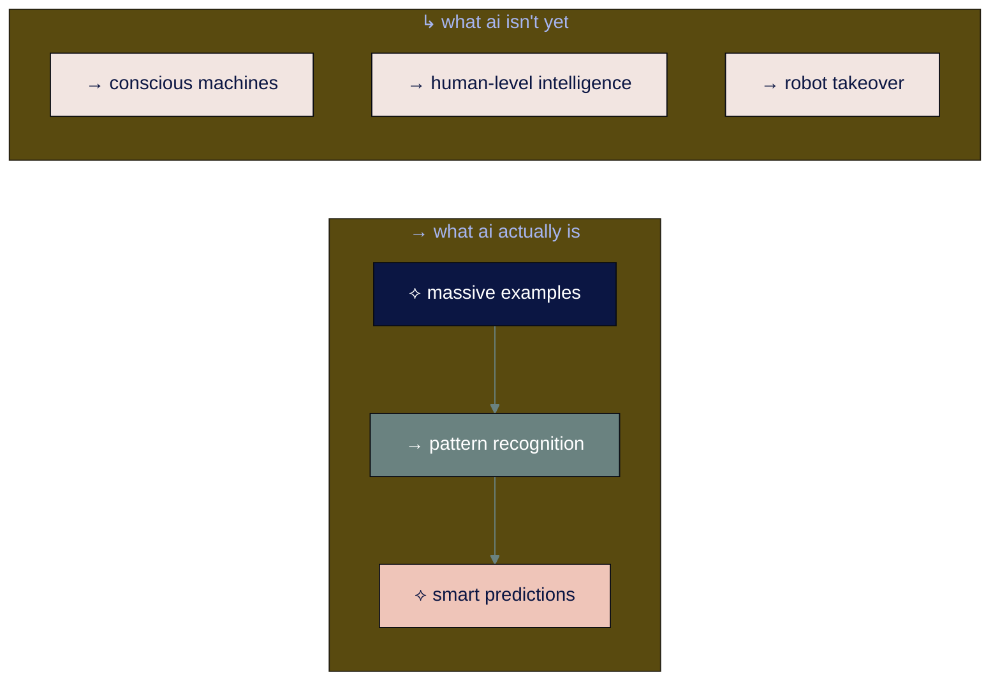
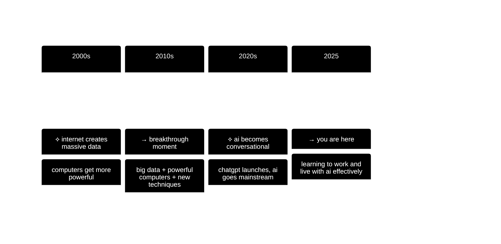

# ai basics

## navigation
▲ **getting started** | ← [readme](README.md) | → [learning approach](learning-approach.md)

## what you'll learn

→ what ai actually is and why it matters now  
→ how current ai differs from what came before  
→ the ai tools you use every day in work and life without realizing it

you hear "ai" everywhere. your phone suggests replies to texts. netflix knows what you want to watch. google maps finds the fastest route. your fitness tracker coaches your workouts. you're already using ai successfully in work and life - now let's understand what's actually happening.

• • •

## → what ai is (and isn't)

**artificial intelligence** = computers doing tasks that typically require human intelligence

but current ai isn't the sci-fi version. it's sophisticated pattern recognition that learned from massive examples.

current ai excels at specific tasks by recognizing patterns from millions of examples. it's powerful but narrow.

• • •

## → how we got here

for decades, ai lived in research labs. around 2010, three things aligned to create the ai revolution:

the combination of internet-scale data, powerful computers, and new learning techniques created the ai revolution we're experiencing in our daily lives.

• • •

## → understanding ai types

different ai systems excel at different tasks:

**machine learning** = showing ai lots of examples so it learns patterns  
**deep learning** = machine learning with many layers, like how brains work  
**specialized ai** = tools optimized for specific tasks (text, images, voice)

• • •

⟡ **learning vs programming**

**traditional programming:**  
"if customer says 'refund', show refund form"  
→ exact rules for every situation

**machine learning:**  
show ai 1 million customer service conversations  
→ ai figures out patterns and handles new situations

this is why ai can have conversations instead of just following scripts.

• • •

## → current ai vs future ai

understanding ai's current capabilities helps set realistic expectations:

**current ai - specialists:** excellent at specific tasks like writing or image creation, but each tool does one thing well

**ai agents - starting now:** can take real-world actions like booking flights, scheduling meetings, completing multi-step tasks

**agi - artificial general intelligence:** future ai with human-level intelligence across all domains

• • •

## → ai you already use

you successfully use ai daily in work and life without thinking about it:

**your smartphone camera** automatically adjusts settings and recognizes faces  
**netflix and spotify** suggest shows and music you actually want  
**google maps and waze** find the fastest route considering current traffic  
**email spam filtering** sorts legitimate emails from junk automatically  
**voice assistants** (siri, alexa, google) understand speech and respond helpfully  
**fitness trackers** analyze your activity patterns and suggest improvements  
**banking apps** detect fraudulent transactions and alert you immediately  
**social media feeds** show you content based on your interests and behavior

these work because they learned patterns from millions of examples: photos, viewing habits, traffic data, emails, conversations, workout data, and spending patterns.

• • •

## → what this means for you

current ai is sophisticated pattern recognition that learned from massive data. this means:

**ai excels at:**
- tasks with clear patterns (writing, image recognition, recommendations)
- processing large amounts of information quickly
- providing starting points and creative inspiration

**ai requires verification for:**
- current events and recent information
- specific facts and statistics
- medical, legal, or financial advice
- situations requiring human judgment

**your opportunity:** learn to use ai effectively now while building skills that will transfer to more advanced ai systems coming soon.

• • •

## connecting the dots

ai isn't magic - it's powerful pattern recognition that became accessible to regular people. understanding this foundation helps you use ai tools effectively and prepares you for more advanced capabilities ahead.

---

### flashcard for this section

**→ front**: what's the difference between traditional programming and machine learning?  
**⟡ back**: programming uses exact rules for every situation. machine learning shows ai millions of examples so it learns patterns and handles new situations.

**→ front**: what are the three levels of ai development?  
**⟡ back**: current ai (specialists for specific tasks), ai agents (take real-world actions), agi (human-level intelligence across all domains)

---

**sources:**
- ai development: [stanford ai index 2025](https://aiindex.stanford.edu/) | [mit ai overview](https://mitsloan.mit.edu/ideas-made-to-matter/machine-learning-explained)
- current ai capabilities: [anthropic ai research](https://www.anthropic.com/research) | [openai research](https://openai.com/research/)

---

you understand what ai is and how it developed. now learn the most effective methods for learning ai skills that will adapt as technology evolves.

→ **next**: [learning approach](learning-approach.md)
