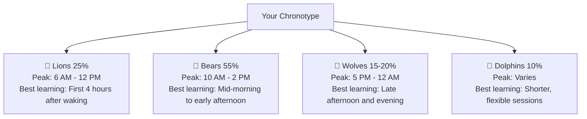
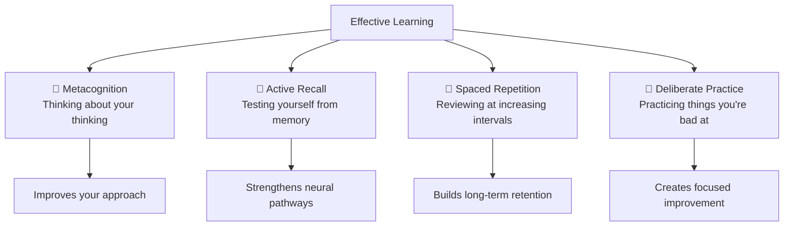
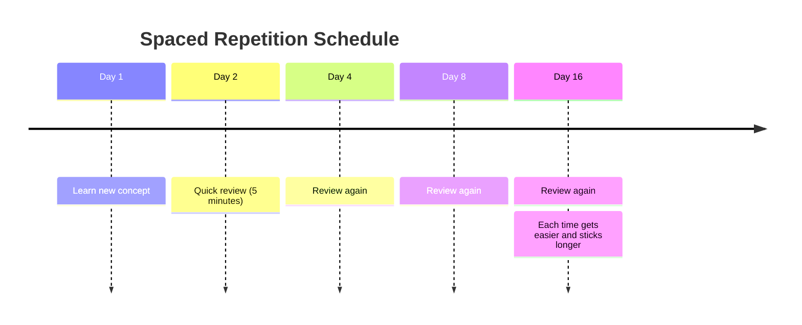

# foundation a: how to learn anything

## why we're starting here

I know you came here to learn AI. But AI is changing fast - new tools every week, new techniques, new applications. I want you to be able to adapt to whatever comes next, not just memorize today's specific tools.

When you have strong learning skills, you don't panic when ChatGPT gets updated or when a new AI tool launches. Instead, you think: "Cool, new thing to figure out. I know how to do this."

So yes, we're starting with learning how to learn. Because I want you to be an AI power user not just today, but for the next decade.

## your brain can change

The most important thing to know: your brain physically changes when you learn. New neural pathways form, existing ones strengthen, and your brain literally rewires itself.

You're not stuck with the brain you have. Every time you practice something, you're building stronger neural pathways. Age doesn't stop this - adult brains are remarkably adaptable.

---

### clarifier: neural pathways

**Neural pathway** = the route information travels in your brain

Think of it like a trail in the woods. The first time you walk it, you have to push through bushes and step over logs. But the more people walk that same path, the clearer and easier it becomes to follow.

**New skill** = new trail  
**Practice** = more people walking the trail  
**Mastery** = smooth, well-worn path

---

---

### clarifier: how skills actually form

**Skill = neural pathway wrapped in myelin**

**Myelin** = insulation around neural pathways (like coating on electrical wires)
→ More myelin = faster, more reliable signals  
→ Built through practice and repetition  
→ Why "muscle memory" feels automatic

Think: dirt path → paved road → highway. Each practice session adds more "pavement."

---

## when your brain learns best

### the 90-minute learning cycles

Your brain naturally operates in 90-minute cycles throughout the day. Working with this rhythm makes learning feel easier.

---

### clarifier: ultradian rhythms

**Ultradian rhythm** = your brain's natural 90-minute energy cycle

Like how your heart beats in a rhythm, your brain has attention rhythms too. Every 90 minutes, your focus goes up and down like a gentle wave.

**Circadian** = big 24-hour sleep/wake cycle (like the sun)  
**Ultradian** = small 90-minute focus cycles (like ocean waves)

Work with the waves instead of fighting them!

---

**Your brain's natural cycle:**
→ First 20 minutes: getting into focus  
→ Middle 50 minutes: peak sustained attention  
→ Last 20 minutes: natural decline  
→ 15-20 minute break: brain needs to reset

### know your chronotype

Most people fall into one of four natural patterns:

**Quick self-assessment:** For the next week, rate your alertness every 2 hours (1-10 scale). Note when you naturally feel most focused and creative. Most people discover their peak learning window within 3-4 days of tracking.

## the core learning methods

### 1. metacognition (thinking about your thinking)

Simple questions to ask yourself:
→ "Do I actually understand this, or does it just feel familiar?"  
→ "What part am I getting stuck on?"  
→ "When do I learn best?"

---

### clarifier: familiar vs. understood

**Familiar ≠ understood**

Just because you've read something doesn't mean you know it. Just because it makes sense doesn't mean you can use it.

**Test:** Can you explain it to someone else without looking?

---

### 2. active recall (testing yourself)

Instead of re-reading, actively retrieve information from memory:
→ Close the book and explain what you just learned  
→ Write down everything you remember about a topic  
→ Teach it to someone else (or pretend to)

Your brain strengthens pathways you actually use, not just ones you passively encounter.

### 3. spaced repetition (coming back to things)

Review information at increasing intervals instead of cramming using tools like [Anki](https://ankiweb.net/):

---

### clarifier: why forgetting helps

**Forgetting = your brain making space for important stuff**

When you struggle to remember something and then recall it, you're strengthening that memory pathway.

Easy recall = weak learning  
Effortful recall = strong learning

---

### 4. deliberate practice (quality over quantity)

Practice specifically on things you can't do well, with immediate feedback.

**Not deliberate practice:**
→ Reading for hours  
→ Following tutorials step-by-step  
→ Doing things you're already comfortable with

**Is deliberate practice:**
→ Explaining concepts until you find gaps  
→ Trying problems slightly beyond your current skill  
→ Getting feedback and adjusting immediately

## how to actually concentrate

### building up your focus

Concentration is like a muscle - it gets tired with use but stronger with training.

**Week 1:** 25-30 minute sessions  
**Week 2:** 45-60 minute sessions  
**Week 3:** 90-minute sessions during your peak hours  
**Week 4:** alternate based on what you're learning

### environment design

→ Remove distractions before you start  
→ Phone in another room  
→ Close unnecessary browser tabs  
→ Have water and snacks ready

### attention training

→ When your mind wanders, gently bring it back (don't judge yourself)  
→ Practice single-tasking throughout your day  
→ Notice what triggers your distraction

## the biological basics

### sleep (7-9 hours)

During sleep your brain:
→ Transfers information from short-term to long-term memory  
→ Strengthens neural pathways you used during the day  
→ Clears metabolic waste that impairs thinking  
→ Consolidates insights and creative connections

Poor sleep = learning feels harder than it needs to  
Good sleep = information sticks and connects naturally

### other factors that help

→ **Hydration:** 16-20 oz water upon waking  
→ **Movement:** 10-20 min light exercise before learning  
→ **Environment:** cool (68-72°F), bright, quiet space

---

### clarifier: bdnf

**BDNF** = brain-derived neurotrophic factor (fancy name for "brain fertilizer")

When you exercise, your body releases BDNF, which helps your brain grow new connections and remember things better. It's like Miracle-Gro for your neurons!

**Exercise** → **BDNF release** → **better learning and memory**

Even a 10-minute walk counts!

---

## learning myths vs. reality

**Myth:** "I'm not a technical person"  
**Reality:** Anyone can learn complex skills with the right approach

**Myth:** "I need to understand everything perfectly before moving on"  
**Reality:** Understanding builds gradually - confusion is normal

**Myth:** "If it's easy, I'm learning well"  
**Reality:** Struggle and confusion are signs of real learning happening

**Myth:** "I should focus for hours at a time"  
**Reality:** 90-minute sessions with breaks work better than marathon sessions

## heart check-in

Learning about learning can feel overwhelming at first. You don't need to master all these techniques immediately. Pick one or two that resonate and try them as you go through your AI learning journey.

The goal is building awareness and developing your personal system over time, not perfecting everything at once.

## your turn

**Try it now:** Set a timer for 25 minutes and practice active recall with something you recently learned. Close any notes and write down everything you remember. Notice where you get stuck - those are your learning gaps.

**Quick reflection:** Which learning technique sounds most useful for how you naturally like to learn?

**This week:** Track your natural energy patterns. When do you feel most alert and focused? When do you struggle to concentrate?

**Tomorrow:** What's one small change you could make to your learning environment based on what you just read?

---

### flashcards for this section

**Front:** What are the four core learning methods?  
**Back:** Metacognition, active recall, spaced repetition, deliberate practice

**Front:** How long is one natural learning cycle?  
**Back:** 90 minutes (20 min focus buildup, 50 min peak attention, 20 min decline)

**Front:** What's the difference between familiar and understood?  
**Back:** Familiar = you've seen it before. Understood = you can explain it to someone else without looking

**Front:** Why is forgetting actually helpful for learning?  
**Back:** When you struggle to remember and then recall something, you strengthen that memory pathway

---

→ **Next:** [ai basics](ai-basics.md)
