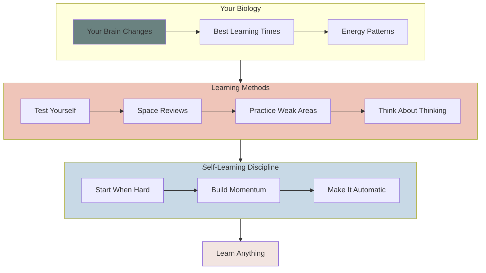
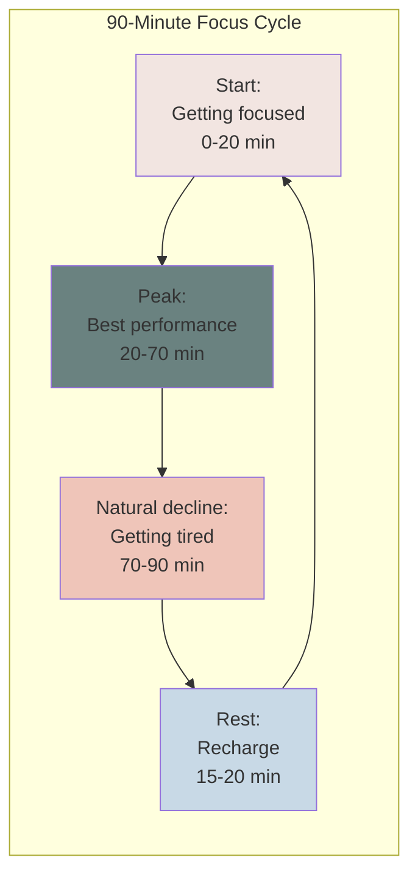
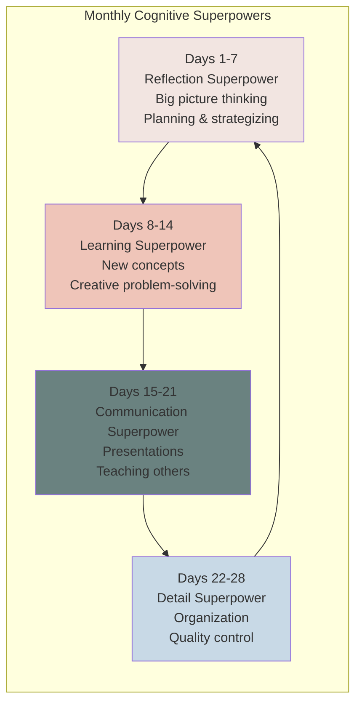
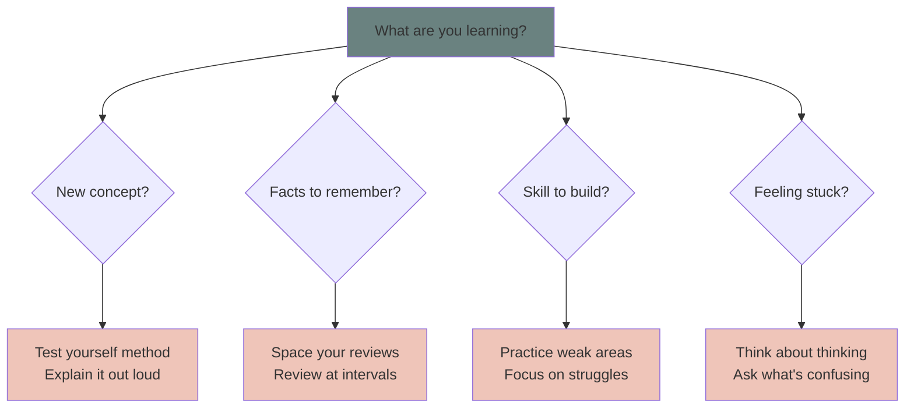

# how to learn anything

## navigation
▲ **foundation a** | ← [getting started with ai](getting-started-with-ai.md) | → [level 1: what happens when you press send](level-1.md)

## why we're starting here

I know what you might be thinking: "Nina, wtf? I came here to learn AI, hello?"

Yes, I know. And I want to make sure you change your mindset first.

AI is changing every week. New models launch, new techniques emerge, new applications get discovered. The specific AI tools we cover today might be different in six months.

I want to make sure you learn how to learn. I promise this is an investment.

When you have strong learning skills, you don't panic when ChatGPT gets updated, or when a new AI tool launches, or when the entire landscape shifts. Instead, you think: "Cool, new thing to figure out. I know how to do this."

**The alternative?** You learn today's specific AI tools, then feel lost and behind every time something changes. You become dependent on tutorials and guides instead of figuring things out yourself.

**With strong learning foundations, you become:** The person who adapts quickly, who figures out new AI tools intuitively, who sees connections others miss, who stays curious instead of overwhelmed.

So yes, we're starting with learning how to learn. Because I want you to be an AI power user not just today, but for the next decade as this technology evolves.

## your learning system overview

Everything connects to help you learn faster and remember longer:

## how your brain actually works

**Simple fact**: Your brain changes when you practice something. The more you practice, the faster your brain gets at that thing.

Scientists call this neuroplasticity. You can call it "practice makes your brain better."

When you practice piano, your brain builds better piano connections. When you practice math, your brain builds better math connections. When you practice learning itself, your brain gets better at learning everything.

**What this means**: You can get smarter at anything by practicing it the right way.

## when your brain works best

### work in 90-minute focus cycles

Your brain has natural energy cycles:

**Simple rule**: Work hard for 90 minutes, rest for 20 minutes, repeat.

### know your energy pattern

People have different energy patterns:

```mermaid
graph TD
    subgraph Chronotypes[Your Natural Energy Pattern]
        L[🦁 Morning Lions 25%<br/>Superpower: 6 AM - 12 PM<br/>Best for: Complex AI concepts]
        B[🐻 Steady Bears 55%<br/>Superpower: 10 AM - 2 PM<br/>Best for: Regular AI practice]
        W[🐺 Night Wolves 20%<br/>Superpower: 5 PM - 12 AM<br/>Best for: Creative AI projects]
        D[🐬 Flexible Dolphins 10%<br/>Superpower: Varies daily<br/>Best for: Short AI sessions]
    end
    
    style L fill:#efc5b9
    style B fill:#6a8280
    style W fill:#c8d9e6
    style D fill:#f2e5e1
```

**Track yourself for one week**: Rate your alertness every 2 hours (1-10). You'll see your pattern.

### hormones give you different superpowers

**Daily patterns**: Some people have morning superpowers, others have evening superpowers. This stays consistent every day.

**Monthly superpowers**: People who menstruate get 4 different cognitive superpowers throughout the month:

**For AI learning**:
- **Reflection phase**: Perfect for understanding AI concepts and planning learning goals
- **Learning phase**: Best time to tackle new AI tools and techniques  
- **Communication phase**: Great for explaining AI concepts and teaching others
- **Detail phase**: Ideal for organizing AI knowledge and refining skills

**Simple rule**: Match your learning activities to your current superpower.

## choosing your learning method

Different situations need different approaches:

## troubleshooting common learning problems

### "I can't focus"
- Start with just 2 minutes
- Remove all distractions first
- Try different times of day
- Check if you're in your natural energy window

### "I forget everything"
- You're probably not testing yourself enough
- Use spaced repetition: review at Day 2, 4, 8, 16
- Explain concepts out loud before moving on

### "It's too hard"
- Break it into smaller pieces
- Start with the easiest part
- Remember: confusion means your brain is growing

### "I don't have time"
- Use 90-minute cycles instead of long sessions
- Learn during your energy superpower times
- Even 15 minutes daily builds momentum

### for neurodivergent learners

**ADHD superpowers**:
- Use timers for focus sessions
- Change locations when attention wanes  
- Learn through movement when possible
- Break everything into smaller chunks

**Autism superpowers**:
- Create detailed learning schedules
- Use special interests to connect new concepts
- Learn in quiet, predictable environments
- Focus on systematic, step-by-step approaches

## the 4 ways to learn anything

### 1. test yourself (don't just re-read)

**Wrong way**: Read the same thing over and over  
**Right way**: Close the book and explain it out loud

**Why this works**: Your brain gets stronger when you make it work to remember.

**How to do it**:
- Read something
- Close the book  
- Explain it like you're teaching a friend
- Check what you missed
- Try again

### 2. space your reviews

**Wrong way**: Cram everything the night before  
**Right way**: Review at increasing time gaps

**Simple schedule**:
- Day 1: Learn it
- Day 2: Quick review
- Day 4: Review again  
- Day 8: Review again
- Day 16: Review again

**Why this works**: Forgetting and then remembering makes your brain remember it longer.

### 3. practice what you're bad at

**Wrong way**: Keep doing things you're already good at  
**Right way**: Focus on your weak spots

**How to do it**:
- Find what you struggle with most
- Practice just that part
- Get feedback immediately
- Fix mistakes right away

### 4. think about your thinking

**Simple questions to ask yourself**:
- Do I actually understand this?
- What part is confusing me?
- When do I learn best?
- What's working? What isn't?

**Why this works**: When you notice how you learn, you can fix what's not working.

## how to focus

### build your focus muscle

Focus gets stronger with practice, just like lifting weights.

**Week 1**: Focus for 25 minutes, then break  
**Week 2**: Focus for 45 minutes, then break  
**Week 3**: Focus for 90 minutes, then break

### remove distractions

Before you start:
- Put your phone in another room
- Close social media tabs
- Have water and snacks ready
- Clear your desk

### when your mind wanders

Don't get mad at yourself. Just notice it happened and bring your attention back. This is normal and gets easier with practice.

## building self-learning discipline

### how to start when you don't feel like it

**The 2-minute rule**: Commit to just 2 minutes. Usually you'll keep going once you start.

**Make it easier**: 
- Set up your materials the night before
- Start with the easiest part
- Use a timer so you know when you can stop

## building learning momentum and accountability

### starting when motivation is low

**The 2-minute commitment**: Promise yourself just 2 minutes. Usually you'll continue once you start.

**Make it easier**:
- Set up materials the night before
- Start with the most interesting part
- Use a timer so you know when you can stop
- Pair learning with something you enjoy (coffee, music)

### tracking progress

**Daily habit tracker**: Check off each day you learn something new
- Week 1: 3 days = success
- Week 2: 4 days = success  
- Week 3: 5 days = success
- Week 4+: Daily becomes automatic

### dealing with setbacks

**When you miss a day**: Just start again tomorrow. One missed day doesn't ruin everything.

**When you feel behind**: Focus on consistency, not perfection. Small daily progress beats occasional marathon sessions.

### creating accountability

- Tell someone your learning goal
- Share progress weekly with a friend
- Join online learning communities
- Use apps that track learning streaks

### dealing with confusion

**Confusion is normal**. It means your brain is building new connections.

**When you're confused**:
- Take a break
- Try explaining it differently  
- Ask someone for help
- Come back to it tomorrow

### making learning automatic

**Same time**: Study at the same time each day  
**Same place**: Use the same learning spot  
**Same routine**: Do the same warm-up activities

**After 3-4 weeks**: Learning will feel automatic, like brushing your teeth.

## your quick learning system

### before learning
- [ ] Remove distractions
- [ ] Set a specific goal
- [ ] Choose your method (test, space, practice, think)

### during learning (90 minutes)
- [ ] Focus on one thing
- [ ] Take notes in your own words
- [ ] Ask yourself questions
- [ ] Notice when you're confused

### after learning (20-minute break)
- [ ] No screens during break
- [ ] Explain what you learned
- [ ] Plan tomorrow's review
- [ ] Note what worked well

### weekly review
- [ ] Test yourself on old material
- [ ] Connect new ideas to old ones
- [ ] Adjust what's not working
- [ ] Plan next week

## other factors that help

**Hydration**: 16-20 oz water upon waking  
**Movement**: 10-20 min light exercise before learning  
**Environment**: Cool (68-72°F), bright, quiet space

**Sleep**: Your brain transfers information from temporary storage to permanent storage while you sleep. 7-9 hours needed.

## learning myths (wrong ideas)

**Myth**: "I'm not smart enough"  
**Truth**: Anyone can learn anything with the right methods

**Myth**: "I need to understand everything perfectly"  
**Truth**: Understanding builds slowly. Confusion is normal.

**Myth**: "Smart people learn faster"  
**Truth**: Effective people use better methods

**Myth**: "I should study for hours"  
**Truth**: 90-minute sessions work better than marathon sessions

## ◇ connecting the dots

**What we learned**: Your brain changes when you practice, you have natural energy patterns, and specific methods (test yourself, space reviews, practice weaknesses, think about thinking) make learning faster

**Why this matters**: These principles work for learning anything - including AI tools that haven't been invented yet

**What's next**: Now we'll learn about AI using these same learning principles

---

### ◈ flashcard for this section

**❯ Front**: What are the 4 ways to learn anything?  
**❮ Back**: 1) Test yourself (don't re-read), 2) Space your reviews, 3) Practice what you're bad at, 4) Think about your thinking

**❯ Front**: What's the simple rule for brain energy cycles?  
**❮ Back**: Work hard for 90 minutes, rest for 20 minutes, repeat

---

**Sources:**
- Brain Plasticity: [Nature Reviews Neuroscience](https://www.nature.com/articles/s41583-020-00379-8) | [Stanford Medicine](https://med.stanford.edu/news/all-news/2024/06/myelin-addiction.html)
- Learning Cycles: [Basic Rest-Activity Cycle](https://en.wikipedia.org/wiki/Basic_rest–activity_cycle) | [Ultradian Rhythms Research](https://www.asianefficiency.com/productivity/ultradian-rhythms/)
- Learning Methods: [Science of Learning](https://www.frontiersin.org/journals/cellular-neuroscience/articles/10.3389/fncel.2020.00156/full)

---

→ **next**: [level 1: what happens when you press send](level-1.md)
