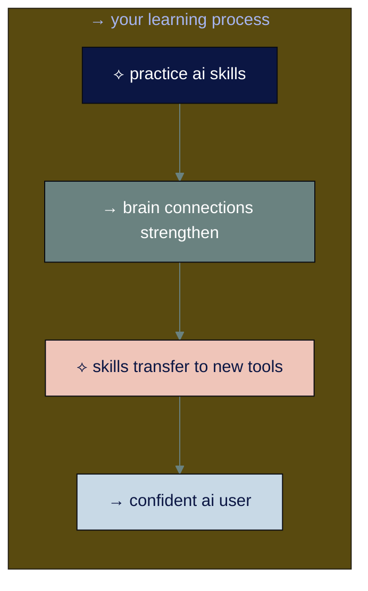
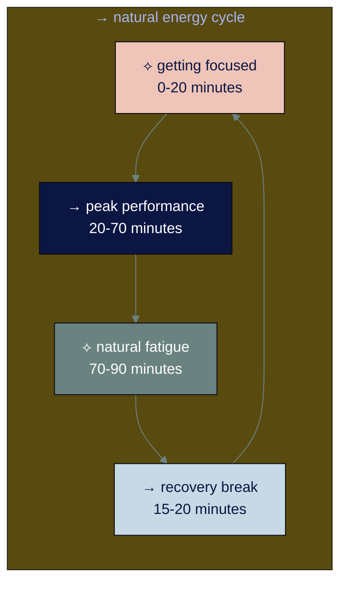
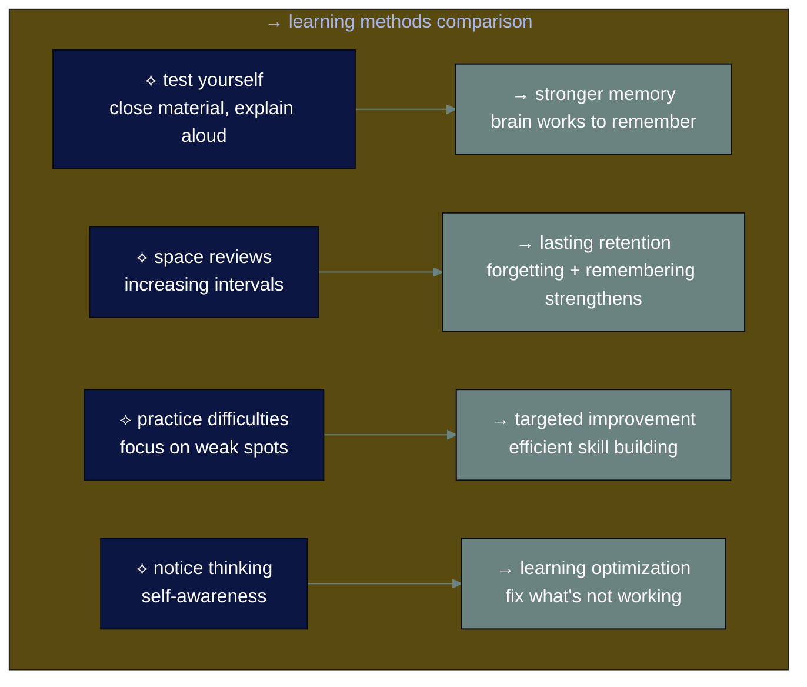

# learning approach

## navigation
▲ **getting started** | ← [ai basics](ai-basics.md) | → [level 1: how ai actually works](level-1.md)

## why start with learning skills

ai changes every week. new models launch, techniques emerge, applications get discovered. the specific tools we cover today might be different in six months.

strong learning skills make you adaptable. when chatgpt updates or new ai tools launch, you think "interesting, let me figure this out" instead of feeling lost and behind.

• • •

## → how your brain learns

your brain physically changes when you practice something. scientists call this neuroplasticity - the more you practice, the better your brain gets at that specific skill.

when you practice using ai tools effectively, your brain builds better ai connections. this transfers to learning any new ai system.

• • •

## → work with your natural energy

your brain has predictable energy cycles. understanding yours makes learning faster and less frustrating.

### ※ 90-minute focus cycles

your brain naturally works in 90-minute cycles. understanding this helps you learn ai skills more effectively:

**simple rule:** work focused for 90 minutes, rest for 20 minutes, repeat.

### ※ daily energy patterns

track your alertness for one week. rate it 1-10 every 2 hours. you'll discover your personal pattern:

**morning types (25%)** - peak energy 6 am - 12 pm  
**steady types (55%)** - peak energy 10 am - 2 pm  
**evening types (20%)** - peak energy 5 pm - 12 am

**use your peak time** for learning new ai concepts. use lower energy times for practice and review.

• • •

⟡ **why timing matters**

**learning during peak energy** = concepts stick faster, less frustration

**learning during low energy** = more effort required, higher abandonment risk

your brain literally works differently at different times. use this instead of fighting it.

• • •

## → the four essential learning methods

these methods work for learning anything - including ai skills for work, family management, creative projects, or personal interests.

### ⌘ 1. test yourself (don't just re-read)

**wrong way:** read the same thing repeatedly  
**right way:** close the material and explain it out loud

**how:** after reading a section, close it and explain the concept like you're teaching a friend. check what you missed, then try again.

**why it works:** your brain gets stronger when it has to work to remember.

### ⌘ 2. space your reviews

**wrong way:** cram everything at once  
**right way:** review at increasing intervals

**simple schedule:**
- day 1: learn it
- day 2: quick review
- day 4: review again
- day 8: review again
- day 16: review again

**why it works:** forgetting and then remembering makes memories stronger.

### ⌘ 3. practice what's difficult

**wrong way:** keep doing things you're already good at  
**right way:** focus on your weak spots

**how:** find what you struggle with most. practice just that part. get feedback immediately.

### ⌘ 4. notice your thinking

**questions to ask yourself:**
- do i actually understand this?
- what part confuses me?
- when do i learn best?
- what's working? what isn't?

**why it helps:** when you notice how you learn, you can fix what's not working.

• • •

## → practical learning system

### ⌘ before each learning session
- remove distractions (phone in another room)
- set a specific goal for the session
- choose your method based on what you're learning

### ⌘ during learning (90 minutes maximum)
- focus on one concept at a time
- take notes in your own words
- ask yourself questions about the material
- notice when you feel confused (this is normal)

### ⌘ after learning (20-minute break)
- no screens during break
- explain what you learned to yourself
- plan tomorrow's review
- note what worked well

### ⌘ weekly review
- test yourself on previous material
- connect new ideas to old ones
- adjust what's not working
- plan next week's focus

• • •

## → building consistent habits

### ※ start small when motivation is low

**the 2-minute rule:** commit to just 2 minutes. usually you'll continue once you start.

**make it easier:**
- set up materials the night before
- start with the most interesting part
- use a timer so you know when you can stop

### ※ track progress simply

**daily habit:** check off each day you learn something new
- week 1: 3 days = success
- week 2: 4 days = success
- week 3: 5 days = success
- week 4+: daily becomes automatic

### ※ handle setbacks

**when you miss a day:** start again tomorrow. one missed day doesn't ruin progress.

**when you feel behind:** focus on consistency over perfection. small daily progress beats occasional marathon sessions.

• • •

## → factors that help learning

**physical environment:**
- cool temperature (68-72°f)
- good lighting
- quiet space
- comfortable seating

**physical state:**
- 16-20 oz water when you wake up
- 10-20 minutes light movement before learning
- 7-9 hours sleep (your brain consolidates learning during sleep)

**mental state:**
- start when you're alert
- remove decision fatigue (plan what to learn in advance)
- expect confusion (it means your brain is growing)

• • •

## → learning myths to ignore

**"i'm not smart enough"** → anyone can learn anything with effective methods

**"i need to understand everything perfectly"** → understanding builds gradually

**"smart people learn faster"** → effective people use better methods

**"i should study for hours"** → 90-minute sessions work better than marathon sessions

• • •

## connecting the dots

your brain changes when you practice, you have natural energy patterns, and specific methods make learning faster. these principles work for learning anything - including ai tools that haven't been invented yet.

understanding how you learn best prepares you to adapt quickly as ai continues evolving.

---

### flashcard for this section

**→ front**: what are the four essential learning methods?  
**⟡ back**: 1) test yourself (don't re-read), 2) space your reviews, 3) practice what's difficult, 4) notice your thinking

**→ front**: what's the simple rule for brain energy cycles?  
**⟡ back**: work focused for 90 minutes, rest for 20 minutes, repeat

---

**sources:**
- brain plasticity: [nature reviews neuroscience](https://www.nature.com/articles/s41583-020-00379-8) | [stanford medicine research](https://med.stanford.edu/news/all-news/2024/06/myelin-addiction.html)
- learning methods: [journal of applied psychology](https://psycnet.apa.org/record/2013-24609-001) | [science of learning review](https://www.frontiersin.org/journals/cellular-neuroscience/articles/10.3389/fncel.2020.00156/full)

---

you understand how to learn effectively. now discover how ai actually works and why it feels different from other software.

→ **next**: [level 1: how ai actually works](level-1.md)
