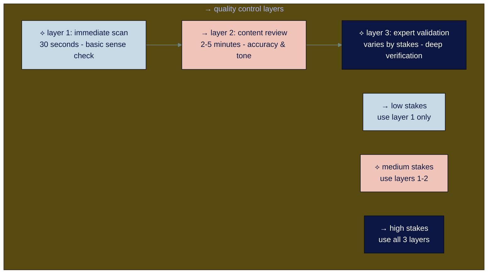

# ● level 6: developing ai quality standards

## navigation
▲ **phase 2: getting started (3/3)** | ← [level 5: finding your ai opportunities](level-5.md) | → [level 7: the 5 essential ai skills](level-7.md)

## what you'll learn

→ how to evaluate ai output quality before you rely on it  
→ why "good enough" varies dramatically by situation  
→ practical quality control frameworks for work and personal use  
→ when human oversight is critical vs optional

you've identified where ai can help in work and life and started experimenting. now learn how to maintain standards as ai becomes part of your professional and personal workflows.

## → the quality spectrum

not all ai output needs the same level of quality. what matters is matching your quality standards to the stakes involved.

```mermaid
%%{init: {'theme':'base', 'themeVariables': { 'primaryColor': '#0b1643', 'primaryTextColor': '#ffffff', 'lineColor': '#6a8280'}}}%%
graph LR
    subgraph Stakes[→ stakes and quality requirements]
        Low[⟡ low stakes<br/>brainstorming, family planning<br/>internal notes, creative projects] --> LowQuality[→ "good enough" = <br/>useful starting point]
        
        Medium[⟡ medium stakes<br/>work communications<br/>family decisions, health research] --> MediumQuality[→ "good enough" = <br/>accurate + appropriate]
        
        High[⟡ high stakes<br/>client deliverables, medical decisions<br/>financial planning, legal matters] --> HighQuality[→ "good enough" = <br/>expert-level verification]
    end
    
    style Low fill:#c8d9e6,color:#0b1643
    style Medium fill:#efc5b9,color:#0b1643
    style High fill:#6a8280,color:#ffffff
    style LowQuality fill:#c8d9e6,color:#0b1643
    style MediumQuality fill:#efc5b9,color:#0b1643
    style HighQuality fill:#0b1643,color:#ffffff
```

**the key insight:** spend quality control effort proportional to consequences, not equal across all tasks in work and life.

• • •

## → the human oversight framework

2025 research shows that ai still requires human oversight, but the type and intensity should match the risk level.

### ※ oversight levels by risk

**minimal oversight (low stakes)**
- brainstorming for creative projects
- internal note-taking and planning
- rough draft creation for personal use
- casual family communication and coordination

**standard oversight (medium stakes)**
- work presentations and client communications
- family health and education decisions
- financial planning and budgeting
- travel planning and major purchases

**intensive oversight (high stakes)**
- legal documents and contracts
- medical information and health decisions
- public statements and professional reputation
- children's safety and educational choices
- major financial or investment decisions

• • •

<div align="center" style="background-color: #d4c9d2; padding: 15px; border-radius: 8px; margin: 15px 0; border-left: 4px solid #6a8280;">

⟡ **the automation bias trap**

humans tend to over-trust ai output, especially when it looks polished. research shows people are 2.5x more likely to accept ai work without review when hallucination rates are low. but "low" doesn't mean "zero" - maintain skepticism even with good ai tools.

</div>

• • •

## → practical quality control methods

the most effective approach uses multiple layers of review, scaled to match the stakes:



### ⌘ the 3-layer quality check

**layer 1: immediate scan (30 seconds)**
- does this make basic sense?
- are there obvious errors or inconsistencies?
- does it match what i asked for?

**layer 2: content review (2-5 minutes)**
- is the information accurate?
- does the tone match the audience?
- are key points covered adequately?

**layer 3: expert validation (varies by stakes)**
- verify facts against trusted sources
- get domain expert review
- test logic and reasoning
- check for subtle biases or gaps

### ⌘ quality indicators to watch for

**positive signals:**
→ **specific details** that show understanding of your context  
→ **appropriate examples** that match your industry/situation  
→ **consistent voice** throughout the response  
→ **logical structure** that builds toward your goal  
→ **relevant limitations** acknowledged where appropriate

**warning signals:**
→ **generic language** that could apply to anyone  
→ **conflicting information** within the same response  
→ **overconfident claims** about uncertain topics  
→ **missing context** that you provided earlier  
→ **inappropriate tone** for the audience or situation

• • •

## → quality control by content type

### ※ written communication quality standards

**emails and messages:**
- accurate recipient and context understanding
- appropriate formality level
- clear action items or next steps
- error-free grammar and spelling

**quality check:** read it as if you're the recipient. does it make sense and prompt the right response?

### ※ analysis and research quality standards

**research summaries:**
- sources cited or identifiable
- key findings highlighted clearly
- limitations and gaps acknowledged
- actionable insights included

**quality check:** can you defend this information to a skeptical colleague?

### ※ creative content quality standards

**presentations and marketing:**
- key messages clearly communicated
- audience-appropriate language and examples
- logical flow and structure
- brand/voice consistency

**quality check:** would this achieve your intended impact with the target audience?

### ※ technical content quality standards

**procedures and documentation:**
- step-by-step clarity
- complete information (no missing steps)
- tested accuracy when possible
- appropriate level of detail

**quality check:** could someone unfamiliar with the process follow these instructions successfully?

• • •

## → developing your quality standards

### ⌘ step 1: define your quality dimensions

for each type of ai-assisted work, identify what "good" looks like:

**accuracy:** factual correctness and logical consistency  
**relevance:** matches your specific context and needs  
**appropriateness:** suitable tone, format, and level of detail  
**completeness:** covers all necessary points without major gaps  
**usability:** ready to use or easy to refine further

### ⌘ step 2: create quality checklists

develop 3-5 question checklists for your most common ai tasks:

**example - meeting summary quality check:**
1. are all key decisions captured accurately?
2. are action items assigned to specific people?
3. is the tone appropriate for sharing with stakeholders?
4. are any confidential details properly handled?
5. would someone who missed the meeting understand next steps?

**example - research summary quality check:**
1. are sources credible and current?
2. do the conclusions match the evidence presented?
3. are counterarguments or limitations mentioned?
4. is the information relevant to my specific question?
5. can i verify the key claims independently?

### ⌘ step 3: calibrate your standards

test your quality standards with colleagues:
- share examples of ai output you consider "good enough"
- ask for feedback on your quality criteria
- adjust standards based on real-world consequences
- document what works for future reference

• • •

## → the continuous improvement approach

### ※ track quality patterns over time

keep simple records of ai quality issues:
- what types of errors occur most frequently?
- which tasks consistently require heavy editing?
- where does ai exceed your expectations?
- how do different prompting approaches affect quality?

### ※ refine your process based on data

monthly review questions:
- which quality checks save the most time/prevent the most problems?
- where am i over-checking or under-checking?
- what new quality issues have emerged?
- how can i improve my prompts to get better initial output?

• • •

## → quality control automation

### ⌘ use ai to check ai

for routine quality checks, ai can help evaluate its own output:

**example prompt for self-evaluation:**
"review the email draft above and check for: 1) factual accuracy, 2) appropriate tone for a client, 3) clear action items, 4) professional formatting. flag any issues you find."

**when this works:** routine formats with clear criteria  
**when this doesn't work:** subjective judgments or high-stakes content

### ⌘ build quality into your prompts

instead of fixing quality problems after generation, prevent them upfront:

**before:** "write a project update"  
**after:** "write a project update that includes current status, key risks, next milestones, and action items. use a professional but approachable tone suitable for both technical and non-technical stakeholders."

• • •

## → industry-specific quality considerations

### ※ healthcare and medical

**critical quality factors:**
- current, evidence-based information
- appropriate disclaimers about seeking professional advice
- careful language around diagnoses and treatments
- verification against medical databases

### ※ legal and compliance

**critical quality factors:**
- current regulatory information
- jurisdiction-specific accuracy
- conservative language that doesn't overstate certainty
- clear disclaimers about legal advice

### ※ financial services

**critical quality factors:**
- current market data and regulations
- risk disclaimers and appropriate qualifications
- compliance with industry communication standards
- fact-checking against authoritative financial sources

### ※ education and training

**critical quality factors:**
- pedagogically sound progression and structure
- age/skill-appropriate language and examples
- accurate and current subject matter
- inclusive and accessible content

• • •

## → when to increase quality standards

### ⌘ escalation triggers

increase your quality control rigor when:

**audience expansion:** moving from internal to external communication  
**increased stakes:** decisions that affect budget, reputation, or compliance  
**domain sensitivity:** legal, medical, financial, or safety-related content  
**cumulative impact:** content that will be referenced repeatedly  
**public visibility:** anything that represents you or your organization publicly

### ⌘ quality intervention strategies

**option 1: additional human review** - get a second pair of eyes  
**option 2: expert consultation** - involve domain specialists  
**option 3: staged release** - test with small groups first  
**option 4: traditional methods** - fall back to non-ai approaches for critical work

• • •

<div align="center" style="background-color: #d4c9d2; padding: 15px; border-radius: 8px; margin: 15px 0; border-left: 4px solid #6a8280;">

⟡ **the 80/20 quality principle**

spend 80% of your quality control effort on the 20% of ai output that has the highest stakes or highest error rates. most ai output is good enough with minimal checking - focus your energy where it matters most.

</div>

• • •

## → your quality standards action plan

### ⌘ week 1: assessment
- identify your 3 most common ai-assisted tasks
- evaluate current quality issues and their impact
- define "good enough" standards for each task type

### ⌘ week 2: implementation
- create simple quality checklists for your common tasks
- test the checklists with recent ai output
- refine based on what you discover

### ⌘ week 3: optimization
- track time spent on quality control vs. problems prevented
- identify which quality checks provide the most value
- adjust your process based on real results

### ⌘ ongoing: evolution
- monthly review of quality patterns and issues
- quarterly update of quality standards as ai capabilities improve
- share effective quality control methods with colleagues

• • •

## connecting the dots

quality control for ai isn't about perfection - it's about matching your effort to the stakes involved. as ai becomes more integrated into your workflow, developing systematic approaches to quality evaluation becomes essential.

the goal is building confidence in ai-assisted work while maintaining appropriate skepticism. this balance lets you capture ai's productivity benefits without sacrificing the standards that matter in your professional context.

---

### flashcard for this section

<div style="background: linear-gradient(135deg, #f2e5e1 0%, #c8d9e6 100%); padding: 20px; border-radius: 12px; margin: 20px 0;">

**→ front**: what are the three levels of ai quality oversight?  
**⟡ back**: minimal (low stakes - brainstorming, drafts), standard (medium stakes - team communications), intensive (high stakes - legal, financial, public content)

**→ front**: what's the 3-layer quality check system?  
**⟡ back**: layer 1: immediate scan (30 sec), layer 2: content review (2-5 min), layer 3: expert validation (varies by stakes)

**→ front**: what are positive quality signals in ai output?  
**⟡ back**: specific details, appropriate examples, consistent voice, logical structure, relevant limitations acknowledged

**→ front**: when should you increase quality control rigor?  
**⟡ back**: audience expansion, increased stakes, domain sensitivity, cumulative impact, public visibility

**→ front**: what's the 80/20 quality principle for ai?  
**⟡ back**: spend 80% of quality control effort on the 20% of ai output with highest stakes or error rates

</div>

---

**sources:**
- ai quality standards: [qodo ai code quality 2025](https://www.qodo.ai/reports/state-of-ai-code-quality/) | [anthropic ai evaluation challenges](https://www.anthropic.com/research/evaluating-ai-systems)
- human oversight research: [cornerstone human oversight in ai](https://www.cornerstoneondemand.com/resources/article/the-crucial-role-of-humans-in-ai-oversight/) | [ai quality testing standards](https://code4thought.eu/2025/02/19/generative-ai-quality-testing-a-standards-based-approach-for-reliability/)
- developer productivity: [metr ai productivity study](https://metr.org/blog/2025-07-10-early-2025-ai-experienced-os-dev-study/) | [compliance quest ai quality management](https://www.compliancequest.com/blog/ai-impact-quality-management-2024/)

---

you've developed quality standards for ai-assisted work. now master the five essential skills that separate casual ai users from ai power users.

→ **next**: [level 7: the 5 essential ai skills](level-7.md)
