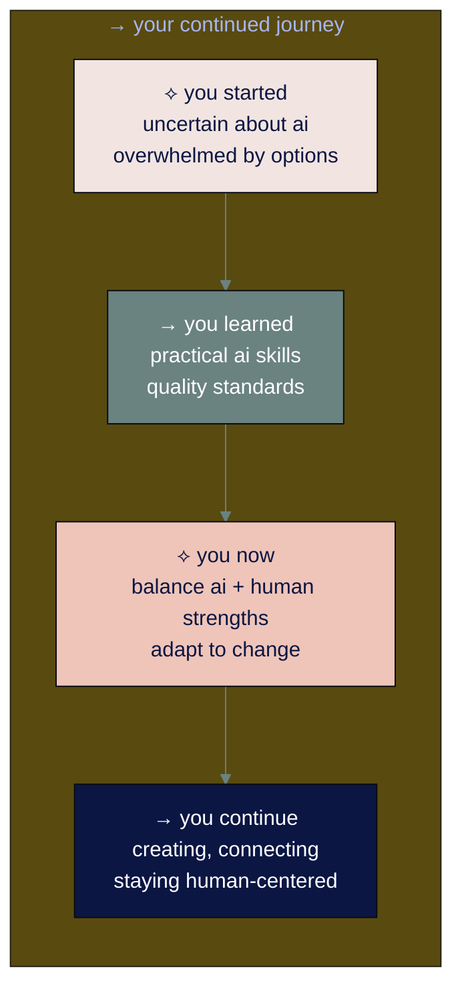

# ● level 9: staying human-centered and growing forward

## navigation
▲ **phase 3: building real skills (3/3)** | ← [level 8: advanced ai workflows](level-8.md) | → **you've completed the guide!**

## what you'll learn

→ both what could go wrong and what could go right with ai advancement  
→ why human creativity is becoming more valuable as ai gets better  
→ how to keep learning when technology changes faster than we can predict  
→ your realistic path forward in an uncertain but opportunity-rich time

you've learned to use ai effectively across work and life. now let's talk about the bigger picture - what happens next, and how you can thrive regardless of which direction things go.

## → my perspective: optimistic but not naive

i'm 28 and work as an ai operations consultant. i haven't lived through decades of tech changes, but i'm watching this one closely. i think ai will create more opportunities than it destroys, but i'm not pretending there aren't real risks.

in my work with ai communities and clients, i see both sides. some people are building amazing things with ai. others are genuinely worried about their livelihoods. both reactions make sense.

```mermaid
%%{init: {'theme':'base', 'themeVariables': { 'primaryColor': '#0b1643', 'primaryTextColor': '#ffffff', 'lineColor': '#6a8280'}}}%%
graph LR
    subgraph Current[→ what we can see now (2025)]
        A[⟡ opportunities<br/>new tools, creative possibilities<br/>time saved, problems solved] 
        B[⟡ challenges<br/>job displacement, rapid change<br/>skill obsolescence fears]
    end
    
    subgraph Future[→ what's uncertain]
        C[⟡ could go right<br/>agi helps solve big problems<br/>abundance for everyone]
        D[⟡ could go wrong<br/>concentration of power<br/>human agency reduced]
    end
    
    Current --> Future
    
    style A fill:#0b1643,color:#ffffff
    style B fill:#f2e5e1,color:#0b1643
    style C fill:#6a8280,color:#ffffff
    style D fill:#efc5b9,color:#0b1643
```

• • •

## → what could go wrong (the realistic concerns)

let me be direct about the risks i see:

### ※ near-term concerns (next 2-3 years)

**job displacement happening faster than retraining**
in my consulting work, i see companies automating roles without clear paths for affected employees. this creates real economic hardship for real people.

**skill obsolescence anxiety**
clients tell me they feel like they're constantly behind. just when they learn one ai tool, three new ones appear. this creates chronic stress and decision paralysis.

**over-dependence on ai systems**
i'm seeing people lose confidence in their own judgment. they ask ai for everything, even simple decisions they could make themselves.

**quality degradation**
when everyone uses the same ai tools, outputs start looking similar. original thinking gets harder to find and value.

### ※ longer-term risks (what keeps me up at night)

**concentration of ai power**
if only a few companies control advanced ai, they control too much of the economy. that's dangerous regardless of their intentions.

**superhuman ai alignment problems**
if we develop ai that's much smarter than humans, we need to be certain it shares our values. getting this wrong could be catastrophic.

**human agency erosion**
if ai makes all our decisions - from what to watch to whom to date to how to solve problems - we might lose the capacity for independent thought.

**social fragmentation**
ai-generated content and filter bubbles could make it harder for society to agree on basic facts or shared values.

• • •

## → what could go right (the genuine opportunities)

but i also see tremendous potential:

### ※ near-term opportunities (already happening)

**creativity amplification**
i watch clients use ai to explore ideas they never could have developed alone. ai handles the boring parts so they can focus on the creative leaps.

**democratized expertise**
small businesses can now access capabilities that used to require large teams. a solo consultant can compete with big firms.

**personalized learning and health**
ai tutors that adapt to individual learning styles. health insights based on your specific data. these are already improving lives.

**time liberation**
the clients who use ai well spend less time on routine tasks and more time on relationships, strategy, and meaningful work.

### ※ longer-term possibilities (if we get it right)

**scientific breakthroughs**
ai could accelerate research into climate change, disease, and other global challenges by decades.

**abundance creation**
if ai makes production incredibly cheap, basic necessities could become affordable for everyone.

**human potential expansion**
instead of replacing human intelligence, ai could augment it in ways we can't imagine yet.

**global problem solving**
complex coordination challenges - from pandemic response to resource allocation - could become manageable.

• • •

## → what i'm noticing right now

working in ai operations gives me a front-row seat to how this is actually playing out:

### ※ the human-made premium is real

last week, a client paid 3x more for a designer who prominently advertised "human-created logos." i've seen youtube videos tagged "human made lofi" getting premium engagement. this trend is accelerating.

people crave authenticity when everything else feels generated. your human perspective, flaws included, becomes more valuable as ai gets better at mimicking perfection.

### ※ the adaptation pattern

in my client base, i see three groups:
1. **early adopters** who integrate ai and focus on uniquely human skills - they're thriving
2. **gradual learners** who approach ai carefully but consistently - they're adapting well  
3. **avoiders** who hope ai goes away - they're struggling more each month

the difference isn't technical skill. it's willingness to experiment while staying grounded in human strengths.

### ※ the community response

in ai communities, i see both panic and excitement, often from the same people on different days. the uncertainty is real. nobody knows exactly what happens next.

what works: people who focus on learning principles rather than chasing every new tool. they adapt faster when things change.

• • •

<div align="center" style="background-color: #d4c9d2; padding: 15px; border-radius: 8px; margin: 15px 0; border-left: 4px solid #6a8280;">

⟡ **the middle path approach**

you don't have to choose between blind optimism and paralyzing pessimism. you can prepare for multiple futures: learn ai skills while developing human capabilities, automate routine work while preserving meaningful decision-making, embrace efficiency while protecting relationships.

</div>

• • •

## → building resilience for multiple futures

since we don't know which way things go, build capabilities that work regardless:

### ⌘ skills that transfer across scenarios

**human connection and communication**
whether ai transforms everything or changes nothing, people still need to work together, resolve conflicts, and build relationships.

**creative problem-solving** 
the ability to see patterns, combine ideas, and think outside existing frameworks remains valuable in any future.

**learning and adaptation**
if you can learn new skills quickly, you can adjust to whatever changes come.

**critical thinking**
distinguishing good information from bad, real from fake, important from trivial - this becomes more crucial as information increases.

### ⌘ practical steps for uncertain times

**diversify your capabilities**
don't put all your skills in one basket. if you're great at ai prompt engineering, also develop sales skills or creative abilities.

**build real relationships**
invest in connections with actual humans. these networks help during transitions and provide opportunities ai can't replicate.

**maintain agency**
use ai as a tool, not a crutch. practice making decisions without ai assistance so you keep that capacity.

**stay financially flexible**
have multiple income streams. if one gets automated, others can sustain you while you adapt.

• • •

## → your path forward (personalizing the approach)

everyone's situation is different. your path depends on your age, responsibilities, risk tolerance, and interests.

### ※ if you're early in your career

you have time to experiment and make mistakes. use it. try different ai tools, explore new fields, build diverse skills. the future belongs to people who can combine human creativity with ai capability.

focus on developing judgment and taste. ai can generate lots of options - your ability to choose the right ones becomes valuable.

### ※ if you're mid-career with expertise

your experience gives you context ai lacks. use ai to amplify your expertise, not replace it. become the person who can evaluate ai output in your domain.

teach others. as ai changes your field, people will need guides who understand both the technology and the human context.

### ※ if you're later in your career

your perspective on what actually matters is valuable. younger people are learning ai tools but they need guidance on when and how to use them responsibly.

mentor others. help them avoid mistakes you've seen before. your experience with previous technology changes is relevant.

### ※ if you're caring for family

focus on ai applications that actually save time and reduce stress. ignore the hype and use what helps your specific situation.

teach your children to use ai as a tool while developing their own thinking skills. they'll need both.

• • •

## → staying centered during rapid change

the pace of ai development is unlike anything i've experienced. new capabilities appear monthly. it can feel overwhelming.

### ⌘ managing information overload

**limit your ai news consumption**
i follow 3-4 trusted sources rather than trying to read everything. you don't need to know about every new model or feature.

**focus on principles over tools**
understand how to evaluate ai output, maintain quality standards, and preserve human judgment. these skills transfer as tools change.

**experiment regularly but not frantically**
try something new each month, but don't feel pressured to use every new tool immediately.

### ⌘ preserving what matters

**protect your relationships**
don't let ai efficiency crowd out time with people you care about. some conversations shouldn't be optimized.

**maintain offline capabilities**
can you still navigate without gps? write by hand? calculate basic math? keep some non-digital skills active.

**preserve decision-making practice**
regularly make choices without ai input. your judgment needs exercise to stay sharp.

• • •

## → your competitive advantages (what makes you irreplaceable)

as ai gets better, these human qualities become more valuable:

**your specific combination of experiences**
nobody else has lived your exact life or developed your particular perspective. this gives you unique insights ai can't replicate.

**your relationships and trust**
people do business with people they know and trust. ai can't build these connections for you.

**your taste and judgment**
ai can generate many options. your ability to choose well, especially in ambiguous situations, becomes crucial.

**your capacity for care**
genuinely caring about outcomes, people, and quality drives decisions ai can't make.

• • •

## → wrapping up this journey

you started this guide feeling uncertain about ai. you now have practical skills for using ai effectively while maintaining your human values.

that's significant. most people are either afraid of ai or think it's magic. you understand it's a powerful tool that requires human judgment to use well.

### ※ what you've actually accomplished

**technical competence**: you can have effective ai conversations, evaluate output quality, and build workflows that solve real problems

**human-centered approach**: you know how to use ai to amplify your capabilities without losing your humanity

**adaptability skills**: you've developed the learning mindset needed to grow with changing technology

**balanced perspective**: you see both opportunities and risks, which helps you make better decisions

### ⌘ your ongoing practice

**keep experimenting** with new ai capabilities while staying grounded in human strengths

**help others** learn to use ai thoughtfully - your balanced perspective is valuable

**stay curious** about what emerges while maintaining relationships and offline skills

**build things** that combine ai efficiency with human insight and creativity

• • •



• • •

## → final thoughts from someone still figuring it out

i don't have all the answers about where ai leads us. nobody does. but i've seen enough to believe we can navigate this well if we stay thoughtful about it.

the people thriving aren't necessarily the most technical or the most resistant to change. they're the ones who experiment while staying grounded, who use ai to amplify their humanity rather than replace it.

you're now one of those people. use these skills to create something meaningful, whether that's a better work process, a creative project, stronger relationships, or solutions to problems you care about.

the future isn't predetermined. the choices you and others make about how to develop and use ai will shape what happens next. that's both a responsibility and an opportunity.

stay curious. stay human. keep learning.

---

**sources:**
- ai safety research: [anthropic constitutional ai](https://www.anthropic.com/research/constitutional-ai-harmlessness-from-ai-feedback) | [future of humanity institute](https://www.fhi.ox.ac.uk/)
- economic impact studies: [mckinsey ai economic impact](https://www.mckinsey.com/capabilities/mckinsey-digital/our-insights/the-economic-potential-of-generative-ai-the-next-productivity-frontier) | [world economic forum future of jobs](https://www.weforum.org/reports/the-future-of-jobs-report-2023/)
- ai development trends: [stanford ai index 2025](https://aiindex.stanford.edu/) | [openai research papers](https://openai.com/research/)
- human-ai collaboration: [mit technology review ai research](https://www.technologyreview.com/topic/artificial-intelligence/) | [harvard business review ai strategy](https://hbr.org/topic/subject/artificial-intelligence)

---

## ★ **you've completed ai for normal people!**

look how far you've come. you started this guide feeling uncertain about ai - maybe a little overwhelmed by all the hype and tools and predictions about the future. now you have practical skills that actually work, a balanced perspective on what's coming, and confidence that you can adapt to whatever changes ahead.

most people are still either afraid of ai or think it's going to solve everything. you've found the middle path: using ai as a powerful tool while staying grounded in your humanity.

you now know how to have conversations with ai that get useful results, how to spot opportunities in your work and life, how to maintain quality when ai is involved, and how to keep growing as the technology evolves. you've also learned to think critically about both the genuine opportunities and real risks ahead.

**what happens next is up to you.** use what you've learned to create something meaningful - whether that's improving your daily routines, starting a creative project, solving problems you care about, or helping others navigate this same journey.

the future isn't written yet. the choices we all make about how to develop and use ai will shape where this goes. you're now equipped to be part of that conversation.

**stay connected with the community:** join [ninagpt: field notes from my ai journey](https://ninaverse.kit.com/36228eea47) where we continue exploring these changes together. your perspective and experiences will help others on their own ai journeys.

keep that learning mindset alive. the specific tools will keep changing, but the approach you've developed here - curious, critical, human-centered - will serve you well no matter what emerges.

thanks for trusting me as your guide through this landscape. 

now go build something interesting with what you know. the world needs people who can use ai thoughtfully.

pura vida ♡,

nina
