# ● level 9: staying human-centered and growing forward

## navigation
▲ **phase 3: building real skills (3/3)** | ← [level 8: advanced ai workflows](level-8.md) | → **you've completed the guide!**

## what you'll learn

→ how to maintain human values while embracing ai capabilities  
→ strategies for continuous growth as ai rapidly evolves  
→ the uniquely human skills that become more valuable, not less  
→ your path forward as an ai-enhanced person in work and life

you've mastered ai conversations, quality control, essential skills, and advanced workflows. now learn how to grow with ai while staying grounded in what makes you distinctly human in all areas of your life. grounded in what makes you distinctly human.

## → the human-ai future isn't about replacement

despite headlines about ai taking jobs, the reality is more nuanced. research shows that professionals who combine human strengths with ai capabilities become more valuable, not less.

recent studies indicate that while ai will automate many tasks, it's creating new roles and augmenting existing ones. the key is positioning yourself at the intersection of human insight and ai capability.

```mermaid
%%{init: {'theme':'base', 'themeVariables': { 'primaryColor': '#0b1643', 'primaryTextColor': '#ffffff', 'lineColor': '#6a8280'}}}%%
graph TD
    subgraph Human[→ uniquely human strengths]
        A[⟡ emotional intelligence<br/>empathy, relationship building]
        B[⟡ creative problem-solving<br/>innovation, lateral thinking]
        C[⟡ ethical reasoning<br/>moral judgment, values-based decisions]
        D[⟡ contextual understanding<br/>cultural nuance, implicit knowledge]
    end
    
    subgraph AI[→ ai capabilities]
        E[⟡ pattern recognition<br/>data analysis, prediction]
        F[⟡ information processing<br/>research, synthesis, speed]
        G[⟡ consistent execution<br/>automation, reliability]
        H[⟡ scalable intelligence<br/>simultaneous processing]
    end
    
    Human --> I[⟡ human-ai collaboration<br/>amplified capabilities]
    AI --> I
    
    style A fill:#0b1643,color:#ffffff
    style B fill:#0b1643,color:#ffffff
    style C fill:#0b1643,color:#ffffff
    style D fill:#0b1643,color:#ffffff
    style E fill:#6a8280,color:#ffffff
    style F fill:#6a8280,color:#ffffff
    style G fill:#6a8280,color:#ffffff
    style H fill:#6a8280,color:#ffffff
    style I fill:#efc5b9,color:#0b1643
```

the professionals who thrive combine both sides - using ai to amplify their human strengths rather than competing with it.

• • •

## → cultivating irreplaceable human skills

as ai handles more routine cognitive work, certain human capabilities become more precious, not less.

### ※ emotional intelligence and relationship building

**why it matters more:** as work becomes more automated, human connection becomes a key differentiator  

**how to develop:**
- practice active listening in all interactions
- develop cultural sensitivity and awareness
- learn to read emotional subtleties in communication
- build genuine relationships, not just professional networks
- understand how different people prefer to receive information

**ai amplification opportunity:** use ai to research and plan family activities, then apply human insight to create meaningful experiences and lasting memories

### ※ creative and strategic thinking

**why it matters more:** ai can execute plans brilliantly, but you excel at seeing what's not there yet - whether that's a new business opportunity, a creative project, or a solution to a family challenge

**how to develop:**
- regularly challenge your own assumptions about work and life
- expose yourself to diverse perspectives, hobbies, and experiences
- practice synthesizing insights from seemingly unrelated areas
- develop comfort with ambiguity in both professional and personal decisions
- cultivate curiosity about why things work the way they do

**ai amplification opportunity:** use ai to gather comprehensive information and generate initial ideas, then apply human creativity to identify unique opportunities and innovative solutions

### ※ ethical reasoning and judgment

**why it matters more:** as ai becomes more powerful, human oversight of its application becomes critical

**how to develop:**
- study ethical frameworks and their real-world applications
- practice considering multiple stakeholder perspectives
- develop comfort with complex tradeoffs that have no perfect answers
- understand the broader implications of technological decisions
- build skills in explaining ethical reasoning to others

**ai amplification opportunity:** use ai to model scenarios and gather data, then apply human values to make principled decisions

### ※ adaptive learning and resilience

**why it matters more:** the pace of change continues accelerating, making adaptability essential

**how to develop:**
- embrace discomfort as a signal of growth opportunity
- develop meta-learning skills (learning how to learn)
- practice recovering quickly from setbacks and failures
- build tolerance for uncertainty and changing requirements
- cultivate intellectual humility and openness to being wrong

**ai amplification opportunity:** use ai to stay current with developments in your field, then apply human judgment to identify what's most relevant

• • •

⟡ **the irreplaceable human contribution**

ai can process information faster and more comprehensively than humans ever could. but humans bring something ai cannot: lived experience, moral intuition, creative leaps, and the ability to care about outcomes beyond optimization metrics.

• • •

## → staying grounded while embracing change

### ⌘ maintain your core values

as you integrate ai into your work, regularly check that your fundamental values remain intact:

**professional integrity:** are you maintaining honesty about ai's role in your work?  
**quality standards:** are you upholding the same standards regardless of whether ai is involved?  
**human dignity:** are you preserving meaningful human agency and choice?  
**continuous improvement:** are you using ai to become better at what matters most?

### ⌘ preserve human agency

**in your own work:** maintain meaningful control over important decisions  
**in your team:** ensure ai enhances rather than replaces human judgment  
**with stakeholders:** be transparent about ai's role and limitations  
**in your industry:** advocate for responsible ai adoption practices

### ⌘ resist the efficiency trap

ai can make many things faster, but not everything should be optimized for speed:

**relationships take time:** don't let ai efficiency crowd out human connection with family, friends, and colleagues  
**learning requires struggle:** preserve challenges that build genuine capability in yourself and your children  
**creativity needs space:** maintain unstructured time for thinking, reflecting, and playing  
**wisdom develops slowly:** balance ai-assisted insights with lived experience and personal reflection  
**meaningful activities aren't always efficient:** some of life's most valuable experiences can't be optimized

• • •

## → your continuous growth strategy

### ※ the 70-20-10 learning model for ai era

**70% experiential learning:** apply ai skills to real challenges in your work  
**20% social learning:** learn from others who are successfully integrating ai  
**10% formal learning:** stay current with courses, books, and structured content

### ⌘ monthly growth activities

**week 1: experimentation**
- try one new ai tool or technique relevant to your work
- identify what worked, what didn't, and why
- document lessons learned for future reference

**week 2: community engagement**
- connect with others exploring ai in your field
- share your experiences and learn from theirs
- contribute to discussions about responsible ai use

**week 3: skill development**
- focus on developing one of the irreplaceable human skills
- practice applying it in combination with ai capabilities
- get feedback from colleagues or mentors

**week 4: strategic reflection**
- assess how ai is changing your industry
- identify emerging opportunities and challenges
- adjust your development priorities based on what you discover

### ※ quarterly strategic reviews

**ai capability assessment:** how have your ai skills developed?  
**human skill evaluation:** are you maintaining and growing your uniquely human capabilities?  
**value alignment check:** does your ai use align with your core values?  
**impact measurement:** how is ai affecting your professional effectiveness?  
**future planning:** what capabilities will you need 6-12 months from now?

• • •

## → building ai-human collaboration culture

### ⌘ in your community and family

**model thoughtful ai use:** demonstrate how to combine ai capabilities with human judgment in both work and personal contexts  
**share learning:** teach family members and friends what you've discovered about effective ai integration  
**advocate for balance:** help others maintain human-centered values while embracing technological benefits  
**preserve meaningful activities:** ensure ai efficiency doesn't replace activities that build relationships and personal growth

### ⌘ in your organization

**contribute to ai governance:** help establish guidelines for responsible ai use  
**support colleague development:** share resources and mentor others in ai adoption  
**maintain quality standards:** ensure ai-assisted work meets the same standards as purely human work  
**document best practices:** create institutional knowledge about effective ai integration

### ⌘ in your industry

**participate in professional discussions:** contribute to conversations about ai's role in your field  
**advocate for responsible practices:** support ethical standards and guidelines  
**share research and insights:** contribute to collective understanding of ai's impact  
**maintain professional standards:** uphold the values and practices that define your profession

• • •

## → navigating ai anxiety and overwhelm

### ※ common concerns and responses

**"ai is changing too fast to keep up"**
→ focus on principles and foundational skills rather than chasing every new tool

**"i'm worried about becoming obsolete"**
→ develop the uniquely human skills that become more valuable as ai advances

**"i don't know which ai developments matter"**
→ filter information through the lens of your specific role and industry

**"ai makes me feel less human"**
→ use ai as a tool to amplify your humanity - let it handle routine tasks so you can focus on relationships, creativity, and meaningful experiences

**"i'm worried about my children's relationship with technology"**
→ teach them to use ai thoughtfully by modeling balanced use yourself, and preserve non-digital activities and skills

**"ai is making everything feel impersonal"**
→ be intentional about where you use ai vs. where you maintain purely human approaches, especially in relationships and creative work

### ⌘ practical anxiety management

**limit ai news consumption:** choose 2-3 trusted sources rather than consuming everything  
**focus on application:** spend more time using ai than reading about it  
**maintain perspective:** remember that fundamental human needs and values remain constant  
**build community:** connect with others navigating the same challenges  
**celebrate progress:** acknowledge your growth and adaptation successes

• • •

## → your path forward

### ⌘ the next 90 days

**days 1-30:** consolidate your learning from this guide
- review and practice the techniques that showed the most promise
- identify the 2-3 ai applications that create the most value in your work
- establish daily or weekly ai practice routines

**days 31-60:** expand your capabilities
- tackle one complex project using advanced ai workflows
- get feedback from colleagues on your ai-assisted work
- identify areas where you need deeper development

**days 61-90:** share and scale
- teach someone else what you've learned about effective ai use
- contribute to ai adoption efforts in your organization
- plan your next phase of ai skill development

### ⌘ the next year

**months 1-3:** become the ai-enabled professional in your immediate circle  
**months 4-6:** help others in your organization develop ai capabilities  
**months 7-9:** contribute to industry discussions about responsible ai adoption  
**months 10-12:** position yourself for emerging opportunities in your ai-augmented field

### ⌘ the ongoing journey

ai capabilities will continue evolving rapidly. your competitive advantage lies not in predicting exactly how they'll develop, but in maintaining the adaptability and human-centered perspective that allows you to grow with them.

the professionals who thrive won't be those who know the most about ai technology. they'll be those who can thoughtfully integrate ai capabilities with distinctly human strengths to create value that neither could achieve alone.

• • •

⟡ **your ai-enhanced future**

you're not becoming less human by working with ai - you're becoming more strategically human. ai handles the tasks that drain your energy so you can focus on the work that energizes and challenges you. this is the future of professional growth.

• • •

## → graduation: from normal person to ai-enhanced professional

congratulations. you've completed a comprehensive journey from ai anxiety to ai competence.

you now understand:
- **how ai actually works** and why it sometimes gets things wrong
- **which ai tools match your needs** and how to choose between them
- **how to have effective ai conversations** that get useful results
- **where ai can create the most value** in your specific work
- **how to maintain quality standards** as ai becomes part of your workflow
- **the essential skills** that separate casual users from ai power users
- **how to orchestrate ai systems** into sophisticated workflows
- **how to grow with ai** while maintaining your human-centered values

more importantly, you've developed the meta-skill of learning and adapting as ai continues evolving. this foundation will serve you well regardless of how the technology develops.

### ※ you are now equipped to:

**use ai effectively** without being overwhelmed by hype or paralyzed by fear  
**maintain professional standards** while leveraging ai capabilities  
**help others navigate** ai adoption in your organization and industry  
**adapt and grow** as ai capabilities continue advancing  
**stay human-centered** while embracing technological enhancement

• • •

## → your final reflection

take a moment to consider:

**where were you when you started this guide?**  
**what has changed in how you think about ai?**  
**which skills or insights surprised you most?**  
**how will you apply what you've learned this week?**  
**what will you teach others about working effectively with ai?**

the journey from normal person to ai-enhanced professional isn't about becoming someone different. it's about becoming more strategic, more effective, and more intentional about how you spend your human energy and attention.

welcome to your ai-augmented future. use it wisely.

---

### flashcard for this section

**→ front**: what are the 4 uniquely human strengths that become more valuable with ai?  
**⟡ back**: emotional intelligence (empathy, relationships), creative problem-solving (innovation, lateral thinking), ethical reasoning (moral judgment, values), contextual understanding (cultural nuance, implicit knowledge)

**→ front**: what's the 70-20-10 learning model for the ai era?  
**⟡ back**: 70% experiential learning (apply ai to real work), 20% social learning (learn from others), 10% formal learning (courses, books, structured content)

**→ front**: how do you resist the efficiency trap with ai?  
**⟡ back**: preserve activities that shouldn't be optimized for speed - relationships take time, learning requires struggle, creativity needs space, wisdom develops slowly

**→ front**: what makes someone an ai-enhanced professional vs. just an ai user?  
**⟡ back**: combining ai capabilities with distinctly human strengths, maintaining human-centered values, helping others navigate ai adoption, adapting as ai evolves

**→ front**: what's the key to thriving as ai continues evolving?  
**⟡ back**: maintaining adaptability and human-centered perspective that allows you to grow with ai, rather than trying to predict exactly how it will develop

---

**sources:**
- human-ai collaboration: research insights from levels 1-8 synthesis  
- future of work: patterns observed across 2025 workplace studies  
- professional development: established learning frameworks adapted for ai era  
- human skills value: economic research on ai impact across industries

---

## 🎉 **you've completed ai for normal people!**

you've transformed from someone anxious about ai to someone who can strategically leverage ai while maintaining human-centered values. 

**share your success:** consider sharing what you've learned with colleagues who are still struggling with ai adoption.

**stay connected:** join [ninagpt: field notes from my ai journey](https://ninaverse.kit.com/36228eea47) for ongoing insights and community discussions.

**keep growing:** use the frameworks you've learned to adapt as ai continues evolving.

pura vida and congratulations on completing this comprehensive ai journey! 🌟
