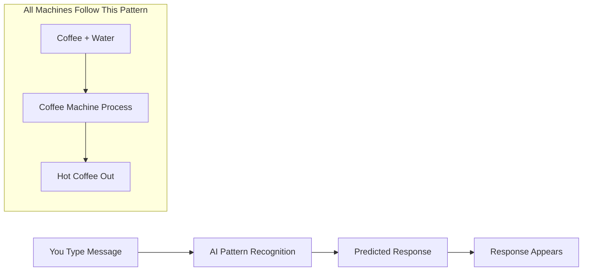

# level 0: what happens when you press send

## what you'll learn

→ The pattern that all machines follow  
→ Why AI feels different from other apps  
→ What happens when you chat with [ChatGPT](https://chatgpt.com)

I pressed send on my message to [ChatGPT](https://chatgpt.com) and got back this perfect response. How did it know exactly what I meant?

## machines follow one pattern

Every machine follows the same pattern:
→ Input: You give it something  
→ Processing: It does something with what you gave it  
→ Output: It gives you back a result

**Coffee machine:** water + coffee pod → heats and brews → coffee  
**Text message:** you type words → phone sends through networks → message appears  
**ATM:** card + PIN → checks your account → gives you cash

[ChatGPT](https://chatgpt.com) does this too. But AI processes differently.

## information becomes data

What's your mom's phone number? That's information in your head.

Where is that number saved in your phone? That's data - information stored where machines can use it.

When you ask [ChatGPT](https://chatgpt.com) a question, you're converting your thoughts into data the machine can process.

## what makes ai different

Traditional machines are literal. You tell them: "If user clicks this button, open that app." They do exactly that.

If someone does something unexpected, traditional machines break. Nobody programmed that situation.

AI learned differently. Instead of programming rules for every situation, we showed AI millions of examples and let it figure out patterns.

---

### clarifier: traditional vs. ai

**Traditional:** Exact rules for every situation  
**AI:** Learn patterns from millions of examples

This is why AI can have conversations - it learned from examples of human communication.

---

## connecting the dots

**What we learned:** All machines follow input → processing → output, but AI processes through pattern recognition instead of predetermined rules

**What's next:** Now we'll explore how pattern recognition works and why you're already an expert at it

## your turn

**Notice today:** What's one app you use that feels rigid compared to AI conversations?

---

→ **Next:** [level 1: how ai works](level-1.md)
