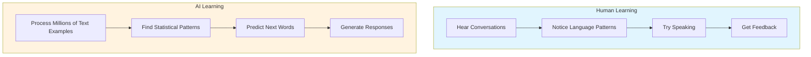

# level 1: how ai works

## what you'll learn

→ Why AI doesn't "think" like humans do  
→ How pattern recognition works (you're already an expert)  
→ Why AI can be brilliant and wrong in the same conversation  
→ How AI learned to communicate

You learned language the same way AI learned language - by recognizing patterns in examples.

When you were little, you heard thousands of conversations, noticed patterns in how people talked, tried using those patterns yourself, and got better through feedback.

No grammar books. No rules. Just pattern recognition from millions of examples.

## you're already a pattern recognition expert

You use pattern recognition every day:

→ Recognizing your friend's voice on the phone  
→ Knowing someone's mood from their facial expression  
→ Predicting which checkout line will move faster  
→ Knowing which route home will have less traffic

None of these came from following rules. They came from noticing patterns in hundreds of previous experiences.

---

### clarifier: how pattern recognition works

**The process:** Experience many examples → Notice what's similar → Make predictions

**Example:** Recognizing your friend's mood
→ Seen your friend happy hundreds of times  
→ Noticed patterns: facial expressions, voice tone, body language  
→ Now you predict their mood from tiny signals

No rulebook needed - just pattern recognition from experience.

---

## the learning formula

All learning works the same way - for you and for AI:

**LOTS OF EXAMPLES → NOTICE PATTERNS → MAKE PREDICTIONS**

The only difference: AI processes millions of examples very quickly. You process them over months and years through lived experience.

The fundamental process is identical.

## why ai can be brilliant and wrong

Since AI works through pattern recognition (just like you do), it can:

**Be brilliant when:**
→ It finds great patterns that match your situation  
→ It connects ideas in ways you hadn't thought of  
→ It draws from patterns you don't have access to

**Be wrong when:**
→ It applies patterns from the wrong context  
→ It finds misleading connections in training data  
→ It predicts what "sounds right" instead of what "is right"

This isn't broken - it's how pattern recognition works. You sometimes misread situations too.

---

### clarifier: why ai gets things wrong

**Pattern recognition isn't perfect:**

**You:** Might misread someone's mood based on limited signals  
**AI:** Might give wrong answer based on misleading patterns

**You:** Sometimes apply patterns incorrectly  
**AI:** Sometimes connects patterns in unexpected ways

Neither humans nor AI are 100% accurate - we're both making educated guesses.

---

## what ai does

AI predicts what words should come next based on patterns it learned from millions of examples.

When you ask "What's the weather like?" AI isn't looking up weather. It's predicting what words usually follow weather-related questions.

When you ask for email help, AI recognizes patterns from millions of emails and applies those patterns to your situation.

---

### clarifier: ai predicts, doesn't understand

**What AI does:**
→ Analyzes patterns in training data  
→ Predicts what response fits the pattern  
→ Generates text that statistically "sounds right"

**What AI doesn't do:**
→ Understand meaning like humans  
→ Look up facts in a database  
→ Know whether its answers are correct

**Example:** When you ask "What's 2+2?" AI doesn't calculate - it predicts that "4" usually follows this pattern.

---

## connecting the dots

**What we learned:** AI uses pattern recognition (just like you do) to predict responses, working with text patterns instead of life experience

**What this builds on:** This explains the "processing" part of input → processing → output from Level 0. AI's processing is pattern recognition and prediction

**Why it matters:** You and AI are both pattern-recognizing systems. You can work together effectively because you understand how pattern recognition works

## your turn

**Try this:** Pay attention to one prediction you make today based on patterns - like how long a line will take. Notice how automatically your brain does this.

**Next time you chat with AI:** Remember it's making pattern-based predictions. How might this change how you phrase your questions?

---

### flashcards for this section

**Front:** How did you learn to speak as a child?  
**Back:** Through pattern recognition - hearing conversations, noticing patterns, trying them out, getting feedback

**Front:** What's the difference between how humans and AI do pattern recognition?  
**Back:** Humans process patterns from life experience over years, AI processes patterns from text data quickly - but the process is identical

**Front:** What does AI do when you ask it a question?  
**Back:** It predicts what words should come next based on patterns it learned from millions of examples

---

→ **Next:** [level 2: where ai gets its knowledge](level-2.md)
