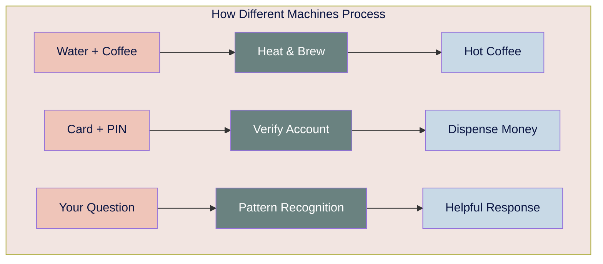
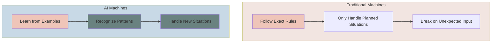

# level 1: what happens when you press send

## navigation
▲ **foundation 1/9** | ← [how to learn anything](how-to-learn-anything.md) | → [level 2: patterns](level-2.md)

## what you'll learn

→ the universal pattern all machines follow  
→ why ai feels different from other apps  
→ how understanding this improves your ai interactions

You ask ChatGPT "Help me write a professional email declining a meeting" and instantly get back a perfectly worded response. How did it know exactly what you needed?

## machines follow one universal pattern

Every machine follows the same basic structure. Whether it's your coffee maker, ATM, or ChatGPT, they all work the same way:

→ **Input**: You give it something  
→ **Processing**: It does something with what you gave it  
→ **Output**: It gives you back a result

ChatGPT follows this same pattern - but processes your input very differently than traditional machines.

## what makes ai different

Traditional machines break when you do something unexpected. Ask a coffee maker to make tea? Nothing happens. It only knows the exact steps someone programmed.

AI learned differently. Instead of programming rules for every situation, we showed AI millions of examples and let it recognize patterns. When you ask something new, AI finds similar patterns from its training.

This is why you can ask ChatGPT to "write like a pirate" and it works - it learned patterns of how pirates talk from examples, not rules.

---

### clarifier: turning thoughts into clear inputs

◆ **Your thoughts become AI instructions:**

**In your head**: "I need help with this email situation"

**Effective input**: "Help me write a polite email declining a meeting invitation because I have a scheduling conflict"

The clearer your input, the better AI's processing and output.

---

## why understanding this improves your ai interactions

Knowing that AI follows input → processing → output helps you:

### optimize your inputs
**Vague input**: "Help me with work stuff"  
**Clear input**: "Help me prioritize my Monday morning tasks: 3 client calls, 2 reports due, and 1 presentation to prep"

**Why this works**: Specific inputs give AI better processing direction

### recognize ai's processing style
AI processes by finding patterns, not following rigid rules:
- It can handle unexpected requests creatively
- It needs context to find the right patterns
- It works better with examples than abstract instructions

### evaluate outputs more effectively
Understanding AI processing helps you judge results:
- **Good output**: Directly addresses your specific input
- **Mediocre output**: Generic response that could apply to anyone
- **Poor output**: Misunderstood your input or found wrong patterns

## practical application: better inputs create better outputs

### strategy 1: be specific about what you want
**Instead of**: "Help me write an email"  
**Try**: "Help me write a follow-up email to a client asking for feedback on the logo design I sent last week"

### strategy 2: provide context for better processing
**Instead of**: "How do I handle this situation?"  
**Try**: "I'm a freelance designer and a client wants unlimited revisions for a fixed price. How should I respond professionally?"

### strategy 3: specify the type of output you need
**Instead of**: "Tell me about marketing"  
**Try**: "Give me 5 specific marketing strategies for a local bakery with a $500 monthly budget"

### strategy 4: recognize when to adjust your input
If AI's output misses the mark:
- **Don't repeat the same input** - AI will likely give a similar response
- **Add more specific context** about what you actually need
- **Show an example** of the type of response you want

## building input awareness

**Notice your communication patterns**:
- How do you ask for help from people?
- What information do you include when explaining problems?
- When do people understand you immediately vs. ask clarifying questions?

**Apply these insights to AI**:
- AI needs similar clarity to people for complex requests
- Context that helps humans helps AI too
- Examples and specifics work better than vague descriptions

## recognizing good ai processing

**Signs AI processed your input well**:
→ Response directly addresses your specific situation  
→ Includes relevant details you mentioned  
→ Matches the tone/style you requested  
→ Provides actionable, specific advice

**Signs AI missed something in processing**:
→ Generic advice that could apply to anyone  
→ Ignores important context you provided  
→ Wrong tone for your situation  
→ Vague suggestions without specifics

## incremental improvement approach

### week 1: input awareness
Pay attention to how you phrase requests to AI. Notice which inputs get better responses.

### week 2: specificity practice
Deliberately add more context and specifics to your AI requests.

### week 3: output evaluation
Start judging AI responses based on how well they address your specific input.

### week 4: input refinement
Practice rephrasing requests when AI's processing seems off-track.

## ◇ connecting the dots

**What we learned**: All machines follow input → processing → output, but AI processes by finding patterns instead of following rigid rules

**Why this matters**: Understanding this helps you provide better inputs, recognize AI's processing style, and evaluate outputs more effectively

**What's next**: Now we'll explore how pattern recognition works and why you're already an expert at it

## your turn

**Input practice**: For your next AI request, consciously think about your input before hitting send. Include specific context and desired output type.

**Processing observation**: Notice how AI responses change when you provide clearer, more specific inputs.

---

### ◈ flashcard for this section

**❯ Front**: What pattern do all machines follow and why does this matter for AI?  
**❮ Back**: Input → Processing → Output. Understanding this helps you provide better inputs and evaluate AI outputs more effectively

**❯ Front**: How does AI processing differ from traditional machines?  
**❮ Back**: Traditional machines follow exact rules, AI finds patterns from examples, making it flexible but requiring clearer context for better results

---

**Sources:**
- Input-Process-Output Model: [Wikipedia](https://en.wikipedia.org/wiki/IPO_model) | [Programming Fundamentals](https://press.rebus.community/programmingfundamentals/chapter/input-process-output-model/)
- AI vs Traditional Programming: [IBM AI Models](https://www.ibm.com/think/topics/ai-model) | [MIT Machine Learning](https://mitsloan.mit.edu/ideas-made-to-matter/machine-learning-explained)
- Machine Learning Fundamentals: [ACAMS AI Concepts](https://www.acamstoday.org/your-ai-cheat-sheet-key-concepts-in-common-sense-terms/)

---

→ **next**: [level 2: how ai recognizes patterns](level-2.md)
