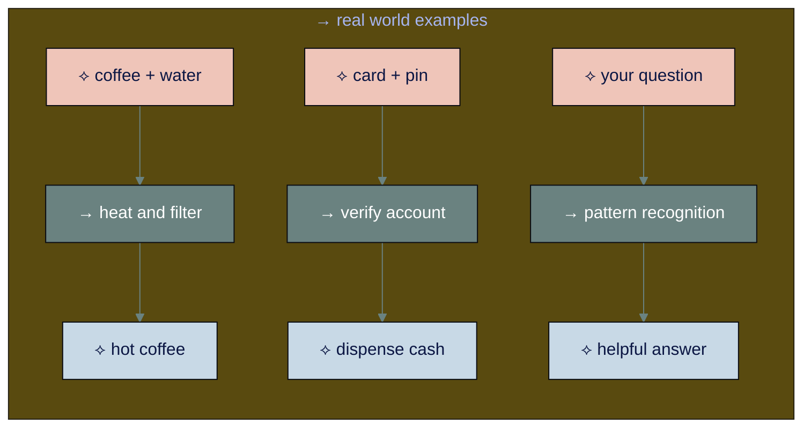

# ○ level 1: how ai actually works

## navigation
▲ **phase 1: understanding ai (1/3)** | ← [learning approach](learning-approach.md) | → [level 2: ai knowledge and limitations](level-2.md)

## what you'll learn

→ the universal pattern all machines follow  
→ how ai recognizes patterns like you do  
→ why ai feels different from other apps you use

you press send on your message to chatgpt and get back this perfect response. how did it know exactly what you meant?

## → all machines follow one pattern

every machine follows the same basic structure:

**input** → **processing** → **output**



chatgpt follows this same pattern, but ai processes information differently than traditional machines.

• • •

## → what makes ai different

**traditional machines** follow exact rules programmed for specific situations. if something unexpected happens, they break because nobody programmed that scenario.

**ai systems** learned patterns from millions of examples. this lets them handle new situations by recognizing similar patterns from their training.

```mermaid
%%{init: {'theme':'base', 'themeVariables': { 'primaryColor': '#0b1643', 'primaryTextColor': '#ffffff', 'lineColor': '#6a8280'}}}%%
graph TD
    subgraph Traditional[↳ traditional programming]
        Rules[→ programmer writes rules<br/>"if x, then y"] --> Limited[→ works only for<br/>planned situations]
        Limited --> Breaks[→ fails on<br/>unexpected input]
    end
    
    subgraph AI[↳ ai approach]
        Examples[⟡ millions of examples<br/>books, conversations, websites] --> Patterns[→ ai learns patterns<br/>what usually comes next]
        Patterns --> Flexible[⟡ handles new situations<br/>by pattern matching]
    end
    
    style Rules fill:#f2e5e1,color:#0b1643
    style Limited fill:#f2e5e1,color:#0b1643
    style Breaks fill:#f2e5e1,color:#0b1643
    style Examples fill:#0b1643,color:#ffffff
    style Patterns fill:#6a8280,color:#ffffff
    style Flexible fill:#efc5b9,color:#0b1643
```

this is why ai can have natural conversations instead of following rigid scripts - whether you're asking about work projects or planning a family vacation.

• • •

## → you're already a pattern recognition expert

you learned to speak without grammar books. you heard thousands of conversations, noticed patterns in how people talked, then used those patterns yourself.

**your learning process:**
1. **examples** - heard many conversations
2. **patterns** - noticed how language works
3. **predictions** - started speaking using those patterns

ai learned the same way, just faster:
- **you:** heard thousands of conversations over years
- **ai:** processed millions of text examples in months

you know when someone's upset before they say anything. you pick the faster checkout line. you recognize a friend's voice instantly. you choose restaurants your family will like. you're doing pattern recognition constantly in work and life.

• • •

<div align="center" style="background-color: #d4c9d2; padding: 15px; border-radius: 8px; margin: 15px 0; border-left: 4px solid #6a8280;">

⟡ **why ai feels different from other software you use**

most apps follow exact rules: click here, get this result. ai learned from examples, so it can understand what you mean even when you don't say it perfectly. that's why talking to ai feels more like talking to a person than using a calculator - whether you're asking for work help or family advice.

</div>

• • •

## → recognizing good vs poor ai responses

since ai works through pattern matching, you can evaluate responses by looking at pattern quality:

### ※ signs ai found good patterns
→ **relevant details** that show ai understood your specific situation  
→ **appropriate examples** that match your context (work, family, hobby)  
→ **specific advice** rather than generic tips that could apply to anyone

### ※ signs ai found wrong patterns
→ **generic responses** that could apply to anyone  
→ **mismatched context** - examples from wrong situation or industry  
→ **overly broad claims** that seem too universal

**work example:** you ask about managing a remote team.  
**good pattern:** mentions "video call fatigue" and "async communication challenges"  
**wrong pattern:** talks about "in-person team building" and "office dynamics"

**family example:** you ask about planning activities for teenagers.  
**good pattern:** suggests "social activities with friends" and "age-appropriate independence"  
**wrong pattern:** recommends "toddler-friendly games" and "nap schedules"

• • •

## → improving ai pattern recognition

### ⌘ give better context
**instead of:** "help me with my business"  
**try:** "i run a small bakery in a suburban neighborhood that serves mostly local families and morning commuters. help me increase weekday afternoon sales."

**instead of:** "help me plan activities"  
**try:** "i need indoor activities for my 8-year-old daughter and her two friends during a rainy saturday afternoon. they like crafts and games but get bored easily."

### ⌘ redirect when patterns seem off
**when ai gives generic advice:** "that seems too general. can you give me specific examples for a small bakery?"

**when ai finds good patterns:** "that bakery-school partnership idea works well. what are 3 specific ways to approach local elementary schools?"

• • •

## → your turn

**pattern awareness:** in your next conversation with any ai tool, notice whether the response feels specifically relevant to your situation or generically applicable to anyone.

**context experiment:** try asking the same question with minimal context versus rich context. notice how the quality and relevance of responses differ.

• • •

## connecting the dots

all machines follow input → processing → output, but ai processes through pattern recognition from examples instead of predetermined rules. understanding this helps you provide better context and recognize when ai responses are useful versus when they need verification.

you're already excellent at pattern recognition in your daily life - now you understand how ai does it too.

you understand the basics of how ai works. now let's explore what ai knows, where that knowledge comes from, and how to verify ai responses.

---

### flashcard for this section

<div style="background: linear-gradient(135deg, #f2e5e1 0%, #c8d9e6 100%); padding: 20px; border-radius: 12px; margin: 20px 0;">

**→ front**: what three steps do all machines follow?  
**⟡ back**: input (receive something), processing (do something with it), output (give back a result)

**→ front**: how did both you and ai learn to communicate?  
**⟡ back**: same process: examples (heard/read many conversations) → patterns (noticed how language works) → predictions (used patterns to communicate)

**→ front**: why can ai handle new situations?  
**⟡ back**: it learned patterns from millions of examples, so it can recognize similar situations and apply what it learned

</div>

---

**sources:**
- input-process-output model: [ieee systems engineering](https://ieeexplore.ieee.org/document/7042431) | [programming fundamentals](https://press.rebus.community/programmingfundamentals/chapter/input-process-output-model/)
- pattern recognition: [mit technology review](https://www.technologyreview.com/2021/07/20/1029644/language-ai-gpt-3-learning-machine-understanding/) | [stanford ai research](https://ai.stanford.edu/blog/understanding-search/)

---

→ **next**: [level 2: ai knowledge and limitations](level-2.md)
