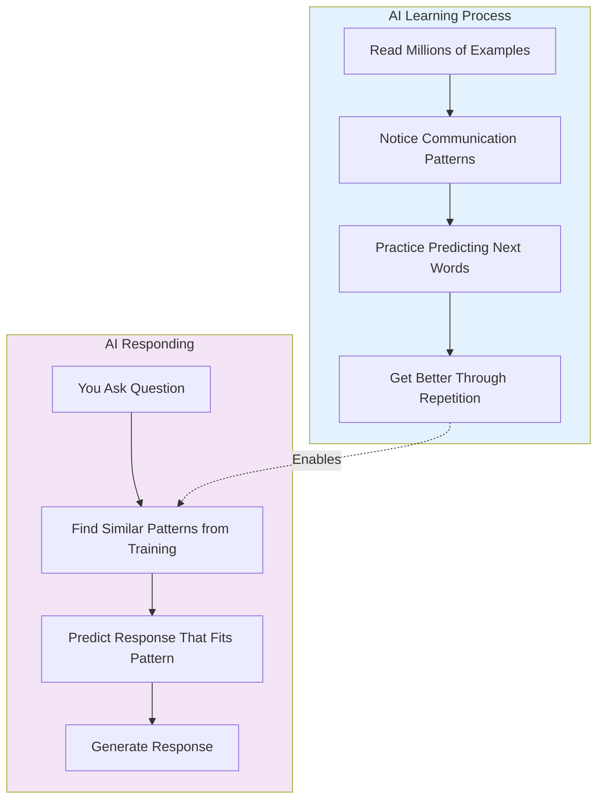
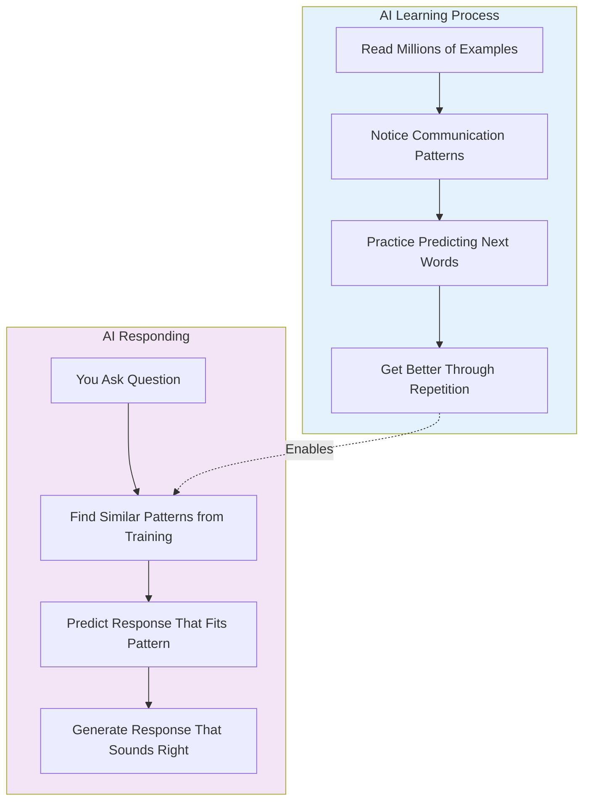

# level 2: where ai gets its knowledge

## what you'll learn

→ How AI learns from examples (not memorizing facts)  
→ Why AI sometimes gets things confidently wrong  
→ The difference between AI with web access and training-only AI

Now we'll explore where AI gets all those patterns from and why it sometimes gets things confidently wrong.

## how ai learns from examples

The learning process:
→ **Collect millions of examples:** Books, websites, conversations, articles  
→ **Find patterns:** Notice how people write and communicate  
→ **Practice predicting:** Guess what word comes next in millions of sentences  
→ **Get feedback:** Learn from right and wrong guesses  
→ **Repeat millions of times:** Until predictions become accurate

AI is like someone who read every book in every library but can't tell you which book any fact came from. It learned patterns of how information is presented, not the sources.

---

### clarifier: what is training data?

**Training data** = all the examples AI learns from

**Sources include:** Websites, books, Wikipedia, conversations, news articles, academic papers

**Important:** AI doesn't "remember" these sources. It learns patterns from them, not specific facts.

---

## what ai knows vs. remembers

**Traditional AI models learned patterns about:**
→ How people structure explanations  
→ What information usually goes together  
→ How conversations normally flow

**Traditional AI models don't have:**
→ A database of facts they can look up  
→ Memory of specific sources from training  
→ Knowledge of what happened after training cutoff

**AI tools with web access can now:**
→ Search for current information  
→ Read and analyze web content in real-time  
→ Cite specific sources

---

### clarifier: two types of ai knowledge

**Training knowledge:** Patterns learned during training
→ Limited by training cutoff date  
→ Can't cite specific sources

**Real-time knowledge:** Current information from web search
→ Can access today's information  
→ Can cite specific sources and links

Many modern AI tools like [Perplexity](https://perplexity.ai) and [Claude](https://claude.ai) with research combine both.

---

## why ai gets things confidently wrong

This is the most important concept for working with AI effectively.

AI makes mistakes because:
→ **It predicts based on patterns, not facts:** If wrong information appeared frequently in training data, AI might predict it  
→ **It applies patterns incorrectly:** AI might use patterns from the wrong context  
→ **It fills gaps with predictions:** When AI doesn't know something, it predicts what "sounds right"  
→ **It doesn't know when it doesn't know:** AI can't tell the difference between confident knowledge and educated guessing

---

### clarifier: what is a "hallucination"?

**Hallucination** = when AI gives a confident answer that's completely wrong

**Examples:**
→ Making up fake research studies that sound real  
→ Creating fictional quotes from real people  
→ Inventing plausible but wrong historical facts

**How to handle:** Always verify important facts, names, dates, and sources.

---

## the training data reality

Training data includes:
→ **High-quality sources** (academic papers, well-edited books)  
→ **Mixed-quality sources** (random websites, social media)  
→ **Outdated information** (old articles with superseded facts)  
→ **Some incorrect information** (mistakes that existed online)

AI learned patterns from all of this, not just the accurate parts. This is why it can confidently state incorrect information.

## building judgment about ai responses

**Where AI excels:**
→ **Brainstorming ideas** (great at finding creative patterns)  
→ **Explaining concepts** (learned from many explanations)  
→ **Improving writing** (trained on millions of examples)  
→ **Structuring information** (recognized common organizational patterns)

**Where AI struggles:**
→ **Specific recent events** (training cutoff limitations)  
→ **Exact statistics or dates** (prediction vs. fact lookup)  
→ **Personal details about people** (limited specific information)

**My approach:**
→ Use basic AI for patterns, structure, and general knowledge  
→ Use web-enabled AI for current information and research  
→ Always verify important facts regardless of AI type

## connecting the dots

**What we learned:** AI learns patterns from massive amounts of text but doesn't memorize facts or sources, which explains both its capabilities and limitations

**What this builds on:** This explains why AI's pattern recognition from Level 1 can be brilliant at some things and unreliable at others - it depends on the patterns in its training data

**What's next:** Now we'll explore how AI broke all the rules of traditional programming, which explains why AI conversations feel so natural

## your turn

**Try this:** Next time you use AI, remember it's predicting based on patterns from training data. Think about whether you need to fact-check the response.

**Consider:** What's one area where you'd definitely want to double-check AI information before trusting it?

---

### flashcards for this section

**Front:** How does AI learn?  
**Back:** By studying millions of examples, finding patterns in communication, and practicing predicting what word comes next

**Front:** What's an AI hallucination?  
**Back:** When AI gives a confident answer that's completely wrong - it predicted a plausible-sounding response that isn't true

**Front:** Why does AI sometimes give confident wrong answers?  
**Back:** AI predicts what "sounds right" based on patterns, not facts. It can't tell the difference between confident knowledge and educated guessing

---

→ **Next:** [level 3: traditional programming vs ai](level-3.md)
→ The difference between AI with web access and training-only AI  
→ How to verify important information before trusting it

Understanding how AI learns explained both its incredible capabilities and its frustrating limitations for me. It also helped me develop better judgment about when to trust AI responses and when to double-check.

## how ai learns

Remember how we said AI learns from examples? The learning process:

→ **Collect millions of examples:** Books, websites, conversations, articles  
→ **Find patterns:** Notice how people typically write, communicate, and structure ideas  
→ **Practice predicting:** Guess what word comes next in millions of sentences  
→ **Get feedback:** Learn from right and wrong guesses  
→ **Repeat millions of times:** Until predictions become very accurate

Think of it as the most intensive reading course ever created, but the student never memorizes the books.

---

### clarifier: what is training data?

**Training data** = all the examples AI learns from

**Sources include:**
→ Websites and articles (how people write online)  
→ Books and literature (formal writing styles)  
→ Wikipedia (factual information structure)  
→ Public conversations and forums (casual communication)  
→ News articles (current events and reporting styles)  
→ Academic papers (technical and scientific writing)

**Important:** AI doesn't "remember" these sources. It learns patterns from them, not specific facts.

---

AI is like someone who read every book in every library but can't tell you which book any specific fact came from. It learned the patterns of how information is typically presented, but not the sources.

## what ai knows vs. what it remembers

Traditional AI models learned patterns about:
→ How people typically structure explanations  
→ What information usually goes together  
→ How conversations normally flow  
→ Common ways to express ideas  
→ General knowledge that appears frequently in training data

Traditional AI models don't have:
→ A database of facts they can look up  
→ Memory of specific sources from training  
→ Ability to cite where training information came from  
→ Knowledge of what happened after training cutoff  
→ Personal information about you (unless you tell them)

**But** - AI tools with web access can now:
→ Search for and find current information  
→ Read and analyze web content in real-time  
→ Cite specific sources for their information  
→ Access recent news, events, and updates  
→ Combine their training knowledge with fresh research

---

### clarifier: two types of ai knowledge

**Training knowledge (from learning process):**
→ Patterns and general knowledge learned during training  
→ Limited by training cutoff date  
→ Can't cite specific sources  
→ Example: "Based on my training, photosynthesis works like this..."

**Real-time knowledge (from web access):**
→ Current information found through web search  
→ Can access information from today  
→ Can cite specific sources and links  
→ Example: "According to a CNN article from yesterday, [specific current event]"

Many modern AI tools combine both.

---

---

### clarifier: training cutoff

**Training cutoff** = the last date AI learned from new information

**Example:** If AI was trained in early 2024:
→ ✓ Knows about: Events through early 2024  
→ ✗ Doesn't know: Anything that happened after training ended

**Why this matters:**
→ AI can't learn from your conversation to help other users  
→ AI doesn't know recent news or current events  
→ AI can't update its knowledge in real-time

Each AI has a different cutoff date.

---

**Recent development:** Some AI tools now have web access!

---

### clarifier: ai with real-time access

**Newer AI tools can now access current information:**

→ **[Perplexity](https://perplexity.ai):** Searches the web and cites sources for current information  
→ **[Claude](https://claude.ai) with research:** Can search and analyze real-time data  
→ **[ChatGPT](https://chatgpt.com) with web browsing:** Can look up recent information online  
→ **[Google Gemini](https://gemini.google.com):** Connected to Google's real-time search  
→ **NotebookLM:** Upload your own documents and research for AI analysis

**How web-enabled AI works:**
1. You ask a question
2. AI searches the web for current information
3. AI reads and analyzes what it finds
4. AI combines its training knowledge with fresh information
5. AI gives you an answer with sources

---

What this means: You now have three types of AI knowledge:
1. **Training knowledge** (patterns learned during training)
2. **Real-time web knowledge** (current information from searches)  
3. **Your custom knowledge** (analysis of documents you provide)

## why ai sometimes gets things wrong

Understanding the learning process explains AI's most confusing behavior: confident mistakes.

AI makes mistakes because:
→ **It predicts based on patterns, not facts:** If wrong information appeared frequently in training data, AI might predict it  
→ **It applies patterns incorrectly:** AI might use patterns from one context in the wrong situation  
→ **It fills gaps with predictions:** When AI doesn't know something, it predicts what "sounds right"  
→ **It doesn't know when it doesn't know:** AI can't tell the difference between confident knowledge and educated guessing

---

### clarifier: what is a "hallucination"?

**Hallucination** = when AI gives a confident answer that's completely wrong

**Why it happens:** AI predicts what response would statistically fit the pattern. Sometimes this creates plausible-sounding but false information.

**Examples:**
→ Making up fake research studies that sound real  
→ Creating fictional quotes from real people  
→ Inventing plausible but wrong historical facts  
→ Generating fake website links that look legitimate

**How to handle:** Always verify important facts, names, dates, and sources. Treat AI responses as drafts that need fact-checking.

---

## real examples from my experience

Where AI excelled:
→ **Helping me brainstorm ideas** (great at finding creative patterns)  
→ **Explaining complex concepts** (learned from many explanations)  
→ **Improving my writing style** (trained on millions of examples of good writing)  
→ **Structuring information** (recognized common organizational patterns)

Where AI struggled:
→ **Specific recent events** (training cutoff limitations - though this is changing with web-enabled AI)  
→ **Exact statistics or dates** (prediction vs. fact lookup - unless AI can search for current data)  
→ **Personal details about people** (limited specific information in training)  
→ **Company-specific information** (not in public training data - unless AI can research it)

The game changer: AI tools with web access have solved many of these limitations. I can now ask [Perplexity](https://perplexity.ai) about yesterday's news or use [Claude's](https://claude.ai) research feature to analyze current market data.

My updated rules:
→ Use basic AI for patterns, structure, and general knowledge  
→ Use web-enabled AI for current information and research  
→ Always verify important facts regardless of the AI type

---

### clarifier: ai knowledge strengths and weaknesses

**AI is excellent at:**
→ General knowledge that appears frequently in text  
→ Common patterns in writing and communication  
→ Explaining concepts in multiple ways  
→ Recognizing connections between ideas  
→ Helping with creative and analytical thinking  
→ Structuring and organizing information

**AI struggles with:**
→ Recent events after training cutoff  
→ Specific facts, dates, and statistics  
→ Personal information about individuals  
→ Company-specific or proprietary knowledge  
→ Knowing when it doesn't know something  
→ Distinguishing reliable from unreliable sources in training

---

## the training data reality

AI training data isn't perfect.

Training data includes:
→ **High-quality sources** (academic papers, well-edited books)  
→ **Mixed-quality sources** (random websites, social media)  
→ **Outdated information** (old articles with superseded facts)  
→ **Conflicting viewpoints** (different perspectives on the same topic)  
→ **Some incorrect information** (mistakes that existed online)

Why this matters: AI learned patterns from all of this, not just the accurate parts. This is why it can sometimes confidently state incorrect information - it's applying patterns it learned from imperfect sources.

## building better ai judgment

Understanding how AI learns helped me become much more effective at using it:

**Before understanding training:** I treated AI responses as either completely right or completely wrong.

**After understanding training:** I see AI as a pattern-matching partner that needs my judgment.

Questions I now ask:
→ Is this the type of information AI would be good at? (patterns, explanations, structure)  
→ Does this require recent or specific factual information? (need to verify)  
→ Am I asking for creative help or precise facts? (different reliability levels)  
→ How important is accuracy for this use case? (determines verification level)

## heart check-in

Does understanding how AI learns from imperfect data help explain why it can be both brilliant and wrong? It's normal to feel both impressed by AI's capabilities and more cautious about verifying its responses.

Remember: AI's strength is recognizing patterns and making connections, not being a perfect database of facts.

## your turn

**Quick reflection:** What surprised you about how AI learns and what it knows?

**Try this:** Next time you use AI, remember it's predicting based on patterns from training data. Think about whether you need to fact-check the response.

**Think about verification:** What's one area where you'd definitely want to double-check AI information before trusting it?

---

### flashcards for this section

**Front:** How does AI learn?  
**Back:** By studying millions of examples, finding patterns in how people communicate, and practicing predicting what word comes next

**Front:** What's the difference between training knowledge and real-time knowledge?  
**Back:** Training knowledge comes from patterns learned during training (limited by cutoff date), real-time knowledge comes from web search (current information with sources)

**Front:** Why does AI sometimes give confident wrong answers?  
**Back:** AI predicts what "sounds right" based on patterns, not facts. It can't tell the difference between confident knowledge and educated guessing

**Front:** What's an AI hallucination?  
**Back:** When AI gives a confident answer that's completely wrong - it predicted a plausible-sounding response that isn't true

---

→ **Next:** [level 3: traditional programming vs ai](level-3.md)
