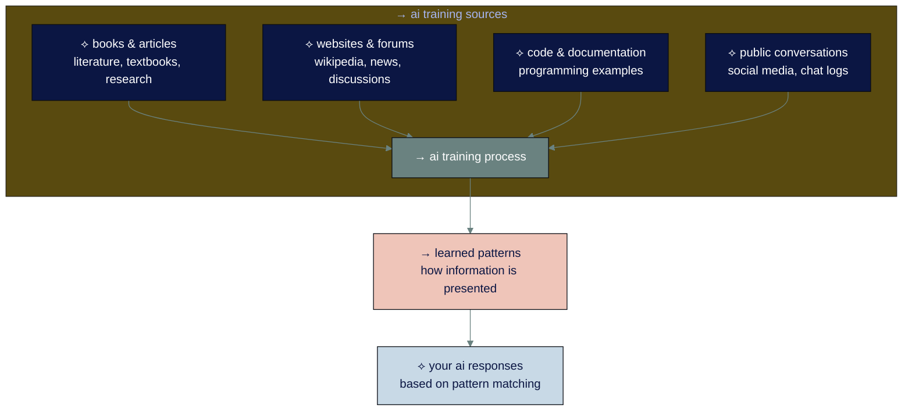
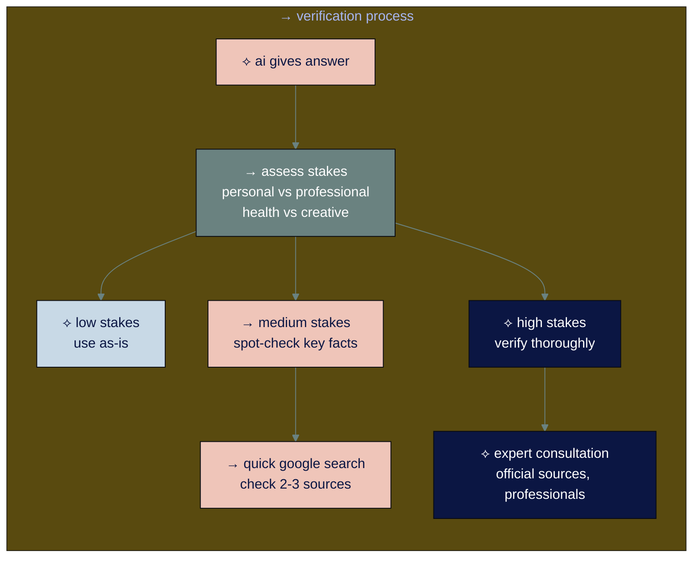

# ◐ level 2: ai knowledge and limitations

## navigation
▲ **phase 1: understanding ai (2/3)** | ← [level 1: how ai actually works](level-1.md) | → [level 3: types of ai and when to use each](level-3.md)

## what you'll learn

→ where ai learned those millions of patterns  
→ why ai sometimes confidently gives wrong answers  
→ practical verification techniques you can use immediately  
→ how ai's memory works and why it matters

chatgpt just told you something that sounds totally legit but is completely made up. what's going on here?

## → where ai gets its knowledge

ai learned patterns from massive text collections across the internet:

ai found patterns in how information is typically presented and learned to predict what words usually come next. but it can't tell you which specific source any information came from.

• • •

⟡ **ai predicts what sounds right, not what is right**

when ai doesn't know something, it doesn't say "i don't know." instead, it predicts what a plausible answer would look like based on patterns. this is why verification matters for important information - whether it's health advice for your family or financial planning decisions.

• • •

## → the verification framework you need

here's a practical system for checking ai information in both work and personal contexts:

**the key:** match your verification effort to the consequences of being wrong.

• • •

## → context windows and conversation limits

ai has a **context window** - a limit to how much conversation it can read at once. think of it like ai's working memory.

**what happens:** when conversations get too long, ai automatically drops the earliest messages to make room for new ones.

**example:**
- **early in chat:** "i'm planning a birthday party for my 5-year-old daughter"
- **50 messages later:** "add balloons to the party plan"
- **ai response:** "what party plan? can you tell me more about the event?"

the ai isn't being difficult - it literally cannot see your early message anymore.

• • •

## → why responses sometimes drift

since ai builds responses piece by piece without planning ahead, conversations can go off track:

**strong starts:** early pieces focus on your specific question  
**gradual drift:** as responses get longer, ai follows its own tangents  
**no course correction:** ai can't step back and think "i'm getting off topic"

**example:** you ask "how do i plan a family vacation to costa rica?" ai starts perfectly but then drifts into general central america travel advice because one piece led to another.

• • •

## → current ai memory capabilities

**2025 update:** ai memory has evolved significantly and now works across conversations:

**chatgpt** now has two types of memory:
- **saved memories:** details you explicitly ask it to remember
- **chat history:** references past conversations automatically (for all users now)

**claude** is developing similar memory features, currently available in claude 4 when given access to local files.

**what this means:** ai can now maintain context across conversations, but you control what it remembers and can delete memories anytime.

• • •

## → practical verification strategies

### ※ when to trust ai responses

**generally reliable for:**
→ general knowledge that's well-established  
→ how-to explanations for common tasks (cooking, basic repairs, learning)  
→ creative work where accuracy isn't critical (brainstorming, story ideas)  
→ concept explanations you can judge yourself

### ※ always verify for

→ **health information** affecting you or your family  
→ **financial advice** or investment recommendations  
→ **current events** or recent developments  
→ **specific statistics** or data points  
→ **legal matters** or official procedures  
→ **children's safety** or educational decisions

### ※ quick verification techniques

**cross-reference multiple sources:** check ai information against 2-3 independent sources

**use ai tools with real-time search:** [perplexity](https://perplexity.ai), [chatgpt with web search](https://chatgpt.com), claude with search capabilities

**apply the "sounds too good/bad to be true" test:** if information seems surprising, verify it

**ask for sources:** "what sources should i check to verify this information?"

**consult professionals:** for health, legal, or financial decisions affecting your family

• • •

## → working within conversation limits

understanding context windows helps you have better ai conversations in both work and personal contexts:

### ⌘ refresh context regularly
every 10-15 exchanges, restate important information.

**try:** "quick reminder: we're planning a family trip to costa rica in december with kids ages 8 and 12, budget $4000. now, about the hotel recommendations..."

### ⌘ start new conversations for new topics
don't pile everything into one endless chat.

**instead of:** adding "oh, and help me plan my daughter's birthday party" to your work project  
**try:** starting a fresh conversation for the birthday party planning

### ⌘ use specific references
**instead of:** "can you expand on that approach?"  
**try:** "can you expand on the meal planning approach you just suggested for our costa rica trip?"

### ⌘ recognize memory problems
watch for signs that ai has lost important context:

→ **asking for previously provided information**  
→ **generic responses** instead of specific help  
→ **not understanding references** to "the trip" or "your project"  
→ **contradicting earlier advice**

**when you notice these:** provide a context refresh or start a new conversation.

• • •

## → your turn

**verification practice:** pick one health or financial fact from an ai response and spend 2 minutes verifying it with an independent source like [mayo clinic](https://www.mayoclinic.org) or [consumer reports](https://www.consumerreports.org).

**context experiment:** try a long conversation (20+ exchanges) about planning something complex like a family vacation. notice when ai starts losing track of early context. practice providing context refreshers.

**memory awareness:** in your next ai conversation, notice that responses are built piece by piece. watch how each new word follows logically from what came before.

• • •

## connecting the dots

ai learned patterns from massive internet data but can't distinguish reliable facts from predictions. it builds responses piece by piece without planning, which explains both its conversational ability and its tendency to drift or make things up.

context windows limit how much ai can remember in long conversations, which is why providing regular context refreshers improves response quality.

understanding these technical limitations helps you use ai effectively while avoiding common frustrations - whether you're planning a work project or a family vacation.

you understand how ai learns patterns and where to be careful. now discover the four types of ai tools and which ones match your needs.

---

### flashcard for this section

**→ front**: where does ai get its knowledge from?  
**⟡ back**: books, websites, code, and conversations from the internet - it learned patterns from massive text collections

**→ front**: why does ai sometimes give wrong answers confidently?  
**⟡ back**: it predicts what sounds right based on patterns, not facts - when it doesn't know something, it creates plausible-sounding responses

**→ front**: when should you verify ai responses?  
**⟡ back**: health information, financial advice, current events, statistics, legal matters, children's safety decisions

---

**sources:**
- ai training data: [stanford ai data](https://crfm.stanford.edu/2021/10/18/forecasting.html) | [mit technology review](https://www.technologyreview.com/2020/08/22/1007539/gpt3-openai-language-generator-artificial-intelligence-ai-opinion/)
- ai hallucinations: [ibm ai research](https://research.ibm.com/blog/what-are-ai-hallucinations) | [anthropic safety research](https://www.anthropic.com/research/measuring-progress-on-scalable-oversight-for-large-language-models)
- chatgpt memory: [openai memory updates](https://openai.com/index/memory-and-new-controls-for-chatgpt/) | [memory faq](https://help.openai.com/en/articles/8590148-memory-faq)

---

→ **next**: [level 3: types of ai and when to use each](level-3.md)
