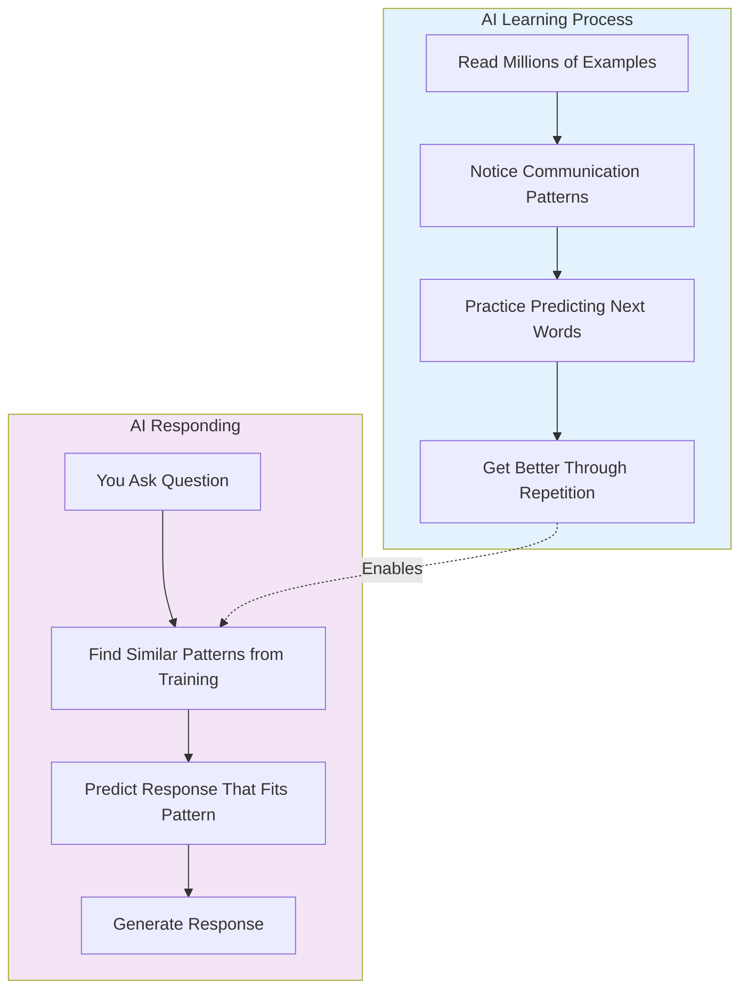

# level 2: where ai gets its knowledge

## what you'll learn

→ How AI learns from examples (not memorizing facts)  
→ Why AI sometimes gets things confidently wrong  
→ The difference between AI with web access and training-only AI

Now we'll explore where AI gets all those patterns from and why it sometimes gets things confidently wrong.

## how ai learns from examples

The learning process:
→ **Collect millions of examples:** Books, websites, conversations, articles  
→ **Find patterns:** Notice how people write and communicate  
→ **Practice predicting:** Guess what word comes next in millions of sentences  
→ **Get feedback:** Learn from right and wrong guesses  
→ **Repeat millions of times:** Until predictions become accurate

AI is like someone who read every book in every library but can't tell you which book any fact came from. It learned patterns of how information is presented, not the sources.

---

### clarifier: what is training data?

**Training data** = all the examples AI learns from

**Sources include:** Websites, books, Wikipedia, conversations, news articles, academic papers

**Important:** AI doesn't "remember" these sources. It learns patterns from them, not specific facts.

---

## what ai knows vs. remembers

**Traditional AI models learned patterns about:**
→ How people structure explanations  
→ What information usually goes together  
→ How conversations normally flow

**Traditional AI models don't have:**
→ A database of facts they can look up  
→ Memory of specific sources from training  
→ Knowledge of what happened after training cutoff

**AI tools with web access can now:**
→ Search for current information  
→ Read and analyze web content in real-time  
→ Cite specific sources

---

### clarifier: two types of ai knowledge

**Training knowledge:** Patterns learned during training
→ Limited by training cutoff date  
→ Can't cite specific sources

**Real-time knowledge:** Current information from web search
→ Can access today's information  
→ Can cite specific sources and links

Many modern AI tools like [Perplexity](https://perplexity.ai) and [Claude](https://claude.ai) with research combine both.

---

## why ai gets things confidently wrong

This is the most important concept for working with AI effectively.

AI makes mistakes because:
→ **It predicts based on patterns, not facts:** If wrong information appeared frequently in training data, AI might predict it  
→ **It applies patterns incorrectly:** AI might use patterns from the wrong context  
→ **It fills gaps with predictions:** When AI doesn't know something, it predicts what "sounds right"  
→ **It doesn't know when it doesn't know:** AI can't tell the difference between confident knowledge and educated guessing

---

### clarifier: what is a "hallucination"?

**Hallucination** = when AI gives a confident answer that's completely wrong

**Examples:**
→ Making up fake research studies that sound real  
→ Creating fictional quotes from real people  
→ Inventing plausible but wrong historical facts

**How to handle:** Always verify important facts, names, dates, and sources.

---

## the training data reality

Training data includes:
→ **High-quality sources** (academic papers, well-edited books)  
→ **Mixed-quality sources** (random websites, social media)  
→ **Outdated information** (old articles with superseded facts)  
→ **Some incorrect information** (mistakes that existed online)

AI learned patterns from all of this, not just the accurate parts. This is why it can confidently state incorrect information.

## building judgment about ai responses

**Where AI excels:**
→ **Brainstorming ideas** (great at finding creative patterns)  
→ **Explaining concepts** (learned from many explanations)  
→ **Improving writing** (trained on millions of examples)  
→ **Structuring information** (recognized common organizational patterns)

**Where AI struggles:**
→ **Specific recent events** (training cutoff limitations)  
→ **Exact statistics or dates** (prediction vs. fact lookup)  
→ **Personal details about people** (limited specific information)

**My approach:**
→ Use basic AI for patterns, structure, and general knowledge  
→ Use web-enabled AI for current information and research  
→ Always verify important facts regardless of AI type

## connecting the dots

**What we learned:** AI learns patterns from massive amounts of text but doesn't memorize facts or sources, which explains both its capabilities and limitations

**What this builds on:** This explains why AI's pattern recognition from Level 1 can be brilliant at some things and unreliable at others - it depends on the patterns in its training data

**What's next:** Now we'll explore how AI broke all the rules of traditional programming, which explains why AI conversations feel so natural

## your turn

**Try this:** Next time you use AI, remember it's predicting based on patterns from training data. Think about whether you need to fact-check the response.

**Consider:** What's one area where you'd definitely want to double-check AI information before trusting it?

---

### flashcards for this section

**Front:** How does AI learn?  
**Back:** By studying millions of examples, finding patterns in communication, and practicing predicting what word comes next

**Front:** What's an AI hallucination?  
**Back:** When AI gives a confident answer that's completely wrong - it predicted a plausible-sounding response that isn't true

**Front:** Why does AI sometimes give confident wrong answers?  
**Back:** AI predicts what "sounds right" based on patterns, not facts. It can't tell the difference between confident knowledge and educated guessing

---

→ **Next:** [level 3: traditional programming vs ai](level-3.md)
