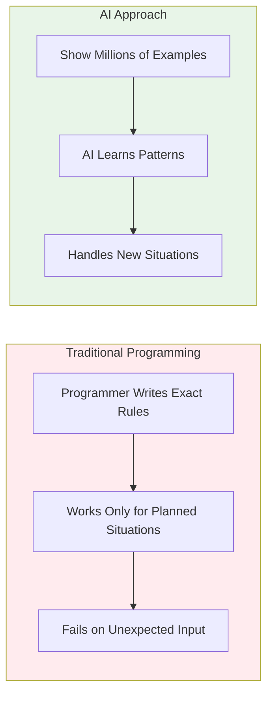

# level 3: traditional programming vs ai

## what you'll learn

→ What programming is (simply explained)  
→ Why traditional programs feel rigid  
→ How AI broke all the rules  
→ Why AI conversations feel natural



Now we'll explore how AI broke all the rules of traditional programming, which explains why AI conversations feel so natural.

## what programming is

Apps are instruction lists for computers. Someone has to write those instructions - that's called programming.

```
if user_clicks_button:
    show_message("Hello!")
else:
    do_nothing()# level 3: traditional programming vs ai

## what you'll learn

→ What programming is (without getting technical)  
→ Why traditional programs feel rigid  
→ How AI broke all the rules  
→ Why AI conversations feel natural


Now we get to the part that changed everything about computers. But first, let me explain what programming is.

## what is programming

Apps are instruction lists for computers. Someone has to write those instructions.

That someone is called a programmer. Those instructions are written in code.

---

### clarifier: programming basics

**Programmer** = person who writes instructions for computers  
**Code** = the written instructions (like a recipe)

**Simple example:**
```
if user_clicks_button:
    show_message("Hello!")
else:
    do_nothing()
```

This tells the computer: "If someone clicks the button, show 'Hello!' If they don't click, do nothing."

---

Code looks like a detailed recipe written in a special language computers understand. Underneath, it all becomes 1s and 0s.

What programmers do:
→ Think through every possible situation users might encounter  
→ Write specific instructions for each situation  
→ Test to make sure instructions work  
→ Fix problems when instructions don't work as expected

## how traditional programming works

For a simple task app, traditional programming looks like:
→ If user types "weather" → show weather app  
→ If user types "music" → play music  
→ If user types "pizza" → open food delivery  
→ If user types anything else → show "I don't understand"

You have to predict every possible way someone might ask for something. Miss one variation and the program breaks.

## the problem with rules

Traditional programming worked for simple, predictable tasks. But it fell apart with real human communication.

What if someone types:
→ "Is it nice outside?" (wants weather)  
→ "I'm hungry for Italian food" (wants food delivery)  
→ "What's on my schedule?" (wants calendar)  
→ "Play something upbeat" (wants music)

None of these match the exact programmed phrases. Traditional programming would fail on all of them.

---

### clarifier: why traditional programming struggles

**Human communication:** Flexible, contextual, creative
→ 100 ways to ask about weather  
→ Subtle meanings and implications  
→ Context matters for understanding

**Traditional programming:** Rigid, literal, exact
→ Must match exact programmed phrases  
→ Can't understand context or implications  
→ Fails on any unexpected input

---

## the ai revolution

AI flipped the approach completely.

Instead of writing rules for every situation, we show AI millions of examples and let it figure out the patterns.

**Traditional approach:** "If user says X, do Y"  
**AI approach:** "Here are a million conversations. Figure out how people communicate."

---

### clarifier: training vs. programming

**Traditional programming:**
→ Programmer writes: "If user says 'weather', show weather app"  
→ Works for: "weather"  
→ Fails for: "Is it nice out?" "Should I bring an umbrella?"

**AI training:**
→ Show AI millions of weather-related conversations  
→ AI notices patterns in how people ask about weather  
→ AI responds to weather questions it's never seen before

---

This was revolutionary because suddenly computers could handle the messy, unpredictable way humans communicate.

## what this means in practice

**Traditional programs:**
→ Work perfectly for planned situations  
→ Fail completely for unexpected ones  
→ Feel rigid and frustrating  
→ Require exact commands

**AI programs:**
→ Handle new situations by finding similar patterns  
→ Sometimes make unexpected connections  
→ Feel more flexible and conversational  
→ Understand natural language

## my experience

When I started using [Claude](https://claude.ai) for writing help, I was amazed that I could just talk to it normally.

I didn't have to learn special commands. I could say:
→ "Help me write an email that sounds professional but friendly"  
→ "Make this paragraph clearer"  
→ "What's a better way to say this?"

[Claude](https://claude.ai) recognizes patterns from millions of examples of good writing and helpful editing.

---

### clarifier: why ai responses vary

**With traditional programming:**
→ Same input always produces identical output  
→ Predictable but limited

**With AI:**
→ Same question might get slightly different responses  
→ AI finds different relevant patterns each time  
→ More flexible but sometimes unpredictable

This is why AI can surprise you - it's not following a script.

---

## the tradeoff

This flexibility comes with a tradeoff. AI can handle unexpected situations, but it can also make unexpected mistakes.

**Traditional programming:** Predictable but rigid  
**AI:** Flexible but sometimes unpredictable

Understanding this helps explain why AI sometimes gives brilliant responses and other times says something completely off.

It's finding patterns in ways you might not expect.

## why this matters for you

Understanding this difference helps you:
→ **Set realistic expectations:** AI is flexible but not perfect  
→ **Communicate naturally:** You don't need special commands  
→ **Troubleshoot problems:** When AI misunderstands, it's usually a pattern recognition issue  
→ **Work collaboratively:** AI can adapt to your communication style

## connecting the dots

**What we learned:** AI broke the traditional programming model by learning from examples instead of following predetermined rules, which is why AI conversations feel natural

**What this builds on:** This explains why AI uses pattern recognition from training data instead of following rigid input → processing → output rules

**Why it matters:** You're not just using a more advanced program - you're communicating with a system that learned from human examples

## your turn

**Try this:** Next time you use AI, pay attention to how naturally you can communicate compared to other apps. Notice how you don't need special commands.

**Compare:** Think of an app that feels rigid because it follows traditional programming. How is that different from talking to AI?

---

### flashcards for this section

**Front:** What's the key difference between traditional programming and AI?  
**Back:** Traditional programming writes exact rules for every situation, AI learns patterns from millions of examples and applies them to new situations

**Front:** Why can AI handle conversations it's never seen before?  
**Back:** AI learned patterns of human communication from millions of examples, so it can recognize similar patterns in new conversations

**Front:** What's the tradeoff of AI's flexibility?  
**Back:** AI can handle unexpected situations but can also make unexpected mistakes, while traditional programs are predictable but rigid

---

→ **Next:** [level 4: ai types and what they do](level-4.md)
