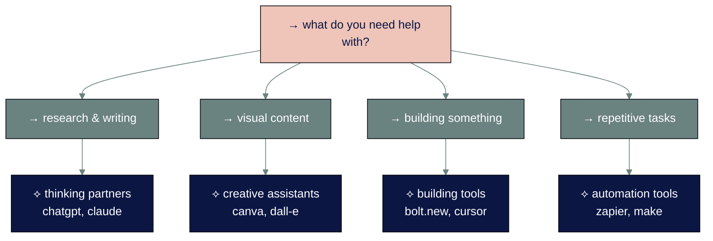

# ◐ level 3: types of ai and when to use each

## navigation
▲ **phase 1: understanding ai (3/3)** | ← [level 2: ai knowledge and limitations](level-2.md) | → [level 4: your first ai conversations](level-4.md)

## what you'll learn

→ the four main types of ai and what each does best  
→ how to avoid tool overwhelm with a simple decision framework  
→ where to find the right ai tool when you need it

new ai tools launch every week. it's overwhelming. don't chase every shiny thing - most people need two tools, maybe three.

## → the ai landscape: four main types

all ai tools fall into four categories based on what they help you do:

• • •

## → thinking partners: ai for research and writing

**what they do:** have conversations, answer questions, help with writing, research topics, explain concepts

**best for:** students, professionals, anyone who works with information

**how they work:** you type questions or requests, they respond like a knowledgeable assistant

**examples of what you can do:**
- "explain quantum computing in simple terms"
- "write a professional email declining this meeting"
- "help me research vacation options for families in europe"
- "proofread this report and suggest improvements"

**key insight:** these are like having a smart intern who never gets tired, knows a lot about many topics, but sometimes needs fact-checking.

• • •

## → creative assistants: ai for design and presentations

**what they do:** create images, design presentations, edit photos, make graphics, generate videos

**best for:** anyone who needs visual content but isn't a designer

**how they work:** describe what you want visually, they create it

**examples of what you can do:**
- "create a professional presentation about healthy eating habits"
- "design a logo for my dog walking business"
- "make a social media post announcing our sale"
- "generate an image of a cozy coffee shop in paris"

**key insight:** these are like having a designer friend who works for free but needs clear instructions about what you want.

• • •

## → building tools: ai for creating apps and websites

**what they do:** write code, build websites, create apps, automate technical tasks

**best for:** entrepreneurs, small business owners, anyone with an idea but no coding skills

**how they work:** describe what you want to build, they create functional code

**examples of what you can do:**
- "build me a simple expense tracking app"
- "create a website for my bakery with online ordering"
- "make a calculator for mortgage payments"
- "build a survey form that emails me results"

**key insight:** these are like having a programmer who builds what you describe, but you might need some trial and error to get exactly what you want.

• • •

## → automation tools: ai for connecting and workflows

**what they do:** connect different apps together, automate repetitive tasks, manage workflows

**best for:** people with established workflows who want to save time on repetitive tasks

**how they work:** set up rules like "when this happens, do that automatically"

**examples of what you can do:**
- "when someone fills out my contact form, add them to my email list"
- "save email attachments automatically to google drive"
- "post my blog articles to social media automatically"
- "send me a weekly summary of my business metrics"

**key insight:** these are like having a super-organized assistant who remembers all your procedures and follows them perfectly.

• • •

⟡ **most people follow this progression:**

1. **start with thinking partners** (chatgpt, claude) - easiest to understand and immediately useful
2. **add creative assistants** (canva, gamma) - when you need visual content
3. **try building tools** (bolt, cursor) - when you have something specific to create
4. **explore automation** (zapier, make) - only after you have established workflows to automate

don't skip ahead. master one type before moving to the next.

• • •

## → your decision framework: avoid overwhelm

### ⌘ step 1: identify your primary need
ask yourself: "what takes me the most time that ai could help with?"

**if it's research, writing, or learning** → start with thinking partners  
**if it's creating visual content** → start with creative assistants  
**if it's building something technical** → start with building tools  
**if it's repetitive computer tasks** → start with automation tools

### ⌘ step 2: the minimalist approach
**rule:** use the minimum number of tools that solve your actual problems.

most people need:
- one thinking partner (chatgpt or claude)
- one tool for their main creative/work need
- nothing else until they hit clear limitations

### ⌘ step 3: start free, upgrade when you hit limits
- almost every tool has a free tier
- use free versions until you clearly understand the value
- only pay when free limitations actually slow you down

⟡ **start free, upgrade when you hit actual limits**

most people try paid versions too early. use free tiers until you clearly understand the value. you'll know you need to upgrade when free limitations actually slow down your work, not just because features exist.

### ⌘ step 4: ignore the shiny new tools
new ai tools launch constantly. ask these questions before trying anything new:

**does this solve a problem i actually have?**  
**is this significantly better than what i'm already using?**  
**do i have time to learn another tool?**

if the answer to any question is no, stick with what you have.

• • •

## → understanding pricing reality

### ※ what this actually costs (verified july 2025)

**free forever options:**
- chatgpt basic, claude basic, canva basic, many building tools

**coffee money ($5-20/month):**
- chatgpt plus: $20/month
- claude pro: $20/month  
- canva pro: $55/year (about $5/month)

**streaming service money ($20-50/month):**
- chatgpt pro: $200/month (professionals only)
- claude max: $100-200/month (enterprise features)
- advanced automation tools

**most people spend:** $0-40/month total across all ai tools

### ※ the cost-benefit reality check

**$20/month for chatgpt plus** = 40 minutes of minimum wage work for unlimited access to a research assistant, writing helper, and tutor

**$55/year for canva pro** = the cost of one stock photo for unlimited access to design tools

**compare to hiring humans:** one hour with a freelance designer costs more than a month of ai design tools

• • •

## → when not to use ai tools

understanding limitations helps you make better decisions:

**don't use ai when:**
- you need current, verified facts for important decisions
- the task requires human judgment or empathy
- you're working with sensitive personal or financial information
- the stakes are high and errors could cause real problems

**do use ai when:**
- you need creative inspiration or starting points
- you're learning something new
- you have repetitive tasks that follow patterns
- you want to explore ideas without judgment

• • •

## → essential ai tools for 2025

here's a focused reference of the most useful ai tools right now, organized by type:

### ※ thinking partners (conversational ai)

| tool | best for | price | key feature |
|------|----------|-------|-------------|
| **[chatgpt](https://chatgpt.com)** | general productivity, creativity | free / $20/month plus / $200/month pro | memory, voice mode, web search |
| **[claude](https://claude.ai)** | professional writing, coding | free / $20/month pro / $200/month max | large context, natural writing |
| **[perplexity](https://perplexity.ai)** | research with sources | free / $20/month | real-time web search |

### ※ creative assistants (design & presentations)

| tool | best for | price | key feature |
|------|----------|-------|-------------|
| **[canva](https://canva.com)** | quick designs, social media | free / $55/year pro | magic design, templates |
| **[gamma](https://gamma.app)** | professional presentations | free / $10/month | ai-native slide creation |
| **[dall-e](https://openai.com/dall-e)** | image generation | $15/month | high-quality images, editing |

### ※ building tools (coding & development)

| tool | best for | price | key feature |
|------|----------|-------|-------------|
| **[bolt.new](https://bolt.new)** | rapid prototyping | free / $20/month | full-stack in browser |
| **[cursor](https://cursor.sh)** | professional development | free / $20/month | ai-enhanced vs code |
| **[github copilot](https://github.com/features/copilot)** | code suggestions | free / $10/month | ide integration |

### ※ automation tools (workflows & agents)

| tool | best for | price | key feature |
|------|----------|-------|-------------|
| **[zapier](https://zapier.com)** | app connections | free / $20/month | 7,000+ integrations |
| **[make](https://make.com)** | visual workflows | free / $9/month | complex automation |

• • •

## → your action plan

### ⌘ week 1: start simple
pick one thinking partner ([chatgpt](https://chatgpt.com) or [claude](https://claude.ai)) and use it for 30 minutes total. try basic tasks like:
- "explain [topic] in simple terms"
- "help me write a professional email about [situation]"
- "give me ideas for [project]"

### ⌘ week 2: add one specialized tool
based on your biggest need, try one tool from another category:
- need presentations? try [gamma](https://gamma.app) or [canva](https://canva.com)
- want to build something? try [bolt.new](https://bolt.new)
- have repetitive tasks? try [zapier](https://zapier.com)

### ⌘ week 3: evaluate and decide
ask yourself:
- which tools actually saved me time?
- what problems do i still have?
- is it worth paying for upgrades?

### ⌘ beyond week 3: resist tool collecting
only add new tools when you have a specific problem that your current tools can't solve.

• • •

## connecting the dots

the ai landscape has four main types: thinking partners, creative assistants, building tools, and automation tools. most people start with thinking partners and gradually add specialized tools as needed.

success comes from understanding the landscape and choosing tools systematically rather than trying everything that launches.

---

### flashcard for this section

**→ front**: what are the four main types of ai tools?  
**⟡ back**: thinking partners (research/writing), creative assistants (design/presentations), building tools (coding/apps), automation tools (workflows)

**→ front**: what's the recommended progression for learning ai tools?  
**⟡ back**: start with thinking partners → add creative assistants → try building tools → explore automation (only after mastering previous types)

**→ front**: what type of ai tool helps with research and writing?  
**⟡ back**: thinking partners (chatgpt, claude)

**→ front**: how many ai tools do most people actually need?  
**⟡ back**: two, maybe three

**→ front**: when should you upgrade from free to paid ai tools?  
**⟡ back**: when free limitations actually slow down your work

---

**sources:**
- ai tool analysis: [zapier best ai tools 2025](https://zapier.com/blog/best-ai-productivity-tools/) | [tom's guide ai alternatives](https://www.tomsguide.com/ai/best-chatgpt-alternatives)
- market research: [synthesia ai tools report](https://www.synthesia.io/post/ai-tools) | [clickup ai comparison](https://clickup.com/blog/chatgpt-alternatives/)
- pricing data: [g2 ai software reviews](https://www.g2.com/categories/ai-software) | [product hunt ai tools](https://www.producthunt.com/topics/artificial-intelligence)

---

you've identified the right ai tools for your needs. now master the conversation skills that separate frustrated users from ai power users.

→ **next**: [level 4: your first ai conversations](level-4.md)
