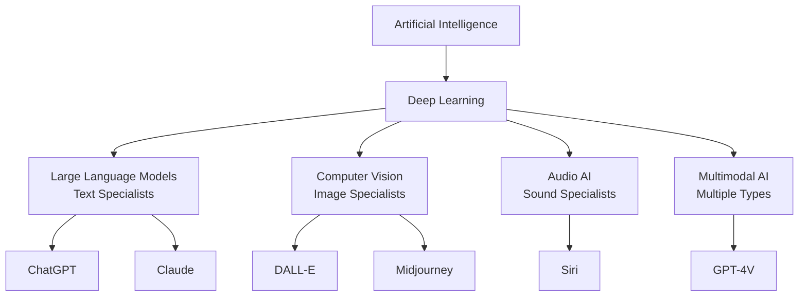

# level 4: ai types and what they do

## what you'll learn

→ Why there are different types of AI  
→ What [ChatGPT](https://chatgpt.com), [DALL-E](https://openai.com/dall-e-2), and other AI tools specialize in  
→ How to match the right AI type to your task

Not all AI is the same. Just like people have different specialties, AI systems are designed for different types of tasks.

## the foundation: deep learning

Everything we call "modern AI" is built on deep learning - many layers of pattern recognition working together.

Each layer recognizes increasingly complex patterns:
→ Layer 1: Basic features (edges, colors, letter shapes)  
→ Layer 2: Simple objects (circles, faces, words)  
→ Layer 3: Complex concepts (emotions, meanings, relationships)

## the three main ai specializations

### 1. large language models (llms) - text specialists

**Trained on:** Billions of books, articles, websites, conversations

**Good at:**
→ Having conversations  
→ Writing and editing text  
→ Explaining complex topics  
→ Creative writing

**Examples:** [ChatGPT](https://chatgpt.com), [Claude](https://claude.ai), [Gemini](https://gemini.google.com)

### 2. computer vision ai - image specialists

**Trained on:** Millions of labeled images and visual scenes

**Good at:**
→ Recognizing objects in photos  
→ Creating original artwork  
→ Understanding visual scenes  
→ Generating images from text descriptions

**Examples:** [DALL-E](https://openai.com/dall-e-2), [Midjourney](https://midjourney.com), [Canva AI](https://canva.com)

### 3. audio ai - sound specialists

**Trained on:** Speech patterns, music, and audio processing

**Good at:**
→ Understanding spoken language  
→ Generating music  
→ Voice synthesis

**Examples:** Siri/Alexa, Spotify recommendations, voice transcription

## multimodal ai: combining specializations

Newer AI systems work with multiple types of information:

**Examples:**
→ **GPT-4V** - can see images AND have conversations about them  
→ **[Claude](https://claude.ai) with vision** - can analyze documents and images while chatting

## why you need different ai tools

Each AI type learned from different examples, so they're good at different things:

**[ChatGPT](https://chatgpt.com)** learned from text examples:
→ Brilliant at writing and conversations  
→ Can't create images (unless it's GPT-4V)

**[DALL-E](https://openai.com/dall-e-2)** learned from image examples:
→ Great at creating artwork  
→ Can't have conversations

This is like having a team of specialists - writing specialist, visual specialist, audio specialist, research specialist.

---

### clarifier: matching ai to tasks

| Your Task | Best AI Type | Examples |
|-----------|-------------|----------|
| Writing, conversations | Large Language Models | [ChatGPT](https://chatgpt.com), [Claude](https://claude.ai) |
| Creating images | Computer Vision + Generative | [DALL-E](https://openai.com/dall-e-2), [Midjourney](https://midjourney.com) |
| Research with sources | LLM + Web access | [Perplexity](https://perplexity.ai) |
| Voice interactions | Audio AI | Siri, Alexa |

---

## my tool selection strategy

I use different AI tools because each has its specialty:

→ **[ChatGPT](https://chatgpt.com):** Quick questions, brainstorming  
→ **[Claude](https://claude.ai):** Serious writing work, creating content like this guide  
→ **[Perplexity](https://perplexity.ai):** Research when I need current information with sources  
→ **[Canva AI](https://canva.com):** Creating graphics for presentations

I don't expect one tool to do everything well. It's like having different experts on your team.

## connecting the dots

**What we learned:** AI systems are specialists trained on different types of data (text, images, audio), which is why you need different tools for different jobs

**What this builds on:** Each AI type uses the same pattern recognition approach we learned about, but they learned from different examples, making them good at different things

**What's next:** Now we'll discover that you've been successfully using AI for years and already have the skills needed for conversational AI

## your turn

**Consider:** Which AI specialization seems most useful for the type of work or creativity you do?

**Try this:** Next time you have a task involving both writing and images, think about which AI tools you'd need and why.

---

### flashcards for this section

**Front:** What are the three main AI specializations?  
**Back:** Large Language Models (text specialists), Computer Vision AI (image specialists), Audio AI (sound specialists)

**Front:** Why can't [ChatGPT](https://chatgpt.com) create images?  
**Back:** [ChatGPT](https://chatgpt.com) is a Large Language Model trained specifically on text patterns - it learned how to work with words, not visual patterns

**Front:** What's the difference between generative and recognition AI?  
**Back:** Recognition AI understands existing content, generative AI creates brand new content - most modern AI can do both

---

→ **Next:** [level 5: ai you're already using successfully](level-5.md)
