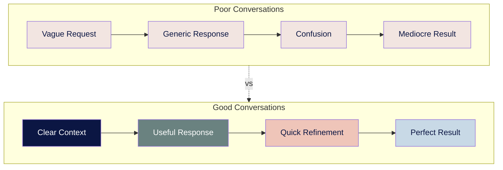

# ● level 4: your first ai conversations

## navigation
▲ **phase 2: getting started (1/3)** | ← [level 3: types of ai and when to use each](level%203:%20types%20of%20ai%20and%20when%20to%20use%20each.md) | → [level 5: finding your ai opportunities](level%205:%20finding%20your%20ai%20opportunities.md)

## what you'll learn

→ why some ai conversations get great results while others don't  
→ the simple anatomy of conversations that work  
→ when to use short messages vs. long requests  
→ when to start fresh vs. keep going

you've picked your ai tool. the difference between useful and frustrating results comes down to how you talk to it - whether for work projects, family planning, or personal goals.

## why conversation quality matters

bad ai conversations? you'll spend 20 minutes going back and forth and still get something generic. good conversations? you get exactly what you need in 2-3 tries.



**time difference:** poor conversations take 20+ minutes of back-and-forth. good conversations get results in 2-3 exchanges.

• • •

## → the anatomy of conversations that work

every effective ai conversation has three essential parts:

**→ who you are** (context)  
tell ai enough about your situation so it can give relevant advice.

examples:
- "i'm a small business owner with 5 employees"
- "i'm learning piano as an adult beginner"  
- "i'm a teacher with 30 students per class"
- "i work in marketing for a tech company"

**→ what you want** (specific request)  
be clear about the end result you need.

instead of: "help me with email"  
try: "write a professional email declining a meeting request"

instead of: "teach me about ai"  
try: "explain the difference between chatgpt and claude for someone choosing their first ai tool"

**→ how to deliver** (format)  
specify how you want the information presented.

examples:
- "give me 5 bullet points"
- "write it as an email under 100 words"
- "create a step-by-step checklist"
- "make a simple table comparing options"

• • •

<div align="center" style="background-color: #d4c9d2; padding: 15px; border-radius: 8px; margin: 15px 0; border-left: 4px solid #6a8280;">

⟡ **ai memory actually works now**

remember having to introduce yourself to chatgpt every conversation? those days are over.

**chatgpt** has two types of memory:
→ **saved memories** - things you tell it to remember  
→ **chat history** - automatically references past conversations (all users have this now)

**claude** keeps detailed notes when developers give it file access. it's surprisingly good at tracking ongoing projects.

you control what gets remembered. turn it off anytime or use temporary chats when you want privacy.

</div>

• • •

## → understanding: how ai builds responses

ai generates responses one small piece at a time, called **tokens**.

**your message:** "explain photosynthesis"

**ai's process:**
1. breaks into tokens: "explain" | "photo" | "synthesis"
2. predicts first response token: "photo"
3. now sees: "explain photosynthesis photo" → predicts next: "synthesis"
4. continues token by token until response feels complete

**what this means for you:**
- ai doesn't plan what it's going to say
- responses are built word by word
- context matters because ai sees everything together
- longer conversations can drift as ai follows its own tangents

• • •

## → short messages vs. long requests

understanding when to use each approach saves time and improves results.

### ※ use short messages when:

**learning something new**
```
message 1: "i want to learn basic photography. what should i focus on first?"
message 2: "great advice on composition. now explain aperture in simple terms."
message 3: "perfect. give me 3 specific exercises to practice aperture control."
```

**you're not sure exactly what you need**
```
message 1: "i need help organizing my home office but i'm overwhelmed."
message 2: "the desk organization ideas are helpful. what about managing cables and tech equipment?"
```

**the topic is complex**
```
message 1: "explain how to start investing for retirement."
message 2: "focus on the 401k vs ira decision. what factors should i consider?"
message 3: "i qualify for both. help me decide based on my situation: [specific details]"
```

### ※ use longer requests when:

**you have a specific, well-defined goal**
```
"i need to write a professional email to my team announcing a new project timeline. 

context: we're 2 weeks behind schedule due to vendor delays, team is stressed, stakeholders are asking questions.

request: write an email that acknowledges the delay, explains the cause without blaming anyone, presents the new timeline with confidence, and maintains team morale.

format: professional but warm tone, under 200 words, with clear next steps."
```

**you can provide comprehensive context**
```
"help me plan a weekend trip to portland for my anniversary.

context: my partner and i are in our 30s, love food and craft beer, have a $800 budget, staying downtown friday-sunday in march, neither of us has been there before.

request: create a day-by-day itinerary focusing on local food scene and breweries, including transportation between locations.

format: simple schedule with addresses and brief descriptions of why each place is worth visiting."
```

• • •

## → when to start fresh vs. keep going

ai has limited working memory - it can only "see" a certain amount of conversation at once.

### ⌘ start a new conversation when:

**switching topics**
- you were discussing vacation planning, now need help with work emails
- previous conversation was about learning guitar, now you want cooking advice

**the conversation gets confusing**
- ai seems to have lost track of your original request
- responses become generic or irrelevant
- you're repeating context multiple times

**you hit the memory limit**
- conversation is very long (15+ back-and-forth exchanges)
- ai asks for information you provided earlier
- responses don't reference important details you mentioned

**you want to try a different approach**
- previous method isn't working well
- you want to test different conversation styles
- you realized you need to frame the problem differently

### ⌘ keep the conversation going when:

**making progress toward your goal**
- each response builds on the previous one
- ai understands your context and constraints
- you're refining details rather than starting over

**working on related sub-topics**
- all questions connect to the same main project
- building on previous advice or recommendations
- exploring different aspects of the same problem

• • •

<div align="center" style="background-color: #d4c9d2; padding: 15px; border-radius: 8px; margin: 15px 0; border-left: 4px solid #6a8280;">

⟡ **when ai memory helps vs hurts**

sometimes ai remembers things that interfere with what you're trying to do now. if responses seem off-topic or overly personalized, try a temporary chat or remind ai to focus only on your current request.

</div>

• • •

## → conversation recipes that work

here are proven conversation starters for common situations:

### ※ learning something new
```
"i want to learn [topic] for [specific reason]. i'm a complete beginner with [time constraint]. 

what are the 3 most important things i should understand first, and what should i actually do this week to get started?"
```

### ※ solving a specific problem
```
"i'm dealing with [specific situation] and need practical advice.

context: [relevant background]
goal: [what success looks like]
constraints: [time, money, or other limitations]

give me 3 concrete options i can try, with the pros and cons of each."
```

### ※ making a decision
```
"help me decide between [option a] and [option b] for [specific situation].

my priorities: [what matters most to you]
my constraints: [limitations to consider]

compare these options focusing on [your main concerns] and give me a recommendation with reasoning."
```

### ※ creating something
```
"i need to create [specific item] for [specific purpose].

context: [who it's for, when you need it, any requirements]
style: [tone, length, format preferences]

create a draft that [specific success criteria]."
```

### ※ planning and organizing
```
"help me plan [specific project/event] that achieves [clear goal].

details: [relevant specifics about scope, timeline, resources]
constraints: [budget, time, other limitations]

give me a step-by-step plan with timeline and key decisions i need to make."
```

• • •

## → troubleshooting common conversation problems

### ⌘ ai gives generic advice
**problem:** responses could apply to anyone  
**solution:** add more specific context about your unique situation

**before:** "how do i get better at public speaking?"  
**after:** "i'm an engineer who needs to present technical concepts to non-technical executives. i get nervous and tend to use too much jargon. how do i communicate more effectively in these situations?"

### ⌘ responses are too long and overwhelming
**problem:** wall of text that's hard to use  
**solution:** ask for shorter, more focused responses

**add to your request:** "give me just the 3 most important points" or "summarize in bullet points"

### ⌘ ai misunderstands what you want
**problem:** response focuses on the wrong thing  
**solution:** clarify your specific need

**try:** "i'm not looking for general information about x. i specifically need help with y because z."

### ⌘ conversation goes off track
**problem:** ai starts discussing tangents  
**solution:** redirect firmly and specifically

**try:** "let's focus only on [specific aspect]. can you give me concrete steps for just that part?"

### ⌘ you're not sure what to ask
**problem:** you know you need help but can't articulate it  
**solution:** start with your situation and frustration

**try:** "i'm struggling with [situation]. what questions should i be asking to solve this effectively?"

• • •

## → setting up ai for better conversations

before diving into conversation techniques, spend 10 minutes setting up your ai tool to work better for you. this eliminates repetitive setup and improves every conversation.

### ※ chatgpt memory settings

**how to control memory:**
1. go to settings > personalization > memory
2. toggle memory on/off as needed
3. view and manage what it remembers
4. use "temporary chat" when you want privacy

**what to have chatgpt remember:**
```
"remember i'm learning ai to improve my marketing work"
"remember i prefer explanations without technical jargon"  
"remember i have 30 minutes daily for learning new skills"
"remember i'm a small business owner with 5 employees"
```

### ※ custom instructions

custom instructions tell ai how to respond to you in every conversation. set this once and save time forever.

**section 1: what should ai know about you?**
examples for different situations:

```
business professional:
"i'm a marketing manager at a mid-size company. i have 10 years experience but i'm new to ai tools. i need practical advice i can implement immediately."

parent learning new skills:
"i'm a working parent with limited time. i learn best through simple explanations and step-by-step instructions. i prefer examples related to everyday situations."

student or career changer:
"i'm transitioning into a new field and need to learn quickly. i appreciate detailed explanations but want them broken into digestible pieces."
```

**section 2: how should ai respond?**
examples of useful preferences:

```
for busy professionals:
"keep responses under 200 words. use bullet points. give me 3 specific actions i can take today. be direct and skip lengthy introductions."

for thorough learners:
"provide detailed explanations with examples. break complex topics into steps. include analogies to help me understand difficult concepts."

for practical implementers:
"focus on actionable advice. include specific tools, resources, or next steps. avoid theory unless it directly helps with implementation."
```

• • •

## → getting started today

### ⌘ your first conversation setup
1. **set up your settings** (10 minutes using the section above)
2. **try the three-part structure** in your next conversation:
   - who you are (context)
   - what you want (specific request)  
   - how to deliver it (format)
3. **practice with real problems** you actually need help with

### ⌘ improvement happens naturally
as you use ai more, you'll naturally notice:
- which conversation approaches work better for different situations
- when to use short messages vs. longer requests
- when to start fresh vs. continue existing conversations
- how to get more useful responses faster

focus on solving real problems rather than practicing artificial exercises. the skills develop through actual use.

• • •

## → quick reference: conversation starters

| situation | conversation starter template |
|-----------|-------------------------------|
| **learning** | "i want to learn [topic] for [reason]. i'm a beginner with [time limit]. what should i focus on first?" |
| **problem-solving** | "i'm dealing with [situation]. context: [background]. give me 3 practical options with pros and cons." |
| **decision-making** | "help me choose between [options] for [situation]. my priorities are [what matters]. which would you recommend and why?" |
| **creating content** | "create [specific item] for [purpose]. context: [details]. style: [preferences]. format: [how you want it]." |
| **planning** | "help me plan [project] to achieve [goal]. details: [specifics]. constraints: [limitations]. give me a step-by-step approach." |
| **explaining complex topics** | "explain [topic] for someone who [your background]. focus on [specific aspect] i need to understand for [purpose]." |

• • •

## connecting the dots

good ai conversations save time and get better results. the key is being specific about your situation, clear about what you want, and strategic about when to use short messages vs. long requests.

understanding ai's memory capabilities and token-by-token generation helps you structure conversations for success rather than frustration.

---

### flashcard for this section

<div style="background: linear-gradient(135deg, #f2e5e1 0%, #c8d9e6 100%); padding: 20px; border-radius: 12px; margin: 20px 0;">

**→ front**: what are the 3 essential parts of effective ai conversations?  
**⟡ back**: context (who you are), request (what you want), format (how to deliver)

**→ front**: when should you start a new conversation vs. continue the current one?  
**⟡ back**: start fresh when switching topics, getting confused responses, or after 15+ exchanges. continue when making progress and building on previous responses.

**→ front**: how does chatgpt memory work in 2025?  
**⟡ back**: saved memories (explicit) + chat history (automatic reference to past conversations for all users)

**→ front**: what indicates ai has lost context?  
**⟡ back**: asks for previously provided info, gives generic responses, doesn't understand references

**→ front**: how often should you refresh context in long conversations?  
**⟡ back**: every 10-15 exchanges

</div>

---

**sources:**
- ai conversation design: [openai usage guidelines](https://platform.openai.com/docs/guides/prompt-engineering) | [anthropic effective prompting](https://docs.anthropic.com/claude/docs/prompt-engineering)
- conversation psychology: [mit technology review ai communication](https://www.technologyreview.com/2023/02/21/1068893/how-to-get-the-best-out-of-gpt-3/) | [harvard business review ai interaction](https://hbr.org/2023/06/how-to-write-an-effective-ai-prompt)
- chatgpt memory: [openai memory updates](https://openai.com/index/memory-and-new-controls-for-chatgpt/) | [memory faq](https://help.openai.com/en/articles/8590148-memory-faq)

---

you understand how to have effective ai conversations. now discover the specific opportunities where ai can make the biggest difference in your work and life.

→ **next**: [level 5: finding your ai opportunities](leve-5.md)
