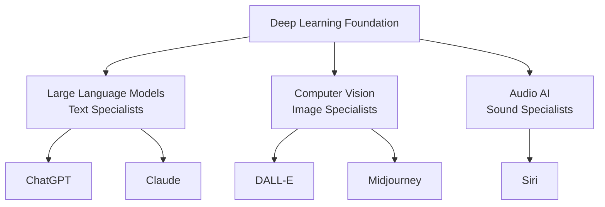

# level 4: ai types and what they do

## what you'll learn

→ Why there are different types of AI  
→ What [ChatGPT](https://chatgpt.com), [DALL-E](https://openai.com/dall-e-2), and other tools specialize in  
→ How to match the right AI type to your task

Not all AI is the same. Just like people have different specialties, AI systems are designed for different types of tasks.

## the three main ai specializations

AI systems are trained to be experts in specific types of information:

### 1. large language models (llms) - text specialists

**What they're trained on:** Billions of books, articles, websites, conversations

**What they do well:**
→ Having conversations  
→ Writing and editing text  
→ Explaining complex topics  
→ Creative writing

**Examples:** [ChatGPT](https://chatgpt.com), [Claude](https://claude.ai), [Gemini](https://gemini.google.com)

### 2. computer vision ai - image specialists

**What they're trained on:** Millions of labeled images and visual content

**What they do well:**
→ Recognizing objects in photos  
→ Creating original artwork  
→ Understanding visual scenes  
→ Generating images from text descriptions

**Examples:** [DALL-E](https://openai.com/dall-e-2), [Midjourney](https://midjourney.com), [Canva AI](https://canva.com)

### 3. audio ai - sound specialists

**What they're trained on:** Speech patterns, music, and audio processing

**What they do well:**
→ Understanding spoken language  
→ Generating music  
→ Voice synthesis

**Examples:** Siri/Alexa, Spotify recommendations, voice transcription

## multimodal ai: combining specializations

Newer AI systems work with multiple types of information:

**Examples:**
→ **GPT-4V** - can see images AND have conversations about them  
→ **[Claude](https://claude.ai) with vision** - can analyze documents and images while chatting

## why you need different ai tools

Each AI type learned from different examples, so they're good at different things:

**[ChatGPT](https://chatgpt.com)** learned from text examples:
→ Brilliant at writing and conversations  
→ Can't create images (unless it's GPT-4V)

**[DALL-E](https://openai.com/dall-e-2)** learned from image examples:
→ Great at creating artwork  
→ Can't have conversations

This is like having a team of specialists: writing specialist, visual specialist, audio specialist, research specialist.

---

### clarifier: matching ai to tasks

| Your Task | Best AI Type | Examples |
|-----------|-------------|----------|
| Writing, conversations | Large Language Models | [ChatGPT](https://chatgpt.com), [Claude](https://claude.ai) |
| Creating images | Computer Vision | [DALL-E](https://openai.com/dall-e-2), [Midjourney](https://midjourney.com) |
| Research with sources | LLM + Web access | [Perplexity](https://perplexity.ai) |
| Voice interactions | Audio AI | Siri, Alexa |

---

## my tool selection strategy

I use different AI tools because each has its specialty:

→ **[ChatGPT](https://chatgpt.com):** Quick questions, brainstorming  
→ **[Claude](https://claude.ai):** Serious writing work, creating content like this guide  
→ **[Perplexity](https://perplexity.ai):** Research when I need current information with sources  
→ **[Canva AI](https://canva.com):** Creating graphics for presentations  

I don't expect one tool to do everything well.

## connecting the dots

**What we learned:** AI systems are specialists trained on different types of data (text, images, audio), which is why you need different tools for different jobs

**What this builds on:** Each AI type uses the same pattern recognition approach from Level 1, but they learned from different examples, making them good at different things

**What's next:** You'll discover that you've already been using AI successfully for years, which should boost your confidence about learning conversational AI

## your turn

**Consider:** Which AI specialization seems most useful for the type of work you do?

**Try this:** Next time you have a task involving both writing and images, think about which AI tools you'd need.

---

### flashcards for this section

**Front:** What are the three main AI specializations?  
**Back:** Large Language Models (text specialists), Computer Vision AI (image specialists), Audio AI (sound specialists)

**Front:** Why can't [ChatGPT](https://chatgpt.com) create images?  
**Back:** [ChatGPT](https://chatgpt.com) is a Large Language Model trained specifically on text patterns - it learned how to work with words, not visual patterns

---

→ **Next:** [level 5: ai you're already using successfully](level-5.md) they're good at different things:

**[ChatGPT](https://chatgpt.com)** learned from text examples, so it's brilliant at:
→ Writing emails and documents  
→ Having conversations  
→ Explaining concepts  
→ But it can't create images or understand photos (unless it's GPT-4V)

**[DALL-E](https://openai.com/dall-e-2)** learned from image examples, so it's great at:
→ Creating artwork from descriptions  
→ Understanding visual concepts  
→ Generating logos and designs  
→ But it can't have conversations or write text

This is like having a team of specialists:
→ Writing specialist (LLMs)  
→ Visual specialist (Image AI)  
→ Audio specialist (Sound AI)  
→ Research specialist (AI with web access)

## how different ais combine technologies

Let's look at some popular AI tools and what they are:

**[ChatGPT](https://chatgpt.com)** = Deep Learning + Large Language Model + Generative Capability
→ Foundation: Deep Learning (complex pattern recognition)  
→ Specialization: Large Language Model (understands text)  
→ Capability: Generative (creates new text)  
→ Result: AI that can have conversations and write original content

**[DALL-E](https://openai.com/dall-e-2)** = Deep Learning + Computer Vision + Generative Capability
→ Foundation: Deep Learning  
→ Specialization: Computer Vision (understands images)  
→ Capability: Generative (creates new images)  
→ Result: AI that creates artwork from text descriptions

**[Perplexity](https://perplexity.ai)** = Deep Learning + Large Language Model + Web Search
→ Foundation: Deep Learning  
→ Specialization: Large Language Model  
→ Capability: Web search + citation  
→ Result: AI that can research current information and cite sources

---

### clarifier: quick reference - matching ai to tasks

| Your Task | Best AI Type | Examples | Why |
|-----------|-------------|----------|-----|
| Writing, conversations | Large Language Models | [ChatGPT](https://chatgpt.com), [Claude](https://claude.ai) | Trained on text patterns |
| Creating images | Computer Vision + Generative | [DALL-E](https://openai.com/dall-e-2), [Midjourney](https://midjourney.com) | Trained on visual patterns |
| Research with sources | LLM + Web access | [Perplexity](https://perplexity.ai), Bing Chat | Can search current info |
| Voice interactions | Audio AI | Siri, Alexa | Trained on speech patterns |
| Analyzing documents | LLM + Vision | [Claude](https://claude.ai), GPT-4V | Can read text and images |

---

## my tool selection strategy

I use different AI tools because each one has its specialty:

→ **[ChatGPT](https://chatgpt.com):** Quick questions, brainstorming, photo analysis (when I send pics of weird pimples or muscle progress)  
→ **[Claude](https://claude.ai):** Serious writing work, creating content like this guide, longer analysis  
→ **[Perplexity](https://perplexity.ai):** Research when I need current information with real sources  
→ **[Canva AI](https://canva.com):** Creating graphics and visual content for presentations  
→ **[Gamma](https://gamma.app):** Building presentations quickly

I don't expect one tool to do everything well. It's like having different experts on your team.

---

### clarifier: model names decoded

**Model** = a specific version of an AI system with particular capabilities

**Examples:**
→ GPT-4 vs GPT-3.5 = newer vs older version (like iPhone 15 vs iPhone 12)  
→ Claude-3-Opus vs Claude-3-Haiku = powerful vs fast version  
→ Different models = different capabilities and costs

**Why versions matter:**
→ Newer models usually more capable but cost more  
→ Some models optimized for speed, others for quality  
→ Knowing the model helps you choose the right tool

---

## common misconceptions

**"AI should be able to do everything"**  
Current AI is specialized. Each type learned from specific examples and is good at specific tasks.

**"[ChatGPT](https://chatgpt.com) is the only AI I need"**  
[ChatGPT](https://chatgpt.com) is amazing at text but can't create images, search the web (without plugins), or analyze your documents.

**"All AI tools are basically the same"**  
Each AI has different training, capabilities, and strengths. Choosing the right one makes a big difference.

## heart check-in

Does understanding AI specializations help explain why some AI tools seem "smarter" at certain tasks? It's like realizing that being good at writing doesn't automatically make someone good at painting - different skills require different training.

Remember: AI specialization is a good thing - it means you get expert-level help for specific tasks rather than mediocre help for everything.

## your turn

**Quick reflection:** Which AI specialization seems most useful for the type of work or creativity you do?

**Try this:** Next time you have a task that involves both writing and images, think about which AI tools you'd need and why.

**Think about your current use:** If you've been using [ChatGPT](https://chatgpt.com) for everything, what other AI types might help you with tasks it struggles with?

---

### flashcards for this section

**Front:** What are the three main AI specializations?  
**Back:** Large Language Models (text specialists), Computer Vision AI (image specialists), Audio AI (sound specialists)

**Front:** Why can't [ChatGPT](https://chatgpt.com) create images?  
**Back:** [ChatGPT](https://chatgpt.com) is a Large Language Model trained specifically on text patterns - it learned how to work with words, not visual patterns

**Front:** What's the difference between generative and recognition AI?  
**Back:** Recognition AI understands existing content, generative AI creates brand new content - most modern AI can do both

**Front:** How is [ChatGPT](https://chatgpt.com) different from [DALL-E](https://openai.com/dall-e-2)?  
**Back:** [ChatGPT](https://chatgpt.com) = Deep Learning + Language Model + Text Generation, [DALL-E](https://openai.com/dall-e-2) = Deep Learning + Computer Vision + Image Generation

---

→ **Next:** [level 5: ai you're already using successfully](level-5.md)
