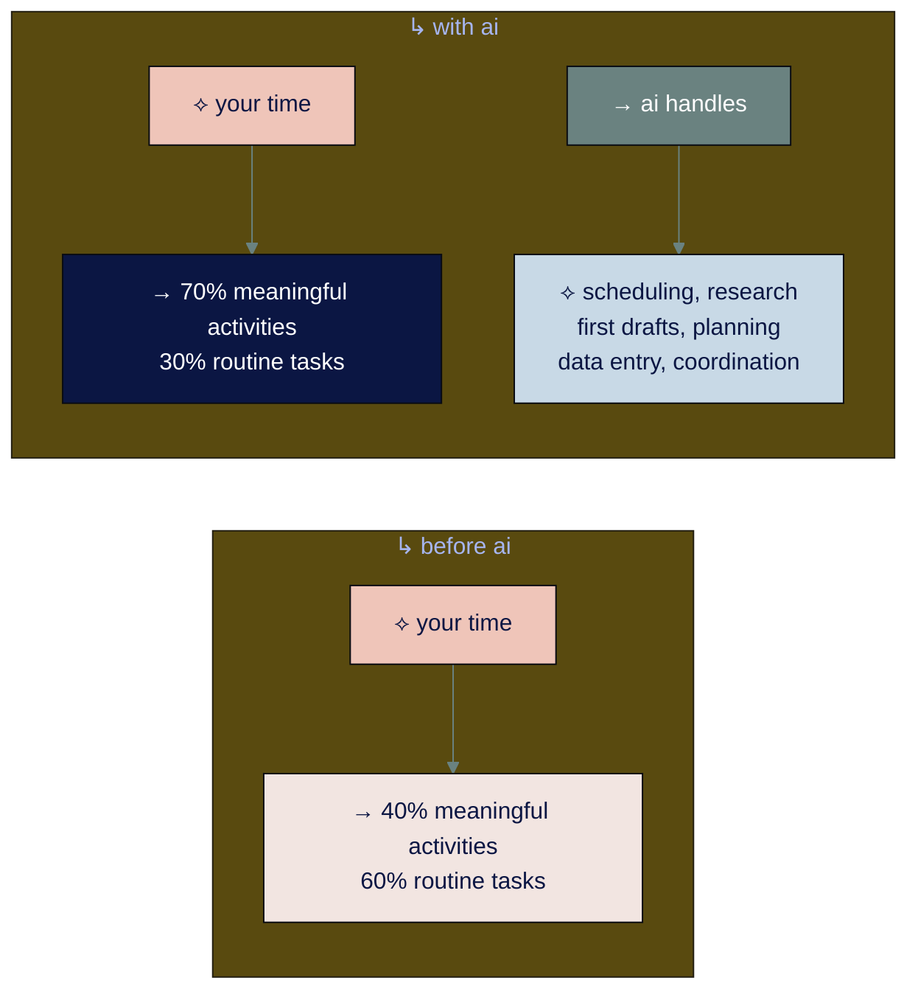
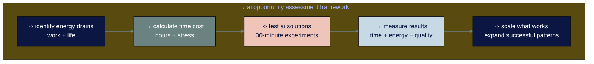

# ● level 5: finding your ai opportunities

## navigation
▲ **phase 2: getting started (2/3)** | ← [level 4: your first ai conversations](level-4.md) | → [level 6: developing ai quality standards](level-6.md)

## what you'll learn

→ how to identify where ai can make the biggest difference in your work and life  
→ the difference between busy work and meaningful activities  
→ practical frameworks for spotting ai opportunities in professional and personal contexts  
→ real examples from work, family, health, learning, and creative projects

you've mastered ai conversations. now discover where ai can actually save you time and create value in your specific work and life situations.

## → the ai opportunity mindset

most people ask "what can ai help me with?" better question: "what takes up my time and energy that shouldn't?"

ai isn't replacing jobs or life activities - it's replacing tasks within them. recent research shows ai could handle routine tasks across work and personal life, freeing you up for what actually matters.

**the key insight:** spend time on what energizes you, let ai handle what drains you.

• • •

## → the comprehensive time audit

spend one week tracking how you actually spend your time across work and life. you'll be surprised by what you discover.

### ⌘ track these categories for 5 days:

**meaningful activities** (require your unique skills, judgment, creativity)
- strategic thinking and creative problem-solving
- building relationships and deep conversations  
- learning new skills or pursuing interests
- physical activities and outdoor time
- quality time with family and friends
- creative projects and personal expression

**routine tasks** (could be done by someone/something else)
- scheduling and calendar management
- research and information gathering
- writing routine communications
- data entry and basic analysis
- meal planning and grocery coordination
- household task organization

**time wasters** (shouldn't be done at all)
- endless scrolling on social media
- unnecessary meetings or obligations
- duplicate work or inefficient processes
- waiting for responses or approvals

### ※ simple tracking method:
use your phone's notes app. every 2 hours, jot down what you spent the most time on. at the end of the week, add up the categories.

**most people discover:** 50-60% of their time goes to routine tasks that ai could handle, both at work and in personal life.

• • •

⟡ **the efficiency vs. meaning balance**

ai can make many things faster, but speed isn't always the goal. use ai to eliminate tasks that drain your energy so you can spend more time on activities that fulfill and challenge you - whether that's deep work, creative projects, or quality time with people you care about.

• • •

## → work-focused ai opportunities

### ※ managers and team leaders

**high-impact opportunities:**
- meeting notes and action item tracking
- performance review drafts and feedback synthesis
- project status reports and stakeholder communication
- team coordination and schedule optimization
- strategic planning research and competitive analysis

**example workflow:** use [otter.ai](https://otter.ai) to transcribe meetings, [chatgpt](https://chatgpt.com) to extract action items, [zapier](https://zapier.com) to update project management tools automatically.

### ※ sales and customer success

**high-impact opportunities:**
- prospect research and lead qualification
- personalized outreach message creation
- proposal drafting and customization
- customer onboarding material development
- performance tracking and reporting

**example workflow:** research prospects with [perplexity](https://perplexity.ai), draft personalized emails with [claude](https://claude.ai), create proposals with [gamma](https://gamma.app).

### ※ marketing and content creators

**high-impact opportunities:**
- content ideation and topic research
- social media post variations and scheduling
- email campaign development and optimization
- market research and trend analysis
- performance data analysis and insights

**example workflow:** brainstorm topics with ai, create drafts with [claude](https://claude.ai), design visuals with [canva](https://canva.com), schedule posts with [buffer](https://buffer.com).

• • •

## → personal life ai opportunities

### ※ family management and parenting

**high-impact opportunities:**
- family schedule coordination and conflict resolution
- meal planning and grocery list optimization
- children's activity research and coordination
- household task distribution and tracking
- educational resource discovery for kids

**powerful tools:**
- **[milo](https://www.joinmilo.com)** - ai family assistant for invisible household management tasks
- **[familywall](https://www.familywall.com)** - shared family calendar with smart scheduling
- **[mealime](https://www.mealime.com)** - ai-powered meal planning with shopping lists
- **[cozi](https://www.cozi.com)** - family organizer with ai-enhanced scheduling

**example workflow:** milo tracks all family commitments and deadlines, mealime plans weekly meals based on preferences and schedules, familywall coordinates everyone's activities automatically.

### ※ health and wellness optimization

**high-impact opportunities:**
- personalized fitness routine planning
- nutrition tracking and meal optimization
- mental health support and stress management
- sleep pattern analysis and improvement
- preventive health research and appointment scheduling

**powerful tools:**
- **[whoop coach](https://www.whoop.com)** - ai fitness coach that adapts to your biometric data
- **[headspace](https://www.headspace.com)** - ai-guided meditation and mental wellness
- **[myfitnesspal](https://www.myfitnesspal.com)** - ai nutrition tracking and meal suggestions
- **[calm](https://www.calm.com)** - personalized relaxation and sleep optimization

**example workflow:** whoop coach analyzes your recovery data and suggests optimal workout timing, headspace provides personalized meditation based on stress levels, myfitnesspal creates meal plans aligned with fitness goals.

### ※ learning and personal development

**high-impact opportunities:**
- personalized learning path creation
- language learning optimization
- skill development planning and tracking
- hobby project research and guidance
- creative project inspiration and execution

**powerful tools:**
- **[duolingo](https://www.duolingo.com)** - ai-adapted language learning
- **[khan academy](https://www.khanacademy.org)** - personalized learning paths
- **[skillshare](https://www.skillshare.com)** - ai-recommended creative courses
- **[masterclass](https://www.masterclass.com)** - expert-led learning with ai optimization

**example workflow:** duolingo adapts lessons to your learning pace, khan academy creates custom study plans, ai helps research and plan creative projects with step-by-step guidance.

### ※ home and lifestyle management

**high-impact opportunities:**
- home maintenance scheduling and reminders
- budget tracking and financial planning
- travel planning and itinerary optimization
- gift planning and relationship maintenance
- household project coordination

**powerful tools:**
- **[mint](https://mint.intuit.com)** - ai-powered budget tracking and financial insights
- **[google assistant](https://assistant.google.com)** - smart home coordination and task management
- **[todoist](https://todoist.com)** - ai-enhanced task prioritization
- **[tripit](https://www.tripit.com)** - ai travel planning and organization

**example workflow:** google assistant manages household reminders and smart home devices, mint analyzes spending patterns and suggests optimizations, todoist prioritizes tasks based on deadlines and importance.

• • •

## → the 80/20 ai framework for work and life

focus on the 20% of tasks that consume 80% of your time or mental energy.

### ⌘ step 1: identify your energy drains
what makes you think "ugh, not this again" in both work and personal contexts?

**common work examples:**
- "i spend 2 hours every monday creating status reports"
- "i hate writing the same type of email over and over"
- "research takes forever and i always feel like i'm missing something"

**common life examples:**
- "meal planning every week is exhausting"
- "coordinating family schedules is a constant headache"
- "i never remember all the household maintenance tasks"
- "planning anything takes forever because i overthink it"

### ⌘ step 2: calculate the time and stress cost
for each pain point, estimate:
- how much time does this take?
- how often do i do this?
- what's the mental energy cost?
- how does this affect other activities?

**example:** weekly meal planning
- time per session: 1.5 hours
- frequency: 52 times per year
- annual cost: 78 hours + decision fatigue + family stress

### ⌘ step 3: test ai solutions
start with your biggest time/energy drain. spend 30 minutes testing an ai approach:

**for meal planning:** try [mealime](https://www.mealime.com) to generate weekly menus and shopping lists
**for family scheduling:** test [milo](https://www.joinmilo.com) for coordination and reminders
**for fitness planning:** experiment with [whoop coach](https://www.whoop.com) for personalized guidance
**for learning projects:** use [claude](https://claude.ai) to create structured learning plans

### ⌘ step 4: measure the improvement
track results after implementing ai solutions:
- how much time saved?
- what's the stress reduction?
- what unexpected benefits emerged?
- what new challenges appeared?

• • •

• • •

## → industry and life stage applications

### ※ healthcare professionals

**work applications:**
- patient documentation and clinical notes
- insurance pre-authorization letters
- treatment plan explanations for patients
- continuing education research

**life applications:**
- personal health tracking and optimization
- family medical appointment coordination
- wellness routine planning

### ※ educators and parents

**work applications:**
- lesson plan development and curriculum research
- student feedback and progress tracking
- parent communication and updates

**life applications:**
- children's homework and project support
- family learning activities planning
- personal skill development

### ※ students and young professionals

**work/study applications:**
- research paper assistance and citation management
- interview preparation and career planning
- skill development and course selection

**life applications:**
- budget management and financial planning
- social event coordination
- personal project management

### ※ retirees and empty nesters

**common applications:**
- health and wellness optimization
- travel planning and logistics
- hobby and creative project development
- family coordination and grandparenting support
- volunteer work organization

**powerful tools for this stage:**
- [claude](https://claude.ai) for research and planning complex projects
- [canva](https://canva.com) for creating family photo books and cards
- [whoop coach](https://www.whoop.com) for health optimization
- [tripit](https://www.tripit.com) for travel coordination

• • •

⟡ **start where you have the most control**

don't begin with tasks that require buy-in from others or affect family routines immediately. start with personal productivity, research, or planning activities that are entirely within your control. build confidence and demonstrate value before expanding to collaborative processes.

• • •

## → your comprehensive ai opportunity assessment

### ⌘ complete this assessment:

**1. work time audit results:**
- meaningful work: __% of my professional time
- routine tasks: __% of my professional time  
- biggest work time drain: ________________
- most frustrating recurring work task: ________________

**2. personal life audit results:**
- meaningful activities: __% of my personal time
- routine tasks: __% of my personal time
- biggest personal time drain: ________________
- most stressful recurring life task: ________________

**3. ai readiness check:**
- i have tasks that follow predictable patterns: yes/no
- i do information-heavy work or life management: yes/no
- i control my own processes (work and personal): yes/no
- i'm willing to invest 2-3 hours learning new approaches: yes/no

**4. opportunity prioritization:**
rank your top 6 potential ai opportunities (3 work + 3 life):

**work opportunities:**
1. ________________ (estimated time savings: __ hours/week)
2. ________________ (estimated time savings: __ hours/week)
3. ________________ (estimated time savings: __ hours/week)

**life opportunities:**
1. ________________ (estimated time savings: __ hours/week)
2. ________________ (estimated time savings: __ hours/week)
3. ________________ (estimated time savings: __ hours/week)

**5. next steps:**
- this week, i will test ai for: ________________
- success will look like: ________________
- i'll measure progress by: ________________

• • •

## → common mistakes to avoid

### ⌘ trying to optimize everything at once
start with one work task and one personal task. master them before expanding.

### ⌘ focusing on tasks you enjoy
ai should handle work you don't like doing. save the enjoyable, meaningful activities for yourself.

### ⌘ ignoring the learning curve
budget time for setup and refinement. most ai solutions need 2-3 iterations to work well.

### ⌘ not measuring actual impact
track time saved and stress reduced, not just perceived benefits. data drives better decisions.

### ⌘ forgetting about other people
consider how your ai use affects family members, colleagues, and friends. communicate changes that impact them.

• • •

## connecting the dots

the biggest ai opportunities aren't always the most obvious ones. they're found in the routine tasks that eat up your time and energy without creating proportional value - whether that's work projects, family coordination, health management, or personal development.

successful ai integration in 2025 means looking at your whole life, not just your job. ai can help you become more efficient at work so you have more energy for family. it can streamline household management so you have more time for hobbies. it can optimize your health routines so you feel better in all areas of life.

focus on freeing yourself from routine tasks so you can spend more time on what actually matters to you.

---

### flashcard for this section

**→ front**: what's the difference between meaningful activities and routine tasks?  
**⟡ back**: meaningful activities require your unique skills, judgment, and creativity (relationships, creative work, strategic thinking). routine tasks could be done by someone/something else (scheduling, research, data entry, meal planning).

**→ front**: what are the signs a task is ripe for ai automation?  
**⟡ back**: high repetition, clear patterns, information-heavy, time-consuming, high frustration factor - in both work and personal contexts

**→ front**: name 3 powerful ai tools for family management  
**⟡ back**: milo (family assistant), familywall (shared scheduling), mealime (meal planning), cozi (family organizer)

**→ front**: what should you prioritize when choosing ai opportunities?  
**⟡ back**: the 20% of tasks that consume 80% of your time or mental energy, across both work and life

**→ front**: where should you start ai experimentation?  
**⟡ back**: tasks entirely within your control - personal productivity, research, planning - before expanding to collaborative processes that affect others

**→ front**: how should you measure ai success in work and life?  
**⟡ back**: track actual time saved and stress reduced, assess impact on meaningful activities, note effects on relationships and well-being

---

**sources:**
- workplace ai trends: [world economic forum 2025](https://www.weforum.org/stories/2025/01/ai-2025-workplace/) | [pwc ai business predictions](https://www.pwc.com/us/en/tech-effect/ai-analytics/ai-predictions.html)
- family ai applications: [global wellness institute ai trends](https://globalwellnessinstitute.org/global-wellness-institute-blog/2025/04/02/ai-initiative-trends-for-2025/) | [ai family tools guide](https://warrenschuitema.com/post/top-10-ai-apps-for-family-activity-management)
- productivity research: [mckinsey ai workplace](https://www.mckinsey.com/capabilities/mckinsey-digital/our-insights/superagency-in-the-workplace-empowering-people-to-unlock-ais-full-potential-at-work) | [zapier ai productivity tools](https://zapier.com/blog/best-ai-productivity-tools/)

---

you've identified your biggest ai opportunities across work and life and know where to start experimenting. now learn how to evaluate ai output quality and maintain standards as you integrate ai into both professional and personal workflows.

→ **next**: [level 6: developing ai quality standards](level-6.md)
