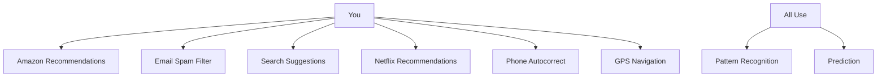

# level 5: ai you're already using successfully

## what you'll learn

→ AI you've been using for years without realizing it  
→ Why you already have the skills to work with conversational AI  
→ How your existing judgment transfers to new AI tools

You've been using AI for years: Amazon recommendations, email spam filtering, Google search suggestions, Netflix recommendations. All AI.

You're already familiar with AI. You're just expanding your knowledge.

## ai you use every day

→ **Amazon:** "People who bought this also bought..." - AI analyzing purchase patterns  
→ **Email:** Spam folder sorting junk mail - AI recognizing spam patterns  
→ **Google:** Search suggestions as you type - AI predicting what you want  
→ **Netflix:** "Because you watched..." - AI learning your preferences  
→ **Your Phone:** Autocorrect fixing typos - AI predicting what you meant  
→ **GPS:** Finding fastest routes - AI analyzing traffic patterns

## you already work well with ai

You already know when Netflix's suggestions match your taste vs. when they're off.

You already use Google search suggestions as shortcuts but ignore them when they're not helpful.

You already let your phone autocorrect help you but check that it makes sense.

You already trust GPS routing but use your judgment when it suggests something weird.

You've been successfully working with AI for years.

---

### clarifier: your existing ai skills

**You're already good at:**
→ Trusting AI when it makes sense  
→ Ignoring AI when it's wrong  
→ Using AI as a starting point  
→ Combining AI with your judgment

These are the exact skills you need for conversational AI.

---

## the connection to conversational ai

[ChatGPT](https://chatgpt.com) and [Claude](https://claude.ai) work exactly the same way:

→ Netflix learns your viewing patterns → [ChatGPT](https://chatgpt.com) learned conversation patterns  
→ Amazon predicts what you might buy → AI predicts what response you might want  
→ Google suggests search terms → AI suggests helpful responses

The only difference? Instead of product recommendations, you're getting conversation responses and writing help.

The fundamental relationship is the same: AI provides suggestions based on patterns, and you use your judgment to decide what's useful.

## what this means for your confidence

I wasn't learning some scary new technology. I was expanding skills I already had.

I already knew how to work with AI that's helpful but imperfect. I already knew when to trust AI and when to use my own judgment.

You do too.

---

### clarifier: why this confidence matters

**Common thought:** "I don't know how to use this new AI technology"  
**Reality:** You already use AI successfully multiple times per day

**Your skills transfer:**
→ Evaluating Netflix suggestions → Evaluating AI responses  
→ Using Google as starting point → Using AI for first drafts  
→ Combining GPS with judgment → Fact-checking AI information

You're building on years of success.

---

## skills that transfer directly

You don't need to learn entirely new skills for conversational AI. You apply the skills you already have:

**What transfers:**
→ Evaluating AI suggestions for quality and relevance  
→ Using AI as a starting point rather than final answer  
→ Combining AI assistance with your judgment  
→ Adapting when AI doesn't understand

**What's new:**
→ Having conversations instead of just getting recommendations  
→ Asking for specific help instead of browsing suggestions  
→ Providing context to get more relevant responses

## connecting the dots

**What we learned:** You've been successfully using AI for years through recommendation systems, which means you already have the core skills needed for conversational AI

**What this builds on:** The Netflix, Google, and GPS AI you use daily all work through the same pattern recognition and prediction principles from previous levels

**What's next:** Now we'll set realistic expectations about what AI can and can't do well, so you can develop good judgment about when to use AI versus when to rely on human intelligence

## your turn

**Recognize:** What's one way you successfully work with AI recommendations that you could apply to conversational AI?

**Consider:** Which AI tool do you use most without thinking about it as AI?

---

### flashcards for this section

**Front:** Name five AI tools you use daily without realizing it  
**Back:** Email spam filters, GPS routing, search suggestions, shopping recommendations, social media feeds, autocorrect, streaming suggestions

**Front:** What skills transfer from Netflix recommendations to [ChatGPT](https://chatgpt.com) responses?  
**Back:** Evaluating suggestions for relevance, using AI as starting point not final answer, combining AI input with personal judgment

**Front:** Why should you feel confident about using conversational AI?  
**Back:** You already successfully use AI multiple times per day and have years of experience evaluating AI suggestions

---

→ **next:** [level 6: setting realistic expectations](level-6.md)
