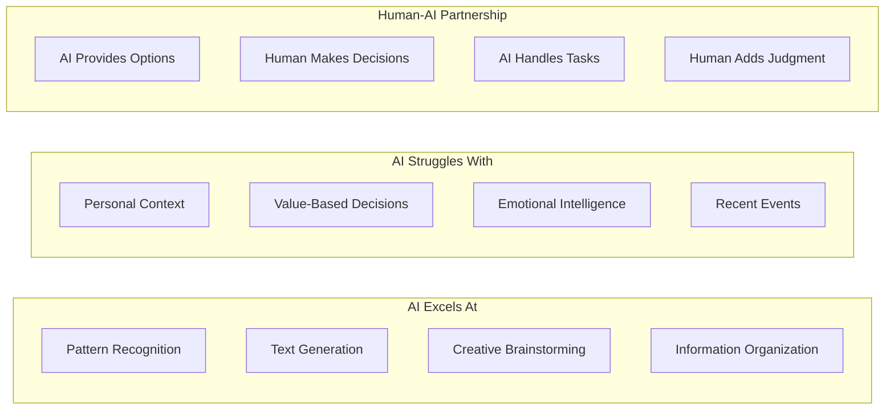

# level 6: setting realistic expectations

## what you'll learn

→ What AI genuinely excels at (and what it struggles with)  
→ How to develop good judgment about when to use AI  
→ Your role as the human in the AI partnership

Understanding what AI can and can't do well saved me from expecting AI to be perfect and helped me become a much more effective AI user.

## what ai genuinely excels at

Based on how AI works (pattern recognition and prediction), it's naturally good at:

### pattern recognition and analysis
→ Identifying trends in large amounts of information  
→ Finding connections between ideas or concepts  
→ Spotting inconsistencies in writing or logic

### text generation and communication
→ Creating first drafts of written content  
→ Explaining complex topics in different ways  
→ Adapting tone and style for different audiences

### creative brainstorming
→ Coming up with ideas you might not think of  
→ Combining concepts in unexpected ways  
→ Breaking through creative blocks

### organization and structure
→ Organizing scattered thoughts into logical flow  
→ Creating outlines and frameworks for projects  
→ Summarizing long documents

## what ai struggles with

Understanding AI limitations helps you know when to rely on human judgment:

### context you haven't provided
→ **Your specific situation:** AI doesn't know your company culture, family dynamics, or personal history  
→ **Unspoken assumptions:** Things you take for granted but haven't mentioned  
→ **Cultural nuances:** Subtle social factors that affect decisions

### current and personal information
→ **Recent events:** Anything after the AI's training cutoff (unless it has web access)  
→ **Your personal data:** Information about you that isn't publicly available  
→ **Real-time changes:** Situations that are evolving as you work

### value-based decisions
→ **Ethical choices:** Decisions that depend on your personal values  
→ **Relationship decisions:** Choices affecting family, friends, or coworkers  
→ **Personal priorities:** What matters most to you in any given decision

### emotional and social intelligence
→ **Reading between the lines:** Understanding what people really mean  
→ **Emotional support:** Providing genuine empathy  
→ **Social dynamics:** Navigating complex interpersonal situations

## developing good ai judgment

The most valuable skill is knowing when to use AI and when to rely on human intelligence:

### green light: great ai tasks
→ First drafts of writing projects  
→ Brainstorming when you're stuck  
→ Explaining concepts you're learning  
→ Organizing scattered information  
→ Research starting points (with verification)

### yellow light: ai + human collaboration
→ **Research projects:** AI finds information, you verify and synthesize  
→ **Creative projects:** AI provides ideas and structure, you add vision  
→ **Problem-solving:** AI suggests approaches, you evaluate fit

### red light: human-only tasks
→ **Important relationship conversations:** Personal, sensitive, or emotional discussions  
→ **Final decisions affecting other people:** Choices with real impact  
→ **Value-based choices:** Decisions requiring your personal ethics

## my decision framework

**Use AI when:**
→ I need ideas or options quickly  
→ I want help organizing thoughts  
→ I'm looking for different perspectives

**Don't use AI when:**
→ The decision significantly affects relationships  
→ Personal values or ethics are central  
→ The stakes are high and accuracy is critical

---

### clarifier: ai as your thinking partner

**Think of AI as a research assistant, not a decision maker:**

**Good partnership:** AI provides options, you choose. AI suggests approaches, you adapt. AI generates drafts, you add your voice.

**Poor partnership:** AI makes decisions for you. AI replaces your thinking instead of enhancing it.

---

## real example from my experience

I asked [Claude](https://claude.ai) to help me write an email to my team about a project delay. [Claude](https://claude.ai) gave me good structure and professional tone, but it was missing crucial context:

**What [Claude](https://claude.ai) provided:** Professional explanation of delays and next steps  
**What I added:** Specific context about our team culture, acknowledgment of individual efforts, and personal touches

The result was much better than either of us could have created alone.

## ai as enhancement, not replacement

**Enhancement mindset:**
→ AI helps me think better and faster  
→ AI provides starting points for my own work  
→ AI offers perspectives I might not consider

**Replacement mindset (problematic):**
→ AI should do everything for me  
→ AI answers are always accurate  
→ AI can make important decisions without my input

## your role in the partnership

You bring irreplaceable human capabilities:

**Your unique contributions:**
→ **Personal context:** Your specific situation and relationships  
→ **Values and judgment:** Your ethics and priorities  
→ **Cultural understanding:** Your lived experience  
→ **Domain expertise:** Your specific knowledge  
→ **Creative vision:** Your unique perspective

**AI's contributions:**
→ **Pattern recognition:** Spotting connections from vast examples  
→ **Rapid generation:** Creating options quickly  
→ **Broad knowledge:** Access to information across many domains  
→ **Consistent availability:** 24/7 assistance without fatigue

## connecting the dots

**What we learned:** AI excels at pattern-based tasks but struggles with personal context, values, and emotional intelligence - making human judgment essential

**What this builds on:** This completes your foundation by showing you how to combine AI's pattern recognition capabilities with your human judgment effectively

**What's next:** You're now ready for Phase 2, where you'll have your first quality AI conversations and start building practical skills

## your turn

**Consider:** What's one task you do regularly where AI would excel as a thinking partner?

**Reflect:** Think of a recent decision. Which parts could AI have helped with, and which parts required your human judgment?

**Set boundaries:** What's one area where you want to keep human-centered rather than using AI?

---

### flashcards for this section

**Front:** What types of tasks does AI excel at?  
**Back:** Pattern recognition, text generation, creative brainstorming, organizing information - anything where learning from examples helps

**Front:** What types of tasks does AI struggle with?  
**Back:** Personal context, value-based decisions, emotional intelligence, current events - anything requiring lived experience

**Front:** What makes human judgment essential in AI partnerships?  
**Back:** Humans provide personal context, values, cultural understanding, domain expertise, and creative vision that AI can't access

---

**congratulations!** You've completed Phase 1: Foundation. You now understand how AI works, where it gets its knowledge, why it feels different from other programs, and how to set realistic expectations.

→ **next:** [phase 2: first contact - your first quality ai conversations](level-7.md)
