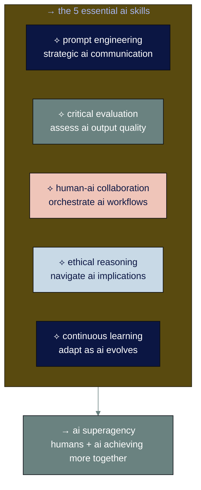

# ● level 7: the 5 essential ai skills

## navigation
▲ **phase 3: building real skills (1/3)** | ← [level 6: developing ai quality standards](level-6.md) | → [level 8: advanced ai workflows](level-8.md)

## what you'll learn

→ the five skills that separate casual ai users from ai power users  
→ why prompt engineering is just one piece of the puzzle  
→ how to develop uniquely human skills that complement ai  
→ practical techniques for each skill you can start using today

you understand ai conversations and quality control. now master the core competencies that will make you valuable in an ai-augmented workplace.

## → the ai skills landscape of 2025

recent research shows that 50% of recruiters now screen for ai literacy in all candidates, regardless of job function. but what exactly are they looking for?

the answer isn't just technical skills. it's a combination of human-ai collaboration abilities that create what experts call "superagency" - humans empowered by ai to achieve far more than either could alone.

these five skills work together to create professionals who don't just use ai tools - they orchestrate ai systems to solve complex problems.

• • •

## → skill 1: prompt engineering (strategic ai communication)

prompt engineering goes beyond writing good questions. it's about understanding how to communicate strategically with ai systems to get consistently useful results.

### ※ the anatomy of expert prompts

**context setting:** establish the situation, constraints, and background  
**role definition:** tell ai what perspective to take  
**task specification:** be specific about what you want  
**format guidance:** specify how you want the output structured  
**quality criteria:** define what good looks like

### ⌘ prompt engineering techniques

**the chain-of-thought method:**
instead of: "plan our family vacation"  
try: "plan our family vacation to costa rica step by step. first, research the best time to visit with kids ages 8 and 12. then, identify 3-4 must-see destinations that balance adventure and relaxation. next, create a realistic daily itinerary. finally, estimate total costs and suggest ways to save money."

**the persona method:**
instead of: "help me learn spanish"  
try: "you're an experienced language teacher who specializes in helping busy parents learn spanish for family travel. create a 30-day learning plan that focuses on practical phrases for restaurants, hotels, and activities with children. use methods that work during short practice sessions."

**the constraint method:**
instead of: "help me eat healthier"  
try: "create a 2-week meal plan for a family of 4 with one vegetarian teen and one picky 8-year-old. all meals must take 30 minutes or less to prepare. include shopping lists organized by grocery store sections. focus on increasing vegetables while keeping everyone happy."

### ※ advanced prompting strategies

**iterative refinement:** start broad, then narrow based on results  
**context priming:** feed ai relevant background information systematically  
**output templating:** provide examples of desired output formats  
**error anticipation:** include guidance for edge cases and common mistakes

• • •

## → skill 2: critical evaluation (assess ai output quality)

ai output can look polished while being fundamentally flawed. critical evaluation is your defense against automation bias - the tendency to over-trust ai results.

### ※ the evaluation framework

**accuracy check:** are the facts correct and verifiable?  
**relevance assessment:** does this actually address my specific need?  
**completeness review:** what important elements might be missing?  
**bias detection:** what perspectives or groups might be overlooked?  
**logical consistency:** do the conclusions follow from the evidence?

### ⌘ red flags that demand deeper scrutiny

**overconfident language:** statements that seem too certain about uncertain topics  
**generic examples:** illustrations that could apply to any situation  
**missing nuance:** complex topics presented as simple or binary  
**source gaps:** claims without clear attribution or verification paths  
**perfect alignment:** results that match your expectations too perfectly

### ※ practical evaluation techniques

**the peer review test:** would i be comfortable sharing this with a knowledgeable colleague?  
**the devil's advocate approach:** what would a critic say about this analysis?  
**the implementation test:** can i actually execute these recommendations?  
**the stakeholder perspective:** how would different groups react to this?

• • •

⟡ **the 70% rule for ai evaluation**

aim for ai output that gets you 70% of the way to your goal. perfect ai output is often a red flag - it might be generic or missing important nuances. the best ai work usually needs human refinement to reach full value.

• • •

## → skill 3: human-ai collaboration (orchestrate ai workflows)

this is where the magic happens. instead of replacing human work, ai amplifies human capabilities when orchestrated effectively.

### ※ collaboration patterns that work

**ai as research assistant:** ai gathers information, human synthesizes insights  
**ai as first-draft generator:** ai creates starting points, human adds expertise and nuance  
**ai as thought partner:** ai helps explore possibilities, human makes strategic decisions  
**ai as quality checker:** ai flags potential issues, human makes final judgments  
**ai as process automator:** ai handles routine steps, human focuses on exceptions and strategy

### ⌘ designing effective human-ai workflows

**step 1: map your current process**
- what are the discrete steps?
- which require human judgment vs. pattern recognition?
- where do bottlenecks typically occur?

**step 2: identify ai intervention points**
- where can ai accelerate information gathering?
- what routine decisions could ai support?
- which creative tasks could benefit from ai brainstorming?

**step 3: design the handoffs**
- how will you provide context to ai?
- what output format enables easy human review?
- when do you escalate back to human control?

**example workflow - market research project:**
1. **human:** defines research questions and success criteria
2. **ai:** gathers initial data and identifies key trends
3. **human:** validates sources and assesses relevance
4. **ai:** synthesizes findings into structured summary
5. **human:** adds strategic interpretation and recommendations

### ※ collaboration principles

**maintain human oversight:** ai supports decisions, humans make them  
**leverage comparative advantages:** use ai for scale, humans for judgment  
**create feedback loops:** ai learns from human corrections and preferences  
**stay context-aware:** humans provide situational knowledge ai lacks

• • •

## → skill 4: ethical reasoning (navigate ai implications)

as ai becomes more powerful, the ability to navigate ethical implications becomes a key differentiator. this isn't about following rigid rules - it's about thoughtful decision-making in ambiguous situations.

### ※ the ethical dimensions of ai use

**fairness and bias:** how might ai recommendations affect different groups?  
**transparency:** can you explain how you reached ai-assisted conclusions?  
**privacy and consent:** are you using data appropriately?  
**accountability:** who's responsible when ai-assisted work has problems?  
**human agency:** are you preserving meaningful human control and choice?

### ⌘ ethical decision-making process

**identify stakeholders:** who could be affected by this ai-assisted work?  
**consider consequences:** what are the potential positive and negative impacts?  
**evaluate alternatives:** are there less risky ways to achieve the same goal?  
**seek diverse perspectives:** how would different groups view this decision?  
**document reasoning:** can you explain your ethical considerations?

### ※ practical ethical guidelines

**for content creation:** always disclosure when ai significantly contributed  
**for analysis:** acknowledge limitations and potential biases in ai-assisted research  
**for decision support:** maintain human accountability for final choices  
**for automation:** ensure human oversight remains meaningful, not just ceremonial

• • •

## → skill 5: continuous learning (adapt as ai evolves)

ai capabilities are advancing monthly, not yearly. the skill of learning and adapting has become more valuable than any specific technical knowledge.

### ※ staying current without overwhelm

**focus on principles over tools:** understand why approaches work, not just how  
**follow quality sources:** curate 3-5 trusted information sources rather than consuming everything  
**practice regularly:** spend 30 minutes weekly experimenting with ai tools  
**connect with practitioners:** join communities where people share real-world ai experiences

### ⌘ building learning habits

**weekly ai experimentation:** try one new ai approach or tool  
**monthly reflection:** what worked? what didn't? what will you change?  
**quarterly skill assessment:** evaluate your competency in each of the five skills  
**annual trend analysis:** what major ai developments will affect your work?

### ※ learning resources by skill level

**beginners:** [coursera's "ai for everyone"](https://www.coursera.org/learn/ai-for-everyone), [linkedin learning's "ai foundations"](https://www.linkedin.com/learning/artificial-intelligence-foundations-thinking-machines)  
**intermediate:** [anthropic's prompting guides](https://docs.anthropic.com/claude/docs/prompt-engineering), [openai's best practices documentation](https://platform.openai.com/docs/guides/prompt-engineering)  
**advanced:** [arxiv papers](https://arxiv.org), ai conference recordings, practitioner case studies

• • •

## → skill development roadmap

### ⌘ month 1: foundations
**week 1:** master basic prompt engineering with your most common tasks  
**week 2:** develop critical evaluation checklists for your work  
**week 3:** map one complete human-ai workflow  
**week 4:** identify ethical considerations in your ai use

### ⌘ month 2: integration
**week 1:** refine prompts based on quality evaluation results  
**week 2:** optimize your human-ai workflows for efficiency  
**week 3:** practice ethical reasoning with ambiguous scenarios  
**week 4:** establish learning habits and information sources

### ⌘ month 3: mastery
**week 1:** teach someone else your ai techniques (teaching reveals gaps)  
**week 2:** tackle a complex project using all five skills  
**week 3:** get feedback from colleagues on your ai-assisted work  
**week 4:** plan your next phase of skill development

• • •

## → measuring your skill development

### ※ self-assessment questions

**prompt engineering:**
- can i get useful results from ai in 2-3 tries instead of 10+?
- do my prompts consistently produce output that needs minimal editing?
- can i adapt my prompting strategy based on the task and ai tool?

**critical evaluation:**
- do i catch errors and biases before they cause problems?
- can i explain why ai output is or isn't trustworthy?
- do i maintain appropriate skepticism without being paralyzed?

**human-ai collaboration:**
- have i designed workflows that amplify my strengths?
- do i know when to trust ai vs. when to override it?
- can i orchestrate multiple ai tools to solve complex problems?

**ethical reasoning:**
- do i consider the broader implications of my ai use?
- can i articulate the ethical tradeoffs in ambiguous situations?
- do i maintain accountability for ai-assisted decisions?

**continuous learning:**
- am i staying current with ai developments relevant to my work?
- do i adapt my practices as ai capabilities evolve?
- can i learn new ai tools and techniques efficiently?

• • •

⟡ **the compound effect of ai skills**

these five skills multiply each other's value. good prompt engineering makes critical evaluation easier. strong collaboration skills make ethical reasoning more practical. continuous learning keeps all other skills sharp. master them together, not separately.

• • •

## → industry applications

### ※ healthcare professionals
**prompt engineering:** create patient-friendly explanations of complex conditions  
**critical evaluation:** assess ai-generated treatment summaries for accuracy  
**collaboration:** use ai for documentation while maintaining clinical judgment  
**ethics:** balance ai efficiency with patient privacy and care quality  
**learning:** stay current with ai applications in medical practice

### ※ educators and trainers
**prompt engineering:** develop personalized learning materials  
**critical evaluation:** verify ai-generated educational content for accuracy  
**collaboration:** use ai to scale personalized feedback to students  
**ethics:** ensure ai supports rather than replaces meaningful learning  
**learning:** adapt teaching methods as ai changes how students work

### ※ business professionals
**prompt engineering:** create strategic analyses and recommendations  
**critical evaluation:** assess ai market research and competitive intelligence  
**collaboration:** orchestrate ai across research, analysis, and communication  
**ethics:** maintain transparency in ai-assisted business decisions  
**learning:** anticipate how ai will change industry practices

• • •

## connecting the dots

mastering these five skills transforms you from someone who uses ai tools to someone who orchestrates ai systems to solve meaningful problems. you become what researchers call "ai-native" - naturally thinking in terms of human-ai collaboration rather than human-vs-ai competition.

the professionals who thrive in 2025 and beyond won't be those who know the most about ai technology. they'll be those who can combine ai capabilities with uniquely human strengths like creativity, empathy, and strategic thinking.

these skills compound over time. small improvements in each area create exponential improvements in your overall ai effectiveness.

---

### flashcard for this section

**→ front**: what are the 5 essential ai skills for 2025?  
**⟡ back**: prompt engineering (strategic ai communication), critical evaluation (assess quality), human-ai collaboration (orchestrate workflows), ethical reasoning (navigate implications), continuous learning (adapt as ai evolves)

**→ front**: what's the 70% rule for ai evaluation?  
**⟡ back**: aim for ai output that gets you 70% of the way to your goal. perfect ai output is often a red flag - it might be generic or missing important nuances.

**→ front**: what are effective human-ai collaboration patterns?  
**⟡ back**: ai as research assistant, first-draft generator, thought partner, quality checker, and process automator - with humans maintaining oversight and strategic control

**→ front**: what makes someone "ai-native"?  
**⟡ back**: naturally thinking in terms of human-ai collaboration rather than human-vs-ai competition, orchestrating ai systems to solve meaningful problems

**→ front**: why do these 5 skills compound each other's value?  
**⟡ back**: good prompt engineering makes critical evaluation easier, collaboration skills make ethics practical, continuous learning keeps all skills sharp - master them together for exponential improvement

---

**sources:**
- ai workplace skills: [world economic forum ai skills](https://www.weforum.org/stories/2025/01/ai-workplace-skills/) | [hr executive essential ai skills](https://hrexecutive.com/5-essential-skills-for-thriving-in-the-ai-driven-workplace-of-2025/)
- ai competencies: [educause ai competencies](https://er.educause.edu/articles/2024/9/must-have-competencies-and-skills-in-our-new-ai-world-a-synthesis-for-educational-reform) | [skillsoft ai skills demand](https://www.skillsoft.com/blog/essential-ai-skills-everyone-should-have)
- workplace transformation: [mckinsey ai workplace report](https://www.mckinsey.com/capabilities/mckinsey-digital/our-insights/superagency-in-the-workplace-empowering-people-to-unlock-ais-full-potential-at-work) | [coursera ai skills 2025](https://www.coursera.org/in/articles/ai-skills)

---

you've mastered the essential ai skills that create human-ai superagency. now learn how to combine these skills into advanced workflows that solve complex, multi-step problems.

→ **next**: [level 8: advanced ai workflows](level-8.md)
