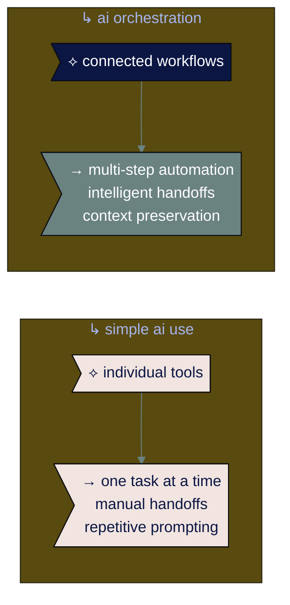

# ● level 8: advanced ai workflows

## navigation
▲ **phase 3: building real skills (2/3)** | ← [level 7: the 5 essential ai skills](level-7.md) | → [level 9: staying human-centered and growing forward](level-9.md)

## what you'll learn

→ how to chain multiple ai tools together for complex problem-solving  
→ the difference between simple automation and intelligent orchestration  
→ real-world multi-step workflows that save hours in work and life  
→ when to use multi-agent systems vs. single-agent approaches

you've mastered individual ai skills. now learn to orchestrate multiple ai capabilities into workflows that solve complex, multi-step problems in professional and personal contexts.

## → from ai tools to ai orchestration

most people use ai like individual tools - ask chatgpt a question, generate an image with dall-e, automate a task with zapier. but the real power comes from connecting these capabilities into intelligent workflows.

2025 research shows 45% of businesses now use ai to automate multi-step workflows, with the ai workflow market projected to reach $10.9 billion by 2025.

**the shift:** from using ai tools to orchestrating ai systems that work together autonomously.

• • •

## → the anatomy of intelligent workflows

advanced ai workflows have five key components that work together:

### ※ perception layer
**what it does:** monitors inputs, changes, and triggers  
**examples:** new email arrives, document uploaded, deadline approaches, data threshold exceeded

### ※ reasoning engine  
**what it does:** analyzes context, evaluates options, makes decisions  
**examples:** determines urgency level, chooses appropriate response strategy, prioritizes competing tasks

### ※ memory system
**what it does:** maintains context across steps, learns from patterns  
**examples:** remembers previous interactions, tracks workflow progress, builds knowledge base

### ※ planning module
**what it does:** breaks down goals into executable steps, sequences actions  
**examples:** creates project timelines, allocates resources, coordinates dependencies

### ※ action orchestrator
**what it does:** executes tasks, coordinates multiple agents, manages handoffs  
**examples:** sends communications, updates systems, triggers next workflow steps

• • •

⟡ **the orchestration advantage**

intelligent workflows don't just automate - they adapt. unlike rigid rule-based automation, ai-powered workflows can handle exceptions, make contextual decisions, and improve over time based on outcomes.

• • •

## → workflow patterns that work

based on 2025 implementations, here are the most effective workflow patterns:

### ⌘ the research-to-insight pipeline

**use case:** competitive analysis, market research, strategic planning  
**workflow steps:**
1. **data gathering agent** collects information from multiple sources
2. **analysis agent** identifies patterns and trends  
3. **synthesis agent** creates structured insights
4. **presentation agent** formats findings for specific audiences
5. **distribution agent** delivers to stakeholders with appropriate context

**example implementation:**
- trigger: monthly competitive analysis needed
- agent 1: scrapes competitor websites, press releases, social media
- agent 2: analyzes pricing changes, feature updates, market positioning
- agent 3: synthesizes implications for our strategy
- agent 4: creates executive summary and detailed report
- agent 5: schedules delivery to strategy team with discussion prompts

### ⌘ the content multiplication workflow

**use case:** marketing content, educational materials, communication campaigns  
**workflow steps:**
1. **ideation agent** brainstorms topics based on goals and constraints
2. **research agent** gathers supporting information and data
3. **creation agent** develops core content
4. **adaptation agent** creates variations for different channels/audiences
5. **optimization agent** refines based on performance data

**example implementation:**
- trigger: new product launch announcement needed
- agent 1: generates content angles based on product features and target audiences
- agent 2: researches market context, competitor messaging, customer pain points
- agent 3: creates master announcement with key messages
- agent 4: adapts for email, social media, website, sales materials
- agent 5: tests variations and optimizes based on engagement metrics

### ⌘ the decision support system

**use case:** complex business decisions, resource allocation, strategic choices  
**workflow steps:**
1. **context agent** gathers relevant background information
2. **modeling agent** creates scenarios and projections
3. **evaluation agent** assesses options against criteria
4. **risk agent** identifies potential issues and mitigation strategies
5. **recommendation agent** synthesizes into actionable guidance

**example implementation:**
- trigger: expansion into new market under consideration
- agent 1: compiles market data, regulatory requirements, competitive landscape
- agent 2: models revenue projections, investment requirements, timelines
- agent 3: scores options against strategic priorities and success criteria
- agent 4: identifies legal, financial, operational, and competitive risks
- agent 5: provides recommendation with implementation roadmap

• • •

## → building your first advanced workflow

### ⌘ step 1: identify the right problem

not every task needs advanced orchestration. look for problems that are:

**multi-step and complex:** require several different types of analysis or action  
**repetitive but variable:** happen regularly but with different parameters  
**information-intensive:** require gathering and synthesizing data from multiple sources  
**stakeholder-dependent:** involve different people or systems at different stages  
**decision-heavy:** require multiple judgment calls throughout the process

### ⌘ step 2: map the human process

before automating, understand how humans currently handle this:
- what are the actual steps?
- where do people make decisions?
- what information do they need at each stage?
- how do they handle exceptions?
- what makes some instances harder than others?

### ⌘ step 3: design the agent roles

break your workflow into specialized agents, each with clear responsibilities:

**specialist approach:** each agent handles one type of task very well  
**clear handoffs:** define exactly what each agent passes to the next  
**error handling:** plan for what happens when something goes wrong  
**human oversight:** identify where human review or intervention is needed

### ⌘ step 4: choose your orchestration tools

**for beginners:** [zapier agents](https://zapier.com), [microsoft copilot studio](https://www.microsoft.com/en-us/copilot/microsoft-copilot-studio)  
**for developers:** [n8n](https://n8n.io), [langchain/langgraph](https://www.langchain.com), [crewai](https://www.crewai.com)  
**for enterprises:** [microsoft agent flows](https://www.microsoft.com/en-us/microsoft-copilot/blog/copilot-studio/introducing-agent-flows-transforming-automation-with-ai-first-workflows/), custom solutions with apis

### ⌘ step 5: start simple and iterate

begin with a basic version that handles the most common scenarios:
- build the core workflow with 3-4 agents max
- test with real data and edge cases
- add complexity gradually based on what you learn
- measure time saved and quality improvements

• • •

## → real-world workflow examples

### ※ customer onboarding automation

**business impact:** reduced 3-hour manual process to 12 minutes  
**workflow architecture:**

**intake agent** → processes new customer information and documents  
**verification agent** → validates credentials and compliance requirements  
**setup agent** → creates accounts and configures systems  
**communication agent** → sends personalized welcome sequences  
**monitoring agent** → tracks progress and flags issues

**key features:**
- maintains context throughout multi-day process
- handles exceptions like missing documents
- provides real-time status updates to stakeholders
- learns from successful vs. problematic onboardings

### ※ family coordination workflow

**life impact:** reduced family scheduling conflicts by 80%, saved 5 hours/week  
**workflow architecture:**

**calendar agent** → monitors all family member schedules and commitments  
**conflict agent** → identifies scheduling conflicts and suggests resolutions  
**planning agent** → creates optimal weekly schedules considering everyone's preferences  
**communication agent** → sends reminders and updates to family members  
**logistics agent** → coordinates transportation and meal planning

**key features:**
- adapts to changing schedules and unexpected events
- considers individual preferences and constraints
- maintains family traditions and important commitments
- integrates with school calendars and work schedules

**tools used:** [milo](https://www.joinmilo.com), [familywall](https://www.familywall.com), [google calendar](https://calendar.google.com), [zapier](https://zapier.com)

### ※ personal health optimization workflow

**life impact:** improved fitness consistency by 60%, reduced health decision fatigue  
**workflow architecture:**

**data agent** → collects health metrics from wearables and apps  
**analysis agent** → identifies patterns and areas for improvement  
**planning agent** → creates personalized weekly health and fitness plans  
**adaptation agent** → adjusts plans based on progress and life changes  
**motivation agent** → provides encouragement and celebrates achievements

**key features:**
- integrates fitness, nutrition, sleep, and stress management
- adapts recommendations based on family schedule and work demands
- provides actionable daily guidance
- tracks long-term health trends

**tools used:** [whoop coach](https://www.whoop.com), [myfitnesspal](https://www.myfitnesspal.com), [headspace](https://www.headspace.com), [apple health](https://www.apple.com/ios/health/)

• • •

## → multi-agent coordination strategies

### ⌘ sequential orchestration

agents work in a defined order, each building on the previous agent's output

**best for:** linear processes with clear dependencies  
**example:** research → analysis → synthesis → presentation  
**advantages:** predictable, easy to debug, clear responsibility  
**disadvantages:** can be slow, doesn't handle parallelization well

### ⌘ parallel coordination

multiple agents work simultaneously on different aspects of the same problem

**best for:** complex problems that can be broken into independent parts  
**example:** market research (competitors + customers + trends + regulations)  
**advantages:** faster execution, leverages specialized agents  
**disadvantages:** requires coordination logic, potential conflicts

### ⌘ hierarchical management

a coordinator agent manages and directs specialized worker agents

**best for:** complex workflows with dynamic requirements  
**example:** project management agent directing research, analysis, and communication agents  
**advantages:** flexible, can adapt to changing requirements  
**disadvantages:** coordinator becomes bottleneck, more complex to design

### ⌘ collaborative swarming

agents work together, sharing information and coordinating autonomously

**best for:** creative or problem-solving tasks where the optimal approach isn't predetermined  
**example:** product development team with design, engineering, and marketing agents  
**advantages:** highly adaptive, leverages collective intelligence  
**disadvantages:** harder to control, potential for inefficient resource use

• • •

⟡ **the human-in-the-loop principle**

even the most advanced workflows need human oversight points. plan for approval steps, quality checks, and manual overrides. the goal isn't to eliminate human judgment - it's to focus it where it adds the most value.

• • •

## → common workflow pitfalls and how to avoid them

### ⌘ the over-automation trap

**problem:** trying to automate every step without considering where human judgment adds value  
**solution:** identify the 20% of decisions that require human insight and design explicit handoff points

### ⌘ the brittle workflow syndrome

**problem:** workflows that break when conditions change slightly  
**solution:** build in error handling, fallback procedures, and graceful degradation

### ⌘ the context loss issue

**problem:** important information gets lost as work passes between agents  
**solution:** design explicit context preservation and sharing mechanisms

### ⌘ the infinite loop risk

**problem:** agents get stuck in cycles without making progress  
**solution:** implement timeout mechanisms, progress tracking, and escalation procedures

### ⌘ the black box dilemma

**problem:** stakeholders can't understand or trust the workflow's decisions  
**solution:** build in transparency features, decision logging, and explainability

• • •

## → measuring workflow success

### ※ efficiency metrics

**time savings:** how much faster is the automated workflow?  
**resource utilization:** are people working on higher-value activities?  
**throughput:** can you handle more volume with the same resources?  
**cost reduction:** what's the total economic impact?

### ※ quality metrics

**accuracy rates:** how often does the workflow produce correct results?  
**consistency:** is output quality reliable across different conditions?  
**completeness:** does the workflow handle edge cases appropriately?  
**stakeholder satisfaction:** are users happy with the results?

### ※ adaptability metrics

**learning rate:** how quickly does the workflow improve over time?  
**exception handling:** how well does it manage unexpected situations?  
**maintenance requirements:** how much human intervention is needed?  
**scalability:** can it handle increased volume or complexity?

• • •

## → scaling advanced workflows

### ⌘ from prototype to production

**start departmental:** prove value within one team before expanding  
**establish standards:** create templates and best practices for workflow design  
**build expertise:** develop internal capabilities rather than depending entirely on vendors  
**plan for governance:** establish oversight and control mechanisms

### ⌘ organizational readiness factors

**technical infrastructure:** do you have the systems and integrations needed?  
**data quality:** is your information organized and accessible?  
**change management:** are people prepared for new ways of working?  
**risk tolerance:** can you handle the occasional workflow failure?

• • •

## → your advanced workflow development plan

### ⌘ month 1: foundation building
**week 1:** identify your best workflow candidate using the criteria above  
**week 2:** map the current human process in detail  
**week 3:** design agent roles and handoffs  
**week 4:** choose tools and begin prototype development

### ⌘ month 2: implementation and testing
**week 1:** build basic workflow with core agents  
**week 2:** test with real data and edge cases  
**week 3:** add error handling and human oversight points  
**week 4:** train stakeholders and gather feedback

### ⌘ month 3: optimization and scaling
**week 1:** refine based on real-world usage  
**week 2:** add advanced features like learning and adaptation  
**week 3:** document best practices and create templates  
**week 4:** plan next workflow or scaling approach

• • •

## connecting the dots

advanced ai workflows represent a fundamental shift from using ai as individual tools to orchestrating ai as intelligent systems. the businesses that master this orchestration will have significant competitive advantages in speed, quality, and scalability.

the key is starting with real problems that benefit from multi-step automation, then building workflows that preserve human oversight where it matters most. as these systems prove their value, they become the foundation for even more sophisticated ai-human collaboration.

think of advanced workflows as your ai-powered team members - specialized, reliable, and always learning.

---

### flashcard for this section

**→ front**: what are the 5 components of intelligent ai workflows?  
**⟡ back**: perception layer (monitors inputs), reasoning engine (makes decisions), memory system (maintains context), planning module (sequences actions), action orchestrator (executes tasks)

**→ front**: what problems are best suited for advanced ai workflows?  
**⟡ back**: multi-step and complex, repetitive but variable, information-intensive, stakeholder-dependent, decision-heavy

**→ front**: what are the 4 multi-agent coordination strategies?  
**⟡ back**: sequential orchestration (defined order), parallel coordination (simultaneous work), hierarchical management (coordinator directs workers), collaborative swarming (autonomous coordination)

**→ front**: what's the human-in-the-loop principle for advanced workflows?  
**⟡ back**: even advanced workflows need human oversight points for approval steps, quality checks, and manual overrides - focus human judgment where it adds the most value

**→ front**: what's the difference between simple ai use and ai orchestration?  
**⟡ back**: simple ai uses individual tools one at a time with manual handoffs. orchestration connects ai capabilities into multi-step automation with intelligent handoffs and context preservation

---

**sources:**
- ai workflow automation: [superagi ai orchestration guide](https://superagi.com/mastering-ai-agent-orchestration-in-2025-a-step-by-step-guide-to-automating-complex-workflows/) | [openxcell agentic workflows](https://www.openxcell.com/blog/ai-agentic-workflows/)
- agent frameworks: [datacamp best ai agents 2025](https://www.datacamp.com/blog/best-ai-agents) | [machine learning mastery ai frameworks](https://machinelearningmastery.com/7-ai-agent-frameworks-for-machine-learning-workflows-in-2025/)
- enterprise implementation: [microsoft agent flows](https://www.microsoft.com/en-us/microsoft-copilot/blog/copilot-studio/introducing-agent-flows-transforming-automation-with-ai-first-workflows/) | [n8n ai automation](https://n8n.io/ai/)
- family ai applications: [ai family tools guide](https://warrenschuitema.com/post/top-10-ai-apps-for-family-activity-management) | [milo family assistant](https://www.joinmilo.com)

---

you've learned to orchestrate ai systems into intelligent workflows that solve complex problems. now discover how to maintain human-centered values and continue growing as ai capabilities rapidly evolve.

→ **next**: [level 9: staying human-centered and growing forward](level-9.md)
