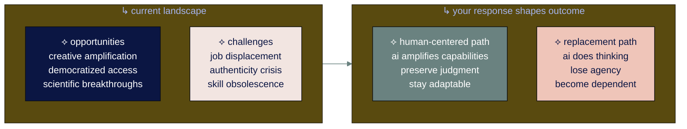

# ● level 9: staying human-centered and growing forward

## navigation
▲ **phase 3: building real skills (3/3)** | ← [level 8: advanced ai workflows](level-8.md) | → **you've completed the guide!**

## what you'll learn
→ what's actually happening with ai advancement (beyond the hype)  
→ why human creativity becomes more valuable as ai gets better  
→ your realistic path forward in an uncertain but opportunity-rich time

you've learned to use ai effectively. now let's talk about what happens next, and how you can thrive regardless of which direction things go.

• • •

## → the reality we're living in

i'm 28 and work as an ai operations consultant. the numbers show:

**the internet is becoming non-human.** only 50.4% of internet traffic in 2023 was human activity. this means bots, scrapers, and ai systems now generate nearly half of all web traffic. predictions suggest 99% of online content could be ai-generated by 2030 - meaning finding genuine human perspectives will be like finding a needle in a haystack.

**people are starting to notice.** humans can only distinguish ai-generated text from human text 53% of the time - basically a coin flip. but 62% now mistrust content they suspect is ai-created. this gap between detection ability and suspicion creates a trust problem for all online content.

**human-created work is becoming premium.** you'll now see tags like "human made lofi" on youtube videos because people want to know a real person made it. ai conferences charge $199-$3,295 for in-person experiences because people will pay for real connection in a world drowning in synthetic content.

this creates both risks and opportunities depending on how you respond.

• • •

## → the spectrum of possible futures

### ⌘ what could go wrong

**job displacement without transition support.** companies automate roles faster than they retrain people, creating economic hardship while shareholders capture benefits.

**critical thinking gets weaker.** when ai handles all analysis and decision-making, people lose confidence in their own judgment and can't function without algorithmic help.

**everything starts looking the same.** when everyone uses the same ai tools, original thinking becomes rare. the human perspective that drives innovation gets buried under algorithmic sameness.

**longer-term risks:** if only a few companies control advanced ai, they control too much of the economy. small problems in superhuman ai systems could have big consequences.

### ⌘ what could go right

**creativity gets a boost.** people use ai to explore ideas they never could have developed alone, focusing on creative work and meaningful relationships.

**small teams get superpowers.** small teams can now access capabilities that used to require large organizations, leveling playing fields.

**science moves faster.** ai is already speeding up drug discovery, climate research, and materials science, compressing decades of research into years.

**if we handle this well:** complex global challenges like climate change could become manageable with ai help. production costs could drop so much that basic necessities become affordable for everyone.

• • •

## → why human authenticity is becoming valuable

the flood of ai content creates scarcity in human-made work. with 90% of online content expected to be ai-generated by 2026, genuine human perspectives become rare and valuable. this isn't speculation - we're already seeing it happen.

**your competitive advantages:**
→ your specific mix of experiences nobody else has lived  
→ your relationships and earned trust that ai can't copy  
→ your taste and judgment in choosing between ai-generated options  
→ your ability to care about outcomes and make decisions that matter

the economy is shifting toward valuing human authenticity precisely because it's becoming scarce. position yourself not as someone competing against ai, but as someone whose human qualities become more valuable because ai exists.

• • •

## → building resilience for any future

focus on capabilities that work regardless of which direction ai goes:

### ※ human connection and communication
whether ai changes everything or nothing, people still need to work together, sort out problems, and trust each other. get better at understanding people, saying what you mean, and dealing with messy human situations.

### ※ creative problem-solving
being able to spot patterns, mix ideas, and think differently. ai can give you a hundred options; you decide which ones are worth anything. work on your taste for recognizing good ideas and your gut sense of what actually works.

### ※ learning and adaptation
if you can pick up new skills fast, you can handle whatever comes. this ability to learn matters more than knowing any specific thing. practice learning hard things to keep this skill sharp.

### ※ critical evaluation
telling good information from garbage, real from fake, important from useless gets harder as ai content floods everything. get better at checking sources, spotting bias, and making smart choices when nothing is certain.

• • •

## → your path forward by situation

your specific circumstances determine the best approach:

### ※ early career (time to experiment)
develop judgment and taste. ai can generate many options, but your ability to choose the right ones becomes valuable. focus on building domain expertise that gives you context ai lacks. combine human creativity with ai capability rather than replacing one with the other.

### ※ mid-career (experience as leverage)
your domain expertise gives you context ai lacks. use ai to amplify your knowledge, not replace it. position yourself as someone who can evaluate ai output in your field and guide others on when and how to use ai well.

### ※ later career (experience as currency)
your perspective on what actually matters is valuable. mentor others on handling change, share insights about what works in practice, and help organizations maintain human values while adopting new tools.

### ※ caring for family (practical focus)
use ai apps that genuinely save time and reduce stress. ignore the hype cycles. teach children to use ai as a tool while developing their own thinking skills and maintaining real-world capabilities.

• • •

## → staying sane when everything feels crazy

**stop doom-scrolling ai news.** pick 2-3 sources you trust and ignore the rest. most "revolutionary breakthroughs" turn out to be marketing nonsense that won't change your tuesday. good sources: [harper carroll ai](https://www.harpercarrollai.com/), [the rundown](https://www.therundown.ai/), [superhuman](https://www.superhuman.ai/subscribe), [ai breakfast](https://aibreakfast.beehiiv.com/).

**learn the approach, not the app.** figure out how to spot good ai output from garbage. these evaluation skills work regardless of which shiny new tool launches next week.

**guard your people time.** efficiency tools should give you more time with humans, not less. if your ai setup is making you antisocial, you're doing it wrong.

****make some decisions without ai.** your brain needs practice making choices. cook dinner without looking anything up. plan your weekend without apps. trust your gut sometimes.

• • •

## → your path forward

**get good with ai tools while staying good at human skills.** learn the tech but don't forget how to think, create, and connect without it.

**automate the boring parts, decide the important parts.** let ai handle your scheduling and email sorting. keep control over choices that actually matter to you.

**try new things but check if they actually help.** experiment with new tools but ask whether they're making your life better or just busier.

**build workflows that make you more capable, not more helpless.** design systems that amplify what you can do, not systems that do everything for you.

you've learned to use ai as a powerful amplifier while keeping what makes you human. this isn't just about getting more done - it's about staying in charge of your own life while technology changes everything around us.

• • •

## ⟡ you've completed ai for normal people!

you know how to have productive ai conversations, spot opportunities, maintain quality, and keep growing as technology evolves. the approach you've developed - curious, critical, human-centered - will work regardless of what happens next.

this guide covers the basics, but there's still much to learn. keep curious, keep experimenting, and keep learning as ai continues to evolve.

**what happens next is up to you.** use what you've learned to create something meaningful.

**stay connected:** join [ninagpt: field notes from my ai journey](https://ninaverse.kit.com/36228eea47) where we continue exploring these changes together.

i'm learning this alongside you and will keep updating this guide as i figure out more in my ai operator journey as a solopreneur. now go build something interesting with what you know.

with gratitude,

nina

pura vida! ♡

---

**sources:**
- youtube ai monetization policy: [techcrunch](https://techcrunch.com/2025/07/09/youtube-prepares-crackdown-on-mass-produced-and-repetitive-videos-as-concern-over-ai-slop-grows/)
- internet traffic data: [webmakers ai analysis](https://webmakers.expert/en/blog/ai-and-the-dead-internet-theory)
- ai content predictions: [wikipedia dead internet theory](https://en.wikipedia.org/wiki/Dead_Internet_theory)
- meta ai accounts: [computerworld](https://www.computerworld.com/article/3632173/meta-puts-the-dead-internet-theory-into-practice)
- authenticity trends: [agbi marketing trends 2025](https://www.agbi.com/opinion/media/2024/12/ai-and-authenticity-will-lead-marketing-trends-in-2025/)
- human detection accuracy: [zenmedia](https://zenmedia.com/blog/the-rise-of-ai-dead-internet-and-dark-social/)

